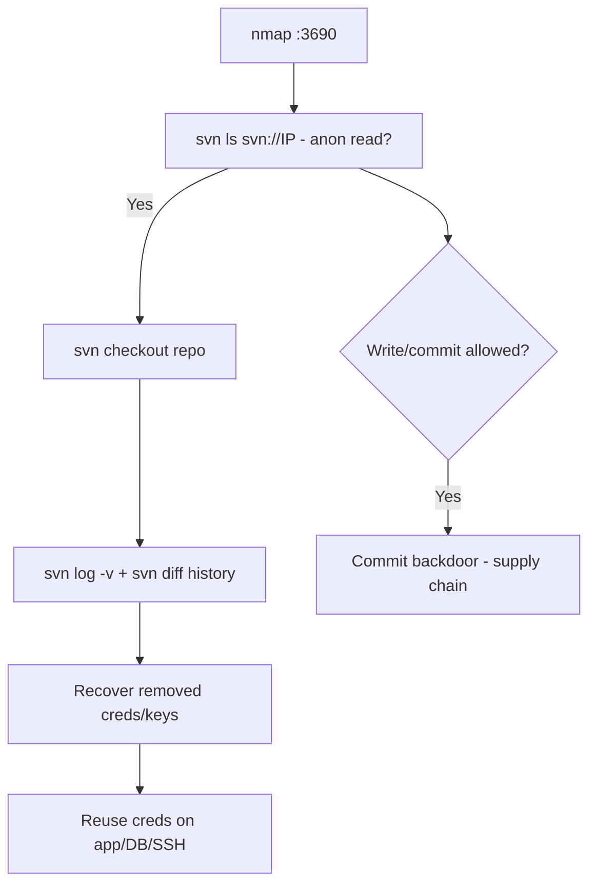

# 79 - Subversion (SVN) Server (Port 3690) Pentesting

## 1. Executive Summary

Subversion (SVN) is a centralized version-control system; the `svnserve` daemon listens on **TCP 3690** (also exposable via HTTP/HTTPS through `mod_dav_svn` and `svn+ssh`). Many `svnserve` repos allow **anonymous read** (sometimes write). The prize is **source code** and, critically, its **full history** — credentials, API keys, and config files that developers committed and later "removed" still live in old revisions. Checking out the repo and walking the revision log routinely yields secrets and a map of the application's internals.

## 2. Protocol Overview & Architecture

`svnserve` serves repositories over the `svn://` protocol; access is governed by `svnserve.conf` + `authz` (anon-access/auth-access). SVN keeps **every revision**, so `svn log` / `svn diff` across history exposes anything ever committed — deleted secrets are not gone. Write access lets you tamper with code (supply-chain) on next checkout/build.

## 3. Enumeration & Footprinting

```bash
nmap -sV -p 3690 <IP>            # svnserve Subversion
nc -vn <IP> 3690                 # banner / version
svn ls svn://<IP>                # list root (anon)
svn ls -R svn://<IP>/repo        # recursive list
svn info svn://<IP>/repo
```

## 4. Exploitation Deep Dive

### 4.1 Anonymous Checkout
```bash
svn checkout svn://<IP>/repo svn_loot
```
Pull the whole working copy for offline review.

### 4.2 Mine History for Secrets
The high-value step — old revisions retain removed credentials:
```bash
svn log -v svn://<IP>/repo                    # full history + changed paths
svn diff -r1:HEAD svn://<IP>/repo | grep -iE 'password|secret|api[_-]?key|token'
svn cat -r <rev> svn://<IP>/repo/config.php   # read an old revision of a file
```

### 4.3 Write Access (supply chain)
If `svn commit` works anonymously/with weak creds, inject a backdoor into source — executes when the target builds/deploys (authorized scope only; document).

## 5. Mermaid Attack Flow



## 6. Post-Exploitation
- Source code → find vulns; history → live credentials/keys.
- Recovered creds → app, DB, SSH access.
- Write access → code backdoor (supply-chain compromise).

## 7. Defense & Hardening
1. Disable anonymous access (`anon-access = none`); require auth; least-privilege authz.
2. **Purge secrets from history** (filter/dump-load); rotate any exposed credentials; never commit secrets.
3. Firewall 3690 to developers/VPN; prefer `svn+ssh`/HTTPS with auth.
4. Audit commits.

## 8. Chaining Opportunities
- Recovered creds → **[[01 - SSH (Port 22) Pentesting]]**, databases.
- Same source-secrets theme as **[[49 - Docker Registry (Port 5000) Pentesting]]** image mining.

## 9. Related Notes
- [[80 - WS-Discovery (Port 3702) Pentesting]]

## 10. Tools
`svn` client, `nc`, `nmap`, secret scanners (trufflehog over checkout).
