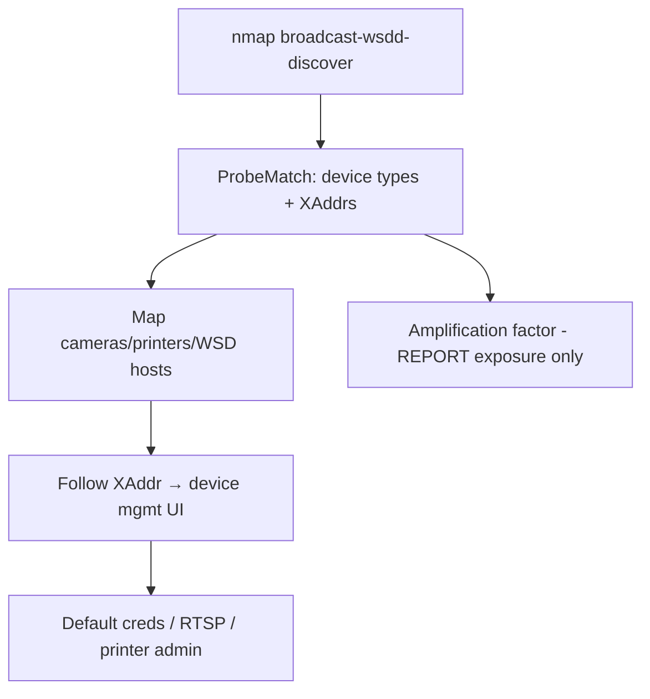

# 80 - WS-Discovery (Port 3702/UDP) Pentesting

## 1. Executive Summary

WS-Discovery (WSD) is a multicast service-discovery protocol using **SOAP over UDP** on **UDP 3702**, common in **ONVIF cameras, network printers, Windows WSD, and IoT/embedded devices**. Offensively it's primarily **reconnaissance**: a multicast `Probe` makes devices announce themselves (type, address, service URLs), exposing cameras/printers and their management endpoints (often weakly secured). WS-Discovery is also a well-known **DDoS amplification vector** (small Probe → large response). **SECURITY CONSTRAINT: use amplification only for measuring/reporting reflection exposure — never launch reflection against third parties.**

## 2. Protocol Overview & Architecture

On joining a network, a Target Service multicasts a `Hello` and listens for multicast `Probe` requests, replying with `ProbeMatch` containing its endpoint reference and transport addresses (XAddrs — the device's service URLs). Because responses are larger than requests and UDP is spoofable, the protocol amplifies. The discovered XAddrs (e.g. ONVIF camera URLs) are the pivot into device management.

## 3. Enumeration & Footprinting

```bash
# Broadcast discovery across the segment
sudo nmap --script broadcast-wsdd-discover
# Query a specific host on UDP/3702
nmap -sU -p 3702 --script wsdd-discover <IP>
# wsdd / python tools also enumerate ONVIF/WSD endpoints
```

## 4. Exploitation Deep Dive

### 4.1 Device Discovery & XAddr Extraction
`ProbeMatch` responses reveal device types and **service URLs (XAddrs)** — map every camera/printer/WSD host and its management endpoint.

### 4.2 Pivot to Device Management
Follow the XAddr to the device's web/ONVIF interface and attack it (default creds, RTSP feeds, printer admin). ONVIF cameras → see RTSP note; printers → IPP/PJL/raw print.

### 4.3 Amplification Exposure (REPORT only)
A spoofed Probe yields a larger ProbeMatch — measure the amplification factor to document the reflection/DDoS exposure of the host. **Do not use it to attack others.**

## 5. Mermaid Attack Flow



## 6. Post-Exploitation
- Inventory of IoT/embedded devices + their management URLs.
- Pivot to camera feeds (RTSP) and printer/admin interfaces.
- Documented amplification exposure = hardening finding.

## 7. Defense & Hardening
1. Disable WS-Discovery if unused; restrict to device VLANs; **block UDP 3702 from untrusted/internet** (anti-amplification).
2. Secure the device endpoints behind WSD (change defaults, auth, TLS).
3. Monitor for external Probe traffic / reflection abuse.

## 8. Chaining Opportunities
- ONVIF camera XAddr → **[[62 - RTSP (Ports 554-8554) Pentesting]]**.
- Printers → **[[86 - IPP (Port 631) Pentesting]]** / **[[87 - PJL (Port 9100) Pentesting]]**.
- Sibling LAN-discovery: **[[81 - mDNS (Port 5353) Pentesting]]**.

## 9. Related Notes
- [[81 - mDNS (Port 5353) Pentesting]]

## 10. Tools
`nmap` wsdd-discover/broadcast-wsdd-discover, `wsdd`, ONVIF tools.
