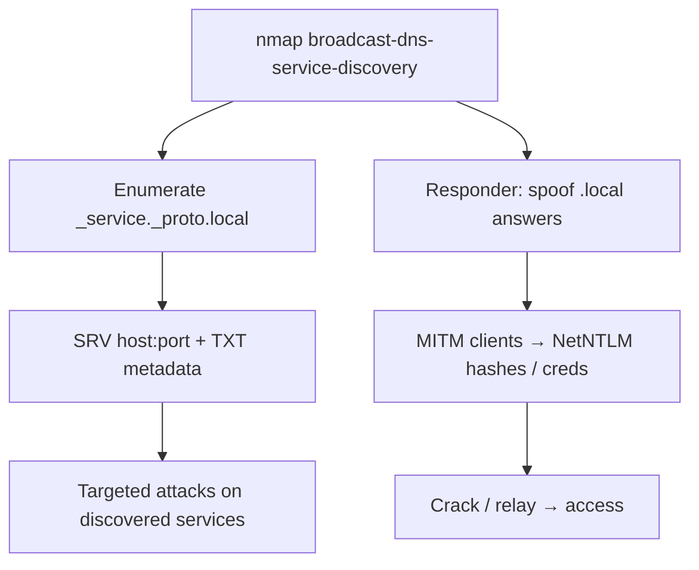

# 81 - mDNS / DNS-SD (Port 5353/UDP) Pentesting

## 1. Executive Summary

Multicast DNS (mDNS) does DNS-style name resolution on the local link with **no central server**, over **UDP 5353** to multicast `224.0.0.251` / `FF02::FB`. Paired with **DNS-SD** (Service Discovery), it advertises services via PTR/SRV/TXT records — so one query enumerates **every device and service on the segment** (printers, Chromecasts, NAS, SSH, HTTP, AirPlay) plus rich metadata in TXT records (versions, paths, sometimes credentials/serials). Beyond recon, mDNS is **spoofable**: an attacker on the LAN can answer `.local` queries to **redirect/MITM** clients (similar to LLMNR/NBT-NS poisoning).

## 2. Protocol Overview & Architecture

Hosts resolve `*.local` names by multicasting questions; any host with the record answers to the group. DNS-SD layers a convention: `_service._proto.local` PTR → instance names → SRV (host+port) + TXT (key/value metadata). No authentication exists, so (a) anyone can enumerate everything, and (b) anyone can forge answers and win the race to poison resolution.

## 3. Enumeration & Footprinting

```bash
# Direct query of a host
nmap -sU -p 5353 --script=dns-service-discovery <IP>
# Listen + enumerate the whole segment
sudo nmap --script=broadcast-dns-service-discovery
# avahi / dns-sd browse
avahi-browse -a -r          # browse all services, resolve host/port/TXT
```

## 4. Exploitation Deep Dive

### 4.1 Service & Metadata Enumeration
Browse all `_service._proto.local` types → instances → SRV (host:port) + TXT (versions, URLs, device info). This maps the LAN's attack surface in one pass and feeds targeted attacks on each discovered service.

### 4.2 mDNS Spoofing / MITM
On the LAN, race to answer `.local` queries with your IP (e.g. via `Responder` mDNS module) to intercept connections — capture credentials or relay to other services:
```bash
responder -I eth0            # poisons LLMNR/NBT-NS + mDNS by default
```
Redirected clients may hand over NetNTLM hashes (→ crack/relay) or app creds.

### 4.3 Information Leakage
TXT records and hostnames leak OS/app versions, internal naming, and occasionally secrets — pure recon value.

## 5. Mermaid Attack Flow



## 6. Post-Exploitation
- Full LAN device/service inventory + version metadata.
- Spoofing → captured hashes/creds → relay/crack → lateral movement.

## 7. Defense & Hardening
1. Disable mDNS where unneeded; segment IoT/consumer devices off sensitive VLANs.
2. Block UDP 5353 across segment boundaries; restrict multicast.
3. Mitigate LAN poisoning (disable LLMNR/NBT-NS, enable SMB signing, 802.1X) to limit relay value.
4. Monitor for rogue mDNS responders.

## 8. Chaining Opportunities
- Discovered printers → **[[86 - IPP (Port 631) Pentesting]]**; cameras → **[[62 - RTSP (Ports 554-8554) Pentesting]]**.
- Spoofing/relay → **[[06 - SMB (Ports 139-445) Pentesting]]** / Active Directory.
- Sibling discovery: **[[80 - WS-Discovery (Port 3702) Pentesting]]**.

## 9. Related Notes
- [[82 - ADB Android Debug Bridge (Port 5555) Pentesting]]

## 10. Tools
`nmap` dns-service-discovery, `avahi-browse`/`dns-sd`, `Responder`.
