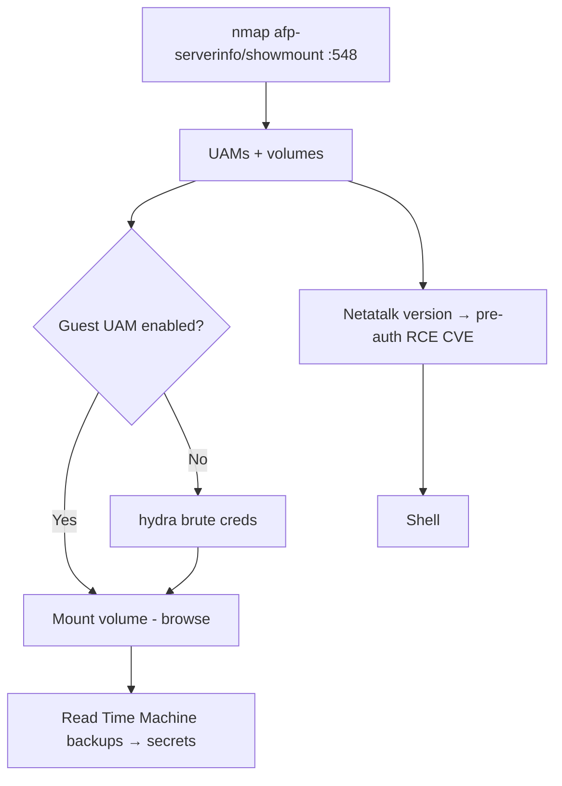

# 84 - AFP (Port 548) Pentesting

## 1. Executive Summary

AFP (Apple Filing Protocol) is Apple's legacy network file-sharing protocol, **TCP 548** (over DSI). Superseded by SMB on modern macOS (default since 10.9) but still seen with **Time Machine over AFP**, mixed-OS networks, NAS appliances (Netatalk), and older Macs. Attacks mirror SMB: enumerate server info + shares, attempt **guest/anonymous access**, brute-force credentials, and read exposed volumes (Time Machine backups are gold — full disk images). The Netatalk implementation has also had serious **pre-auth RCE CVEs**.

## 2. Protocol Overview & Architecture

AFP runs over DSI on 548; a server advertises its info (machine type, AFP versions, UAMs — User Authentication Methods, supported volumes) before login. UAMs include "No User Authent" (guest) when enabled. After auth, clients mount **volumes** (shares). On Linux/NAS, AFP is provided by **Netatalk**, whose older versions carry exploitable memory-corruption bugs.

## 3. Enumeration & Footprinting

```bash
nmap -sV -p 548 <IP>
nmap -p 548 --script afp-serverinfo,afp-showmount,afp-path-vuln <IP>
# Metasploit
msf> use auxiliary/scanner/afp/afp_server_info
```
`afp-serverinfo` reveals UAMs/versions; `afp-showmount` lists shares.

## 4. Exploitation Deep Dive

### 4.1 Server & Share Enumeration
`afp-serverinfo` + `afp-showmount` map machine type, supported auth methods, and available volumes. "No User Authent" UAM = guest access enabled.

### 4.2 Guest / Anonymous Mount
If guest is allowed, mount and browse:
```bash
mount_afp afp://;AUTH=No%20User%20Authent@<IP>/<Volume> /mnt/afp   # macOS
# Linux: afpfs-ng / afp_client
```
Time Machine volumes contain full system backups → offline credential/data theft.

### 4.3 Credential Brute Force
```bash
hydra -L users.txt -P pass.txt afp://<IP>
```

### 4.4 Netatalk CVEs
Fingerprint Netatalk version → known pre-auth RCEs (e.g. CVE-2018-1160 and the 2022 set) for direct compromise.

## 5. Mermaid Attack Flow



## 6. Post-Exploitation
- Read shared volumes / Time Machine backups (full system images → creds, keys).
- Netatalk RCE → host foothold.

## 7. Defense & Hardening
1. Disable AFP if unused; prefer SMB; disable guest UAM.
2. Strong auth; restrict volume permissions; firewall 548.
3. Patch Netatalk; encrypt Time Machine backups.

## 8. Chaining Opportunities
- Backups/shares → creds → cross-service reuse.
- File-share sibling: **[[06 - SMB (Ports 139-445) Pentesting]]**, **[[25 - NFS (Port 2049) Pentesting]]**.

## 9. Related Notes
- [[85 - LPD (Port 515) Pentesting]]

## 10. Tools
`nmap` afp-* NSE, Metasploit `afp_server_info`, `hydra`, afpfs-ng.
