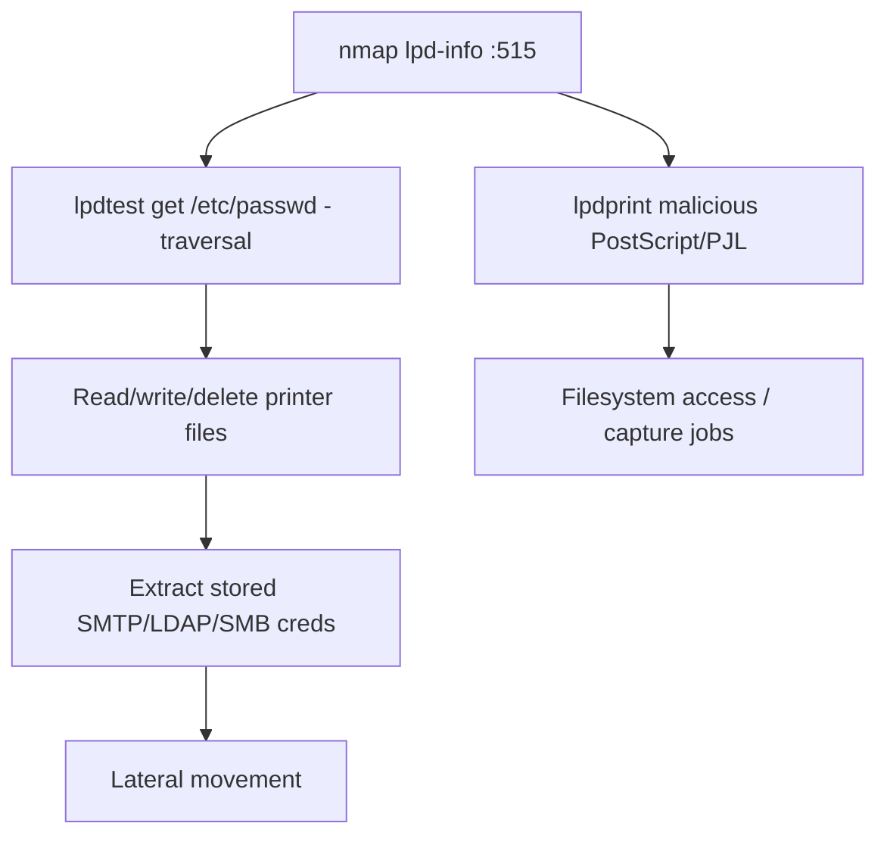

# 85 - LPD / Line Printer Daemon (Port 515) Pentesting

## 1. Executive Summary

LPD (Line Printer Daemon, RFC 1179) is the classic Berkeley print protocol on **TCP 515**, driven by `lpr`. A print job is a **control file** (job/user details) plus a **data file** (content). Two attack themes: (1) LPD can be abused to push **malicious PostScript/PJL** jobs that the printer interprets — leading to filesystem access or persistent changes on the device; (2) some implementations allow **path traversal** via the control/data file handling, letting you **read/write/delete arbitrary files** on the printer. PRET's `lpdprint`/`lpdtest` automate this.

## 2. Protocol Overview & Architecture

Clients connect to 515 and submit jobs to a named queue; the daemon stores the control + data files and prints. The control file selects a format handler — and weak implementations don't sanitize filenames, enabling traversal (`../../etc/passwd`). Because the data file can carry PostScript/PJL, the printer's interpreter executes attacker content — printers are full computers with filesystems and network access.

## 3. Enumeration & Footprinting

```bash
nmap -sV -p 515 <IP>
nmap -p 515 --script lpd-info <IP>
```

## 4. Exploitation Deep Dive

### 4.1 PRET lpdtest — File Access / Traversal
```bash
lpdtest.py <IP> get /etc/passwd          # read a file (traversal)
lpdtest.py <IP> put ../../etc/passwd      # write/overwrite
lpdtest.py <IP> rm /some/file/on/printer  # delete
```

### 4.2 Malicious Print Jobs
```bash
lpdprint.py <IP> payload.ps               # send PostScript/PJL the device interprets
```
PostScript jobs can read/write the printer filesystem and capture other users' print jobs.

### 4.3 Printer as Pivot
The printer often sits on internal VLANs with stored SMTP/LDAP/SMB credentials (scan-to-folder/email) — extract them for lateral movement.

## 5. Mermaid Attack Flow



## 6. Post-Exploitation
- Read/modify printer filesystem; capture queued documents.
- Harvest stored scan-to-folder/email creds (often domain accounts).
- Persistent printer foothold; pivot internally.

## 7. Defense & Hardening
1. Disable LPD/raw printing if unused; use authenticated IPP.
2. Patch printer firmware; restrict 515 to print servers; segment printers on their own VLAN.
3. Don't store privileged creds on printers; rotate any exposed.

## 8. Chaining Opportunities
- Raw-print sibling: **[[87 - PJL (Port 9100) Pentesting]]**; modern: **[[86 - IPP (Port 631) Pentesting]]**.
- Stored creds → **[[08 - LDAP (Ports 389-636) Pentesting]]** / SMB.

## 9. Related Notes
- [[86 - IPP (Port 631) Pentesting]]
- [[87 - PJL (Port 9100) Pentesting]]

## 10. Tools
PRET (`lpdprint.py`/`lpdtest.py`), `nmap` lpd-info, `lpr`.
