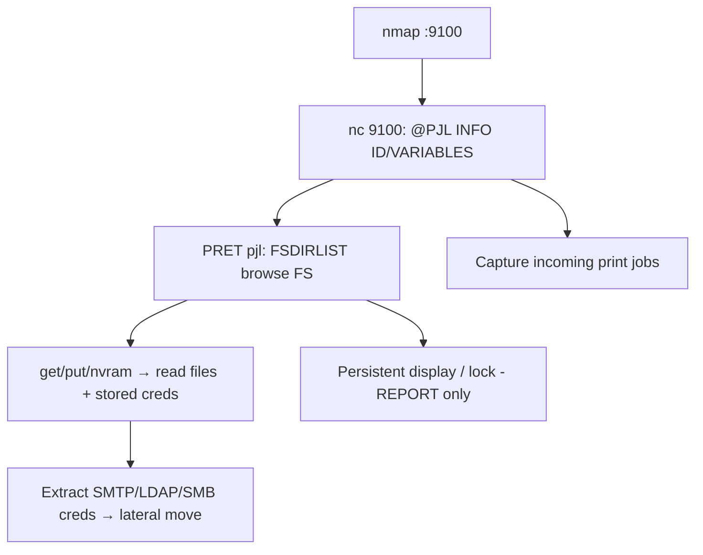

# 87 - PJL / Raw Printing (Port 9100) Pentesting

## 1. Executive Summary

Port **9100/tcp** is **raw printing** (JetDirect / AppSocket / PDL-datastream) — a direct, bidirectional pipe to the printer's interpreter, supported by almost every network printer. It isn't a printing protocol per se: **all data sent is processed directly by the device**, like a TCP parallel port. Because it's **bidirectional**, you get feedback from **PJL/PostScript/PCL** commands — making it the richest channel for printer attacks (PRET/PFT). With PJL you can read device info, **browse and read/write the printer filesystem**, change settings (incl. persistent display/config), capture jobs, and sometimes brick or unlock the device.

## 2. Protocol Overview & Architecture

You `nc` to 9100 and send PJL commands (`@PJL ...`) or PostScript/PCL directly; the device executes and replies. PJL exposes a filesystem (`FSDIRLIST`, `FSDOWNLOAD`, `FSUPLOAD`, `FSDELETE`), environment variables, and status. PostScript jobs run on the printer's interpreter with access to its file operators — so the printer becomes a small attackable computer holding cached jobs and stored network credentials.

## 3. Enumeration & Footprinting

```bash
nmap -sV -p 9100 <IP>      # jetdirect
nc -vn <IP> 9100
@PJL INFO ID               # brand/model/firmware
@PJL INFO STATUS
@PJL INFO VARIABLES        # env variables
@PJL FSDIRLIST NAME="0:\" ENTRY=1 COUNT=65535   # list filesystem
```

## 4. Exploitation Deep Dive

### 4.1 PRET — Filesystem & Control
```bash
pret.py <IP> pjl
> ls /                 # browse printer FS
> get /etc/passwd      # read files (where exposed)
> put localfile        # write files
> nvram dump           # may reveal stored creds/keys
> display "PWNED"       # persistent message
```

### 4.2 Job Capture
PJL/PostScript can redirect or copy incoming print jobs to the printer FS, then exfiltrate them — capture confidential documents.

### 4.3 Credential / Config Theft
`nvram`/config often holds **SMTP, LDAP, SMB scan-to-folder credentials** (frequently domain accounts) — extract for lateral movement.

### 4.4 DoS / Lock (REPORT, avoid on prod)
PJL can set a permanent password lock or loop the display — destructive; document the capability, don't execute on production devices.

## 5. Mermaid Attack Flow



## 6. Post-Exploitation
- Read/write printer filesystem; capture documents.
- Harvest stored domain/scan creds → lateral movement.
- Persistent printer foothold on internal VLAN.

## 7. Defense & Hardening
1. Disable raw 9100 / restrict to print servers; segment printers on their own VLAN.
2. Patch firmware; set printer admin passwords; disable PJL filesystem/PostScript file access where possible.
3. Don't store privileged creds on printers; rotate exposed ones.

## 8. Chaining Opportunities
- Printer-protocol siblings: **[[85 - LPD (Port 515) Pentesting]]**, **[[86 - IPP (Port 631) Pentesting]]**.
- Stored creds → SMB / **[[08 - LDAP (Ports 389-636) Pentesting]]**.

## 9. Related Notes
- [[88 - EPP (Port 700) Pentesting]]

## 10. Tools
PRET (`pret.py ... pjl`), PFT, `nc`, `nmap`.
