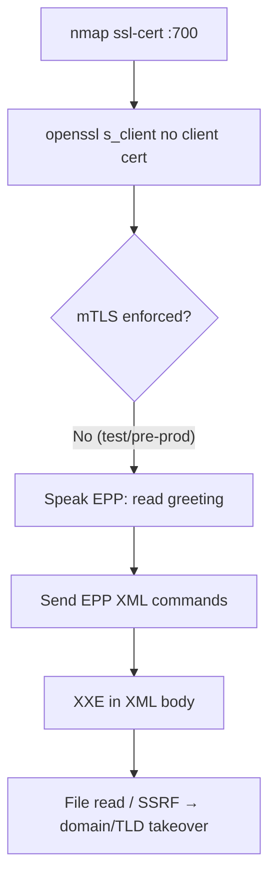

# 88 - EPP (Port 700) Pentesting

## 1. Executive Summary

EPP (Extensible Provisioning Protocol) is how domain **registries and registrars** manage domain names — register, renew, transfer, delete — over **TCP 700, usually with TLS and mutual-TLS (mTLS)**. It's an extremely high-value target: compromising an EPP server can mean **taking over entire TLDs / any domain**. EPP messages are **XML**, and real research found multiple implementations vulnerable to **XXE (XML External Entity)**, which would have allowed TLD-wide takeover. The common practical gap: **test/pre-production EPP servers that forget to enforce mTLS**, letting you connect and send XML.

## 2. Protocol Overview & Architecture

EPP is an XML-over-TCP/TLS request/response protocol (`<epp xmlns="urn:ietf:params:xml:ns:epp-1.0">`). Production registries enforce **mTLS** — the client must present a cert issued by the registry CA — plus a login command with credentials. Because every message is parsed as XML, a parser that resolves external entities is exploitable via **XXE** (file read, SSRF, sometimes RCE). The blast radius (registry-level domain control) makes even subtle bugs catastrophic.

## 3. Enumeration & Footprinting

```bash
nmap -p 700 --script ssl-cert,ssl-enum-ciphers <target>
# Test whether mTLS is actually required (many pre-prod servers don't enforce it)
openssl s_client -connect <target>:700 -servername epp.test 2>/dev/null | head
```
If the TLS handshake completes **without a client cert**, mTLS isn't enforced — proceed to send EPP XML.

## 4. Exploitation Deep Dive

### 4.1 mTLS Enforcement Check
Connect with `openssl s_client` and no client cert. Success ⇒ misconfigured (esp. test/pre-prod) ⇒ you can speak EPP.

### 4.2 EPP Session / Greeting
```bash
go install github.com/domainr/epp/cmd/epp@latest
# connect, read <greeting>, send <login> if creds known/guessable
```

### 4.3 XXE in EPP XML
If the parser resolves external entities, inject XXE in any EPP command body for file read / SSRF:
```xml
<?xml version="1.0"?>
<!DOCTYPE epp [<!ENTITY x SYSTEM "file:///etc/passwd">]>
<epp xmlns="urn:ietf:params:xml:ns:epp-1.0"><command>...&x;...</command></epp>
```
On vulnerable registry stacks this escalated to broad domain/TLD compromise.

## 5. Mermaid Attack Flow



## 6. Post-Exploitation
- XXE → internal file read / SSRF; on weak stacks, registry-level domain control.
- Domain takeover = redirect/hijack any affected domain (massive impact).

## 7. Defense & Hardening
1. **Enforce mTLS everywhere** (incl. test/pre-prod); client-cert from registry CA only.
2. Disable XML external-entity resolution in the EPP parser (XXE-safe config).
3. Strong per-registrar credentials + IP allowlists; patch the EPP stack.
4. Segregate and monitor registry infrastructure.

## 8. Chaining Opportunities
- XXE pattern shared with web XXE (Web Application Security category).
- SSRF from XXE → internal services in this module.

## 9. Related Notes
- [[89 - IBM MQ (Port 1414) Pentesting]]

## 10. Tools
`openssl s_client`, `epp` (domainr/Go), `nmap` ssl-*, XXE payloads.
