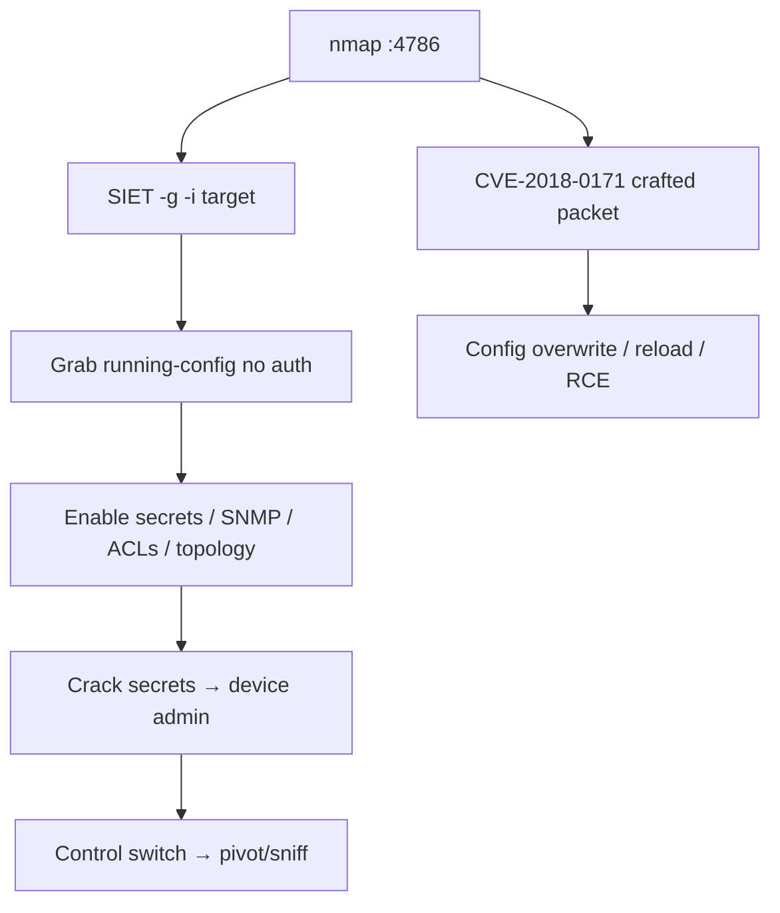

# 90 - Cisco Smart Install (Port 4786) Pentesting

## 1. Executive Summary

Cisco Smart Install (SMI) automates zero-touch provisioning of new Cisco switches — and it's **enabled by default**, listening on **TCP 4786**. Two big problems: (1) the protocol lets a client **request a switch's running configuration with no authentication** (config exfiltration → enable secrets, SNMP strings, VLANs, the whole network blueprint); (2) **CVE-2018-0171** (CVSS 9.8) — a crafted packet to 4786 triggers a buffer overflow allowing config overwrite, reload (DoS), or **RCE** on the switch. The **SIET** tool weaponizes both. Mass-exploited in the wild.

## 2. Protocol Overview & Architecture

SMI uses a director/client model for image+config push to new hardware. The director (or a spoofed one) can instruct a client switch to fetch/replace its config via TFTP, and the client responds to SMI commands on 4786 without authentication — so an attacker speaks the protocol directly to grab or push configs. The CVE-2018-0171 overflow is in the message parsing.

## 3. Enumeration & Footprinting

```bash
nmap -sV -p 4786 <IP>          # 'smart-install'
nmap -p 4786 --script cisco-siet <IP>   # or use SIET directly
```

## 4. Exploitation Deep Dive

### 4.1 Config Exfiltration (SIET)
Pull the device's running config (no auth):
```bash
python SIET.py -g -i 10.10.100.10        # -g = grab config, -i = target IP
```
The config yields enable/secret hashes, SNMP communities, ACLs, VLANs — full network intel.

### 4.2 CVE-2018-0171 (overflow → RCE / config overwrite / DoS)
A crafted packet to 4786 overflows the parser, enabling config replacement, forced reload, or code execution. Use the SIET/Metasploit modules against confirmed-vulnerable IOS versions (authorized scope — can disrupt the network).

### 4.3 Config Push
Spoofing the director, push a malicious config (e.g. add an admin, open a tunnel) to the switch.

## 5. Mermaid Attack Flow



## 6. Post-Exploitation
- Cracked enable secrets → device admin → reroute/sniff, modify ACLs.
- SNMP strings → broader network management access.
- Config push/RCE → persistent network control.

## 7. Defense & Hardening
1. **Disable Smart Install** if unused (`no vstack`); it's on by default.
2. Patch IOS for CVE-2018-0171; ACL/firewall TCP 4786 to provisioning hosts only.
3. Encrypt configs; rotate enable secrets/SNMP strings if exposed.

## 8. Chaining Opportunities
- SNMP strings → **[[07 - SNMP (Ports 161-162) Pentesting]]**.
- Device admin → network pivot/sniff across this module.

## 9. Related Notes
- [[91 - Cisco SD-WAN Control Plane (Port 12346) Pentesting]]

## 10. Tools
SIET, `nmap`, Metasploit Cisco SMI modules.
