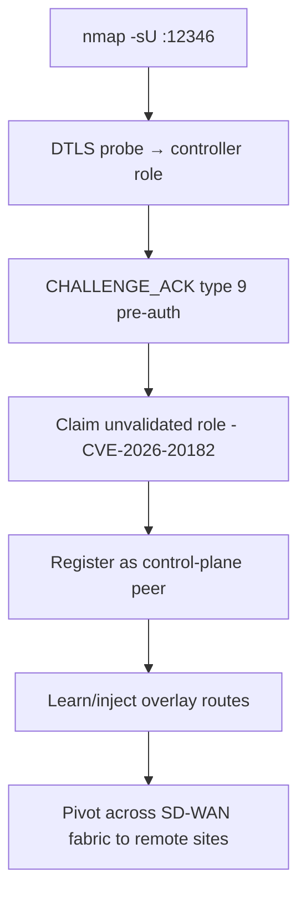

# 91 - Cisco SD-WAN Control Plane (Port 12346/UDP) Pentesting

## 1. Executive Summary

Cisco Catalyst SD-WAN controllers expose a **DTLS control-plane** service (`vdaemon`) on **UDP 12346**. Treat it like a **routing-adjacency surface**: if an attacker becomes (or spoofs) an authenticated control-plane peer, they can pivot into the **overlay fabric** that stitches together an organization's WAN. The instructive bug is **CVE-2026-20182** — a **pre-authentication** handshake message (`CHALLENGE_ACK`, type 9) where role verification (`vbond_proc_challenge_ack`) checked known roles (vEdge/vSmart/vManage) but had **no validation branch for an unexpected claimed role**, an attacker-controlled-role / missing-default-deny flaw.

## 2. Protocol Overview & Architecture

SD-WAN components (vBond/vSmart/vManage controllers + vEdge routers) bootstrap trust over DTLS on 12346. Part of the handshake is in a **pre-auth allowlist** so peers can bootstrap — that's where role-confusion bugs live. Management follow-on ports include SSH 22 and NETCONF 830. The attack pattern to hunt in such proprietary control planes: **pre-auth handshake messages + attacker-chosen role + missing default-deny validation**.

## 3. Enumeration & Footprinting

```bash
nmap -sU -p 12346 <IP>                 # vdaemon DTLS control plane
nmap -sT -p 22,830 <IP>                # follow-on management (SSH, NETCONF)
# DTLS probe
openssl s_client -dtls -connect <IP>:12346 2>/dev/null | head
```

## 4. Exploitation Deep Dive

### 4.1 Identify Controller Role
Fingerprint whether the host is vBond/vSmart/vManage (DTLS cert, follow-on ports). vManage = the management crown jewel.

### 4.2 Pre-Auth Handshake Abuse — CVE-2026-20182
`CHALLENGE_ACK` (message type 9) is reachable before auth. The role check lacked a branch for an unexpected claimed role (e.g. vHub/role 2), so a peer claiming that role bypassed verification. Craft the handshake with the unvalidated role to register as a control-plane peer:
```
# DTLS handshake → CHALLENGE_ACK with claimed role lacking a verification branch
# (Rapid7 PoC pattern for CVE-2026-20182)
```

### 4.3 Overlay Pivot
As an accepted peer, you may inject/learn routes and reach the overlay fabric → pivot across the WAN to remote sites.

## 5. Mermaid Attack Flow



## 6. Post-Exploitation
- Control-plane peer status → overlay route manipulation, traffic interception.
- Pivot to all sites in the SD-WAN fabric.
- Reach vManage → fleet-wide management compromise.

## 7. Defense & Hardening
1. Patch the SD-WAN controllers (CVE-2026-20182 and related).
2. Restrict UDP 12346 / management ports to known controller/edge peers; certificate pinning + strict role validation.
3. Segment and monitor the control plane; alert on unexpected peer registrations.

## 8. Chaining Opportunities
- Overlay pivot → internal services across remote sites (whole module).
- Management ports → device admin.

## 9. Related Notes
- [[90 - Cisco Smart Install (Port 4786) Pentesting]]
- [[92 - Check Point FW-1 (Port 264) Pentesting]]

## 10. Tools
`nmap` (-sU), `openssl s_client -dtls`, CVE-2026-20182 PoC (Rapid7).
