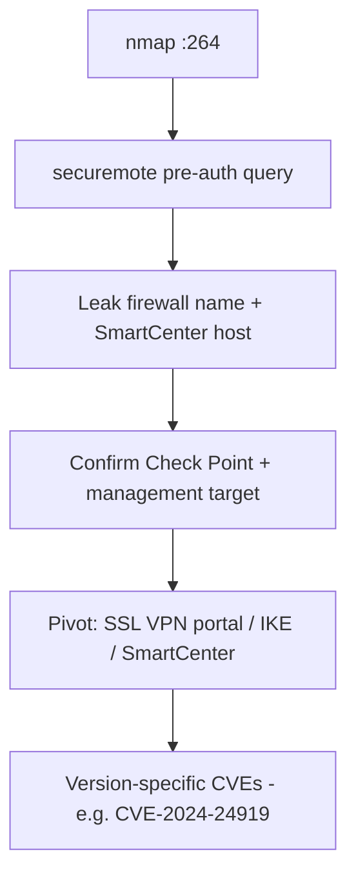

# 92 - Check Point Firewall-1 (Port 264) Pentesting

## 1. Executive Summary

Check Point **Firewall-1** gateways expose the **SecuRemote/SecureClient topology** service on **TCP 264** (`FW1_topo`, an implied-rule service used for topology download by SecureClient/Endpoint Connect). A simple **pre-authentication** query to 264 leaks valuable intel: it **confirms the device is Check Point** and discloses the **firewall's name and the SmartCenter management station's name**. Because it's an implied rule, 264 often answers even when the policy is otherwise restrictive — making it both a reliable Check Point **fingerprint** and a sign that remote-access/management functionality lives behind the gateway.

## 2. Protocol Overview & Architecture

The SecuRemote topology service hands VPN clients the network topology so they know which traffic to encrypt. The pre-auth `securemote` request returns identity strings (CN = firewall name, management host name). This is information disclosure by design of legacy SecureClient — useful for targeting the rest of the Check Point control plane (SmartCenter, mobile access portal, IPsec).

## 3. Enumeration & Footprinting

```bash
nmap -sV -p 264 <IP>
# Metasploit
msf> use auxiliary/gather/checkpoint_hostname
msf> set RHOSTS <IP>
msf> run
# Raw one-liner (leaks CN = firewall + management names)
printf '\x51\x00\x00\x00\x00\x00\x00\x21\x00\x00\x00\x0bsecuremote\x00' | nc -q 1 <IP> 264 | grep -a CN | cut -c 2-
```

## 4. Exploitation Deep Dive

### 4.1 Topology / Hostname Disclosure
The query returns the firewall object name and the SmartCenter management station name — confirming Check Point and naming the management host (a prime next target).

### 4.2 Prioritize the Check Point Control Plane
Use the leaked names to focus follow-on work: SmartCenter/SMS management, the Mobile Access / SSL VPN portal, IKE/IPsec (UDP 500), and any known Check Point CVEs (e.g. the CVE-2024-24919 information-disclosure on the remote-access portal) for the identified version.

## 5. Mermaid Attack Flow



## 6. Post-Exploitation
- Device + management-host names → targeted attacks on the control plane.
- Topology hints → internal network layout.
- Feeds VPN/portal CVE exploitation.

## 7. Defense & Hardening
1. Disable/restrict the SecuRemote topology service (264) if legacy SecureClient isn't needed.
2. Restrict 264 to required client networks; patch Check Point (RCE/info-disclosure CVEs).
3. Harden the SSL VPN/Mobile Access portal; monitor pre-auth topology requests.

## 8. Chaining Opportunities
- IKE/IPsec → **[[59 - IPsec IKE VPN (Port 500) Pentesting]]**.
- Management host → admin compromise → network pivot.

## 9. Related Notes
- [[93 - HP Insight Manager (Ports 2301-2381) Pentesting]]

## 10. Tools
Metasploit `checkpoint_hostname`, `nc`, `nmap`.
