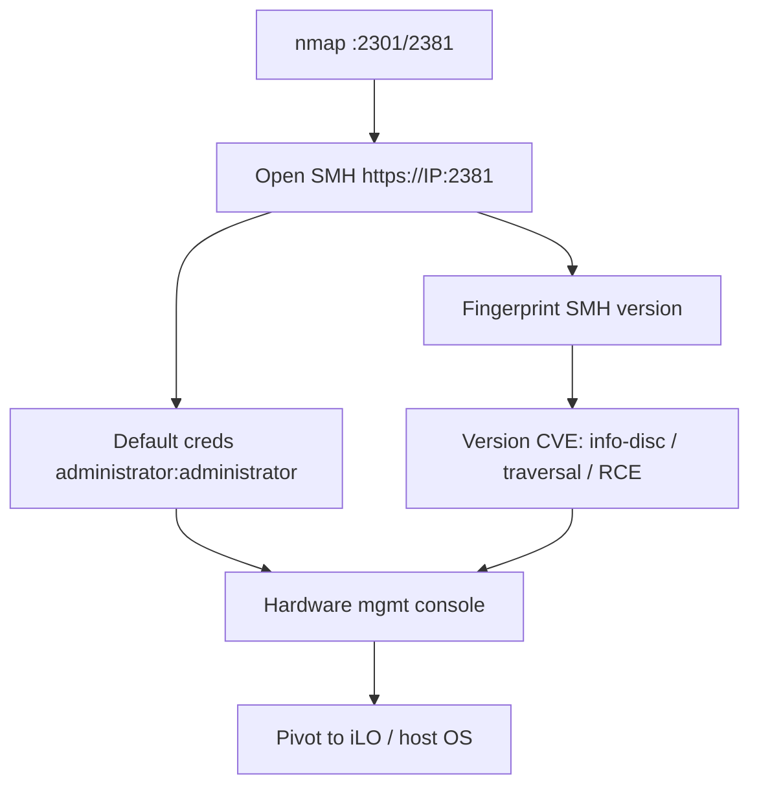

# 93 - Compaq/HP Insight Manager (Ports 2301/2381) Pentesting

## 1. Executive Summary

Compaq/HP Insight Manager (and the System Management Homepage, SMH) is server hardware-management software on **TCP 2301** (HTTP UI) and **2381** (HTTPS). It's an old, often-forgotten management surface on HP ProLiant servers. The main wins are **default credentials** (`administrator`/`administrator`, `admin`/`admin`, plus product-specific defaults) and **version-specific CVEs** in SMH (information disclosure, XSS, and several RCE/privesc bugs over the years). Management access exposes hardware control, server inventory, and a foothold toward the host OS / iLO.

## 2. Protocol Overview & Architecture

The agent serves a web management console (2301 redirects to the 2381 HTTPS SMH). It authenticates against local OS accounts or built-in admin users. Because it's a privileged management daemon running on the server, console access can read sensitive system data and, via known SMH vulnerabilities, escalate to command execution on the host. It's commonly co-resident with **iLO** out-of-band management.

## 3. Enumeration & Footprinting

```bash
nmap -sV -p 2301,2381 <IP>
curl -sk https://<IP>:2381/        # System Management Homepage login
# fingerprint SMH version for CVE mapping
```

## 4. Exploitation Deep Dive

### 4.1 Default / Weak Credentials
Try the well-known logins:
```
administrator : administrator
admin : admin
# plus OS local accounts; check vendor default-password lists
```
A valid login = full hardware management console.

### 4.2 Version CVEs
Map the SMH version to known CVEs — multiple info-disclosure, directory-traversal, XSS, and RCE/privesc issues exist across SMH releases. Use the matching PoC/Metasploit module.

### 4.3 Pivot to Host / iLO
The console reveals server inventory, OS details, and often links/credentials toward **iLO** (out-of-band) — pivot to full server control (virtual media → own the OS, like IPMI/BMC).

## 5. Mermaid Attack Flow



## 6. Post-Exploitation
- Hardware management + server inventory.
- SMH RCE/traversal → host data / command execution.
- Pivot to iLO → out-of-band full server control.

## 7. Defense & Hardening
1. Change all default credentials; restrict SMH to admin networks.
2. Patch/upgrade SMH (many CVEs); disable if unused.
3. Firewall 2301/2381; segment management interfaces (incl. iLO) on a dedicated VLAN.

## 8. Chaining Opportunities
- iLO/BMC pivot → see **[[58 - IPMI (Port 623) Pentesting]]** (out-of-band takeover pattern).
- Host RCE → **System and Privilege Escalation**.

## 9. Related Notes
- [[94 - PPPP P2P Cameras (Port 32100) Pentesting]]

## 10. Tools
`curl`, `nmap`, Metasploit SMH modules, vendor default-password lists.
