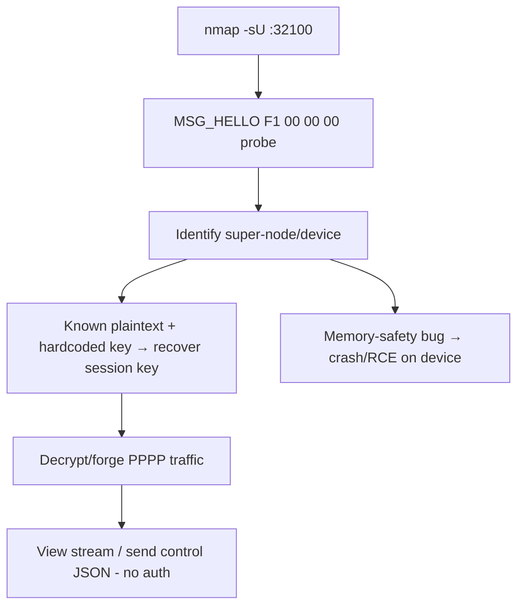

# 94 - PPPP (CS2) P2P Cameras (Port 32100/UDP) Pentesting

## 1. Executive Summary

PPPP (a.k.a. "P2P") is a proprietary CS2 Network connectivity stack embedded in huge numbers of **cheap IP cameras and IoT devices**. It provides rendezvous, NAT traversal (UDP hole punching), a reliable stream over UDP, and **ID-based addressing** so an app can reach a device anywhere on the internet knowing only its device ID. The **rendezvous/super-node listener is UDP 32100**. The stack is notorious for **missing authentication, weak/hardcoded crypto, and memory-safety bugs** — enabling device discovery, traffic decryption, and takeover of internet-exposed cameras. Privacy-critical: live video of homes/businesses.

## 2. Protocol Overview & Architecture

Devices keepalive to rendezvous servers, which learn their public NAT mapping; clients query the server for the mapping and hole-punch a direct UDP flow (relayed if traversal fails). The control plane is usually **JSON commands over the PPPP stream**. Crypto is weak: the first 4 bytes of `MSG_HELLO` to 32100 are the known plaintext **`F1 00 00 00`**, so observing one handshake allows rapid key recovery/validation; some messages (e.g. `MSG_REPORT_SESSION_READY`) use a **library-hardcoded key shared across apps**.

## 3. Enumeration & Footprinting

```bash
# A minimal hello probe fingerprints super-nodes/devices
nmap -sU -p 32100 <IP>
# Known plaintext: MSG_HELLO first 4 bytes = F1 00 00 00
printf '\xf1\x00\x00\x00' | nc -u <IP> 32100      # observe response
# Internet scanners (Shodan) identify 32100/UDP responders by known error strings
```

## 4. Exploitation Deep Dive

### 4.1 Super-Node / Device Discovery
The hello probe identifies PPPP servers and some devices via known plaintext/error responses — map exposed cameras.

### 4.2 Crypto Weakness → Decrypt / Hijack
Known plaintext (`F1 00 00 00`) + hardcoded shared keys let you recover session keys and **decrypt/forge** PPPP traffic — view streams or issue control commands without legitimate auth.

### 4.3 Control-Plane Abuse & Memory Bugs
JSON control commands commonly lack auth (view feed, change settings); the duplicated ACK/retx code paths and parsers have memory-safety bugs exploitable for crashes/RCE on the device.

### 4.4 Device-ID Enumeration
Because addressing is by device ID, weak/sequential ID + default password schemes allow reaching many devices globally (the basis of mass camera-exposure reports).

## 5. Mermaid Attack Flow



## 6. Post-Exploitation
- Live/recorded video access (severe privacy impact).
- Device control + settings change; potential RCE → IoT foothold.
- Pivot via device's local network position.

## 7. Defense & Hardening
1. Avoid PPPP-based devices; if used, block outbound to PPPP rendezvous and UDP 32100 where feasible.
2. Network-isolate IoT cameras (separate VLAN, no internet); change default device passwords.
3. Demand vendor firmware with proper auth/crypto; patch.

## 8. Chaining Opportunities
- Camera foothold → LAN pivot; related camera path **[[62 - RTSP (Ports 554-8554) Pentesting]]**.
- Discovery overlap with **[[80 - WS-Discovery (Port 3702) Pentesting]]** / **[[81 - mDNS (Port 5353) Pentesting]]**.

## 9. Related Notes
- [[95 - Tiller Helm (Port 44134) Pentesting]]

## 10. Tools
`nmap` (-sU), `nc -u`, PPPP research tools (known-plaintext key recovery), Shodan.
