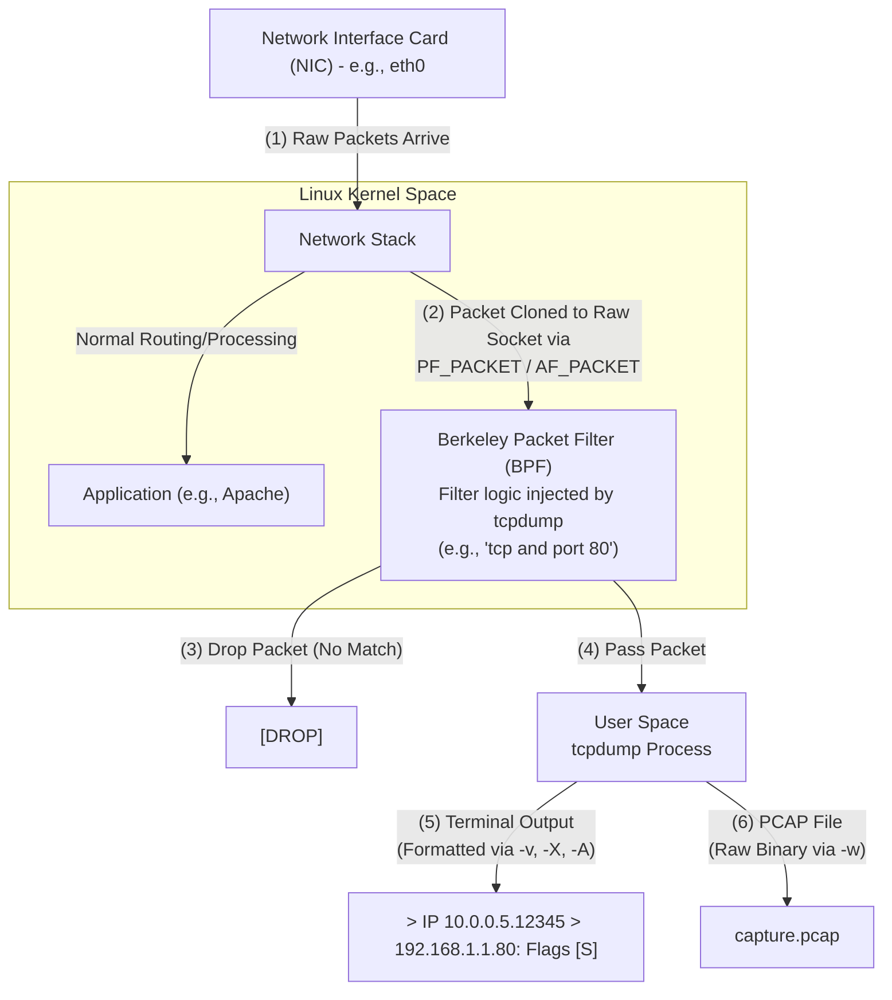

# tcpdump Basics and Command Line Sniffing

## Introduction to tcpdump
`tcpdump` is the premier command-line packet sniffer and network analyzer for Unix-like operating systems. While GUI tools like Wireshark provide extensive visual analysis capabilities, `tcpdump` excels in environments where graphical interfaces are unavailable, undesirable, or computationally prohibitive. It operates strictly from the terminal, making it an essential tool for system administrators, network engineers, and penetration testers operating on headless servers, routers, or during restricted SSH sessions.

The core strength of `tcpdump` lies in its raw speed, low resource consumption, and the immense power of the Berkeley Packet Filter (BPF) syntax it utilizes to capture and display traffic. During a Vulnerability Assessment and Penetration Testing (VAPT) engagement, knowing how to wield `tcpdump` is crucial for verifying exploit payloads, monitoring reverse shell connections, capturing credentials on compromised infrastructure, or troubleshooting routing issues during pivoting.

## Why Command Line Sniffing?
In modern offensive security engagements, you rarely have a graphical desktop environment on a compromised pivot machine. When you land a shell on a Linux server deep inside an internal network, you cannot install Wireshark. You must rely on the tools already present (Living off the Land) or lightweight static binaries you can upload. `tcpdump` is frequently pre-installed on many Linux distributions and networking appliances.

Furthermore, running a GUI packet analyzer on a high-traffic link can easily exhaust system memory and crash the application. `tcpdump`, particularly when writing raw packets directly to a file (`-w`), is highly optimized and can handle massive throughput without dropping packets, provided the underlying storage is fast enough. It interacts efficiently with `libpcap` to capture from the network interface driver.

## Execution Privileges
Packet sniffing inherently requires elevated privileges. To place a Network Interface Card (NIC) into promiscuous mode and tap into the raw socket layer to capture packets, `tcpdump` must be run as the `root` user or with `sudo`. Alternatively, on highly secure systems, specific Linux capabilities (like `CAP_NET_RAW` and `CAP_NET_ADMIN`) can be granted to the binary or a specific user, though running it as root is the standard paradigm. If privileges are restricted, you may encounter 'Operation not permitted' or 'Permission denied' errors immediately upon launch.

## Basic Syntax and Essential Flags
The fundamental usage of `tcpdump` follows this structure:
`tcpdump [flags] [BPF filter expression]`

Understanding the operational flags is critical for controlling what `tcpdump` captures, how it formats the output, and where it sends the data.

### Interface Selection (`-i`)
By default, `tcpdump` will listen on the first network interface it finds (usually `eth0` or `ens33`), excluding the loopback interface. To specify an interface, use the `-i` flag.
- `tcpdump -i eth1`
- `tcpdump -i lo` (Listen on the local loopback, crucial for debugging local services)
- `tcpdump -i any` (A special meta-interface that listens on all available interfaces simultaneously. Note: Traffic captured on 'any' will not show the physical MAC addresses because it abstracts the link layer).

### Name Resolution (`-n`, `-nn`)
By default, `tcpdump` attempts to resolve IP addresses to hostnames (via reverse DNS) and port numbers to service names (via `/etc/services`). This DNS resolution can significantly slow down the capture process, generate unwanted DNS traffic of its own, and alert defenders to your presence if you trigger anomalous reverse lookups.
- `-n`: Do not resolve IP addresses to hostnames.
- `-nn`: Do not resolve IP addresses to hostnames AND do not resolve port numbers to service names. **This is highly recommended for almost all VAPT scenarios.**

### Output Verbosity (`-v`, `-vv`, `-vvv`)
To increase the amount of detail printed to the terminal for each packet:
- `-v`: Prints slightly more information (e.g., TTL, IP ID, total length, options).
- `-vv`: Prints even more detail, including NFS and SMB decoded information.
- `-vvv`: Maximum verbosity, fully decoding protocols like telnet or routing protocols.

### Packet Content Display (`-X`, `-x`, `-A`)
When analyzing traffic, you often need to see the payload data, not just the headers.
- `-A`: Prints each packet in ASCII. Highly useful for quickly spotting cleartext protocols like HTTP, FTP, or Telnet.
- `-x`: Prints the packet data in hexadecimal.
- `-X`: Prints the packet data in both hexadecimal and ASCII side-by-side. This is excellent for low-level protocol analysis and exploit development verification.
- `-e`: Print the link-level header (MAC addresses). Crucial for Layer 2 analysis like ARP spoofing.

### File Input/Output (`-w`, `-r`)
Printing raw packet data to a terminal is only useful for quick checks. For in-depth analysis, you should capture the raw packets to a file (PCAP format) and analyze them later using Wireshark or other tools.
- `-w filename.pcap`: Writes the raw, unparsed packets to the specified file. (e.g., `tcpdump -i eth0 -w capture.pcap`). Note that when using `-w`, nothing is printed to the terminal.
- `-r filename.pcap`: Reads and parses packets from a previously saved capture file, rather than from a live network interface. You can apply BPF filters when reading from a file as well. (e.g., `tcpdump -r capture.pcap port 80`).

### Packet Count (`-c`)
To stop the capture automatically after a certain number of packets, use `-c`.
- `tcpdump -c 100 -i eth0`: Captures exactly 100 packets and exits.

### Snapshot Length (`-s`)
Historically, `tcpdump` only captured the first 68 or 96 bytes of a packet (the headers) to save disk space. Modern versions usually default to capturing the entire packet (`-s 0` or `-s 262144`). If you only care about headers (e.g., just looking at IP addresses and ports), you can lower the snaplen to reduce file size and increase processing speed.
- `tcpdump -s 0 -i eth0 -w full_payload.pcap`: Ensures the entire packet payload is captured without truncation.

## Berkeley Packet Filter (BPF) Syntax Deep Dive
The true power of `tcpdump` lies in BPF. It allows you to define complex, kernel-level filters to isolate exactly the traffic you care about. If a packet does not match the BPF filter, it is dropped immediately by the kernel, saving CPU cycles and memory.

### Host and Network Filters
- `host 192.168.1.100`: Captures traffic to or from this IP.
- `src host 10.0.0.5`: Captures traffic originating from this IP.
- `dst host 10.0.0.5`: Captures traffic destined for this IP.
- `net 172.16.0.0/16`: Captures traffic within this subnet.
- `src net 192.168.1.0 mask 255.255.255.0`: Alternative subnet syntax.

### Port and Protocol Filters
- `port 80`: Captures traffic where either the source or destination port is 80.
- `src port 22`: Captures traffic originating from port 22.
- `portrange 1000-2000`: Captures traffic within this port range.
- `tcp`: Captures only TCP traffic.
- `udp`: Captures only UDP traffic.
- `icmp`: Captures only ICMP (ping) traffic.
- `arp`: Captures ARP requests and replies.

### Logical Operators
You can combine primitives using logical operators: `and` (`&&`), `or` (`||`), `not` (`!`). Use single quotes around your filter expression to prevent the shell from interpreting special characters or spacing issues.
- Capture SSH or HTTP traffic: `tcpdump -nn 'port 22 or port 80'`
- Capture traffic from a specific subnet, excluding ping: `tcpdump -nn 'src net 10.10.10.0/24 and not icmp'`
- Capture traffic between two specific hosts: `tcpdump -nn 'host 192.168.1.5 and host 192.168.1.10'`

### Advanced Filtering: TCP Flags and Byte Offsets
You can inspect specific bytes within a packet header. This is advanced but incredibly powerful for detecting specific types of scans, handshakes, or protocol signatures.
The syntax is `proto[offset:size]`.

- **Isolating TCP SYN Packets (Detecting SYN Scans):**
  The TCP flags are located at the 13th byte of the TCP header.
  A cleaner syntax provided by `tcpdump`: `tcpdump 'tcp[tcpflags] == tcp-syn'`
- **Isolating TCP SYN/ACK Packets:**
  `tcpdump 'tcp[tcpflags] == tcp-syn|tcp-ack'`
- **Isolating TCP PUSH/ACK (Data Transfer):**
  `tcpdump 'tcp[tcpflags] & (tcp-push|tcp-ack) == (tcp-push|tcp-ack)'`
- **Isolating ICMP Echo Requests:**
  `tcpdump 'icmp[icmptype] == icmp-echo'`

## PCAP vs PCAP-NG
Historically `tcpdump` writes in the standard `libpcap` format (.pcap). Modern network analyzers utilize PCAP-NG (.pcapng) which supports storing advanced metadata like interface names, drop counters, and comments directly within the file. While `tcpdump` can read basic pcapng, it fundamentally writes standard legacy pcap format. Always be aware of this compatibility when transferring captures to full-suite GUI tools.

## Common Use Cases in Penetration Testing

1. **Monitoring for Reverse Shells:**
   When you execute a reverse shell payload, you want to ensure the target is actually attempting to connect back to you.
   `tcpdump -i any -nn port 4444` (Assuming your netcat listener is on 4444).

2. **Verifying Exploitation Delivery:**
   If an exploit is failing, capturing the traffic allows you to verify that the target port is open, that your payload is structurally correct, and to see the exact error message the server might be returning.
   `tcpdump -i eth0 -nn -X dst host <target_ip> and dst port <target_port>`

3. **Passive Credential Sniffing (Pivoting):**
   Once you compromise a router or a central server, you can passively monitor for plaintext credentials passing through.
   `tcpdump -i eth1 -nn -A 'port 21 or port 23 or port 80'` (Monitoring FTP, Telnet, and HTTP).

4. **Detecting C2 Beacons:**
   If you suspect a machine on the network is compromised, you can monitor its outbound traffic for periodic, rhythmic connections characteristic of Command and Control beacons.

---

## ASCII Architecture Diagram

## Defensive Perspective
Defenders utilize `tcpdump` constantly. It is the first line of defense for diagnosing network anomalies. When an IDS/IPS triggers an alert, the immediate next step is often to run `tcpdump` on the affected segment to manually verify the malicious traffic. Furthermore, automated scripts often leverage `tcpdump` to capture short rolling PCAPs of high-risk assets, ensuring forensic evidence is available immediately following a breach. It is also used extensively to debug firewall rule interactions, ensuring that dropped packets are visibly logged at the interface boundary before iptables logic applies.

## Chaining Opportunities
- **Living off the Land (LotL):** Post-exploitation, instead of uploading bulky tools, use the native `tcpdump` binary on a compromised Unix host to sniff traffic from other internal systems. See [[15 - Living off the Land Binaries (LOLBins)]].
- **Network Pivoting & Sniffing:** After establishing a SOCKS proxy via SSH or a tool like Chisel, you might want to capture the traffic you are routing. Running `tcpdump` on the pivot point's internal interface allows you to see the unencrypted traffic before it hits the target. See [[16 - Port Forwarding and Pivoting]].
- **ARP Spoofing Verification:** Before running an active MITM attack, `tcpdump` is used to verify that the ARP cache poisoning was successful and that traffic is successfully flowing through the attacker machine. See [[03 - ARP Spoofing and MITM Attacks]].
- **Data Exfiltration Analysis:** Defenders use `tcpdump` logs to reconstruct files exfiltrated via DNS tunneling or ICMP tunneling. See [[20 - Data Exfiltration Techniques]].

## Related Notes
- [[06 - Wireshark Basics and Packet Capture Analysis]]
- [[01 - Introduction to Network Protocols]]
- [[19 - Berkeley Packet Filter BPF Internals]]
- [[12 - Analyzing PCAPs with Zeek and Suricata]]
