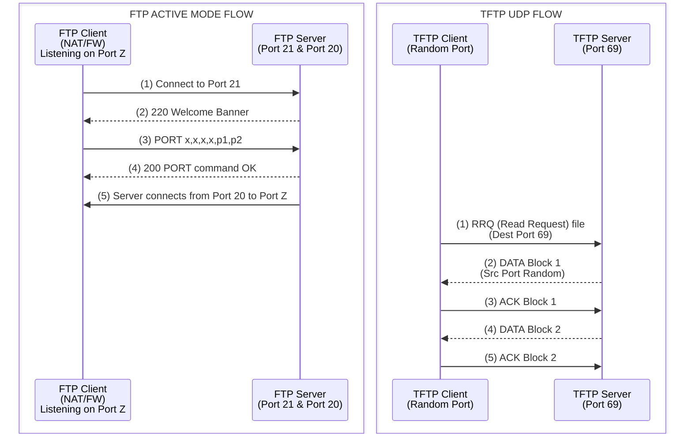

# 11 - Enumerating FTP and TFTP

## Introduction

File Transfer Protocol (FTP) and Trivial File Transfer Protocol (TFTP) are two of the most ubiquitous legacy file-sharing protocols found in enterprise networks. Despite being ancient by internet standards, they remain highly prevalent due to their simplicity, widespread support, and use in legacy systems, automated backups, and embedded devices (like routers, switches, and IoT). 

From a Vulnerability Assessment and Penetration Testing (VAPT) perspective, FTP and TFTP represent incredibly lucrative targets. They are frequently misconfigured, often lack encryption (transmitting credentials and data in plaintext), and can serve as the initial foothold for a broader network compromise. Misconfigured anonymous access, weak credentials, and known software vulnerabilities (like the infamous `vsftpd 2.3.4` backdoor) are standard findings in both internal and external penetration tests.

This document provides an exhaustive, deep-dive exploration of enumerating, attacking, and securing both FTP and TFTP environments.

---

## Protocol Deep Dive: FTP vs TFTP

### File Transfer Protocol (FTP)

FTP operates over the Transmission Control Protocol (TCP) and strictly separates command (control) and data streams. 
- **Command Channel (Port 21):** Used to send commands (e.g., `USER`, `PASS`, `LIST`, `RETR`) and receive responses.
- **Data Channel (Port 20 or High Random Port):** Used to actually transmit the file data or directory listings.

FTP operates in two distinct modes, which drastically alter network behavior and firewall interactions:
1. **Active Mode:** The client connects to the server on Port 21 and issues a `PORT` command, telling the server which port the client is listening on for the data connection. The server then initiates a connection *back* to the client from its Port 20 to the client's specified port. This often fails in modern networks due to client-side NAT and firewalls blocking inbound connections.
2. **Passive Mode:** The client connects to the server on Port 21 and issues a `PASV` command. The server responds with an IP and a random high port ( > 1023) that it is listening on. The client then initiates the data connection to that port. This is firewall-friendly for the client but requires the server to expose a range of high ports.

#### Common FTP Status Codes
Understanding FTP responses is critical for manual enumeration:
- **2xx:** Success (e.g., `230 User logged in`, `220 Service ready for new user`)
- **3xx:** Additional information needed (e.g., `331 User name okay, need password`)
- **4xx:** Transient negative completion (e.g., `421 Service not available`)
- **5xx:** Permanent negative completion (e.g., `530 Not logged in`, `550 Permission denied`)

### Trivial File Transfer Protocol (TFTP)

Unlike FTP, TFTP operates over the User Datagram Protocol (UDP), specifically on **Port 69**. It is designed to be as simple as possible—there is no authentication mechanism, no directory listing (`ls` or `dir`), and no encryption. You either know the exact name of the file you want to download (`get`), or you cannot retrieve it.

TFTP is heavily utilized in:
- Preboot Execution Environment (PXE) booting (loading OS images over the network)
- Cisco and other network equipment configuration backups (`running-config`)
- VoIP phone provisioning (downloading SIP configurations and firmware)

---

## ASCII Diagram: FTP vs TFTP Architecture



---

## FTP Enumeration Methodology

### 1. Banner Grabbing and Version Identification
The first step is always to identify the FTP daemon and its version. This is critical as many FTP servers have publicly known exploits.

**Using Netcat / Telnet:**
```bash
nc -nv 10.10.10.15 21
# Output: 220 (vsFTPd 2.3.4)
```

**Using Nmap:**
```bash
nmap -sV -p 21 10.10.10.15
```

### 2. Anonymous Access Testing
Many FTP servers are configured to allow anonymous access, typically using the username `anonymous` and a blank password, or an email address as the password.

**Manual Interaction:**
```bash
ftp 10.10.10.15
# Name: anonymous
# Password: [Press Enter]
```

**Automated Check with Nmap:**
```bash
nmap -p 21 --script ftp-anon 10.10.10.15
```
*If successful, the output will list the directory contents accessible to the anonymous user.*

**Important Checks for Anonymous Access:**
- Are there sensitive files (backups, passwords, configuration files)?
- **Can we write files?** Use the `put` command. If we can upload files, we might be able to upload a reverse shell to a web root (if the FTP directory overlaps with an IIS/Apache web root), or drop a malicious script into a startup directory.

### 3. Enumerating the System (SYST, STAT, HELP)
Once connected, various commands reveal system information:
```ftp
ftp> SYST
215 UNIX Type: L8
ftp> STAT
211-FTP server status:
    Connected to 192.168.1.100
    Logged in as anonymous
ftp> HELP
214-The following commands are recognized...
```

### 4. Advanced Nmap Scripts for FTP
Nmap's NSE contains several powerful scripts for FTP enumeration:
- `ftp-bounce`: Checks if the server is vulnerable to FTP bounce attacks.
- `ftp-syst`: Retrieves the server OS via the SYST command.
- `ftp-proftpd-backdoor`: Checks for the ProFTPD 1.3.3c backdoor.
- `ftp-vsftpd-backdoor`: Checks for the vsFTPd 2.3.4 backdoor (CVE-2011-2523).
- `ftp-brute`: Performs brute-forcing against the FTP server.

```bash
nmap -p 21 --script ftp-* 10.10.10.15
```

### 5. Brute Forcing Credentials
If anonymous access is disabled, or we want higher privileges, we can brute-force credentials. Note that FTP does not implement account lockouts by default, though modern IPS/IDS will easily catch this.

**Using Hydra:**
```bash
hydra -L users.txt -P passwords.txt ftp://10.10.10.15
```

**Using Medusa:**
```bash
medusa -u admin -P passwords.txt -M ftp -h 10.10.10.15
```

### 6. The FTP Bounce Attack
An archaic but occasionally relevant attack. In Active Mode, an attacker can use the `PORT` command to tell the FTP server to connect to a *third-party* IP and port. This allows the attacker to use the FTP server as a proxy to port scan internal networks or bypass firewall rules. 
Nmap can utilize this via the `-b` flag:
```bash
nmap -Pn -b anonymous:password@10.10.10.15 192.168.1.50
```

---

## TFTP Enumeration Methodology

TFTP is completely blind. You cannot issue an `ls` command to see what is there. Enumeration consists of guessing file names and attempting to download them. 

### 1. Identifying TFTP Services
Because TFTP is UDP, it is often missed by standard TCP scans. You must specifically target UDP port 69.
```bash
nmap -sU -p 69 10.10.10.15
```

### 2. Common Target Files
To enumerate TFTP, you must request specific files. Based on typical TFTP use cases, the following files are excellent targets:
- `running-config` or `startup-config` (Cisco Routers)
- `[router-IP]-confg` (e.g., `10.10.10.1-confg`)
- `network-confg`
- `pxelinux.cfg/default` (Contains paths to boot images, sometimes including plain text credentials or Kickstart/Preseed configuration paths)
- `SIP<mac-address>.cnf` (VoIP Phones - contains SIP server IPs and sometimes extension passwords)

### 3. Manual Extraction
Using a standard TFTP client to request a file:
```bash
tftp 10.10.10.15
tftp> get running-config
tftp> quit
```

### 4. Automated TFTP Enumeration Tools
Automating the guessing of TFTP files is critical.

**Metasploit:**
Metasploit contains modules designed to brute-force TFTP file names based on wordlists and common device patterns.
```bash
msfconsole
msf > use auxiliary/scanner/tftp/tftpbrute
msf > set RHOSTS 10.10.10.15
msf > run
```

**Nmap:**
```bash
nmap -sU -p 69 --script tftp-enum 10.10.10.15
```

---

## Exploitation and Weaponization

### Web Root Overlap (FTP)
If you discover that the FTP root directory is exactly the same as the web server's document root (e.g., `/var/www/html` or `C:\inetpub\wwwroot`), and you have write permissions (via anonymous or weak credentials), you can upload a web shell.
1. Connect via FTP.
2. Upload `shell.php` or `shell.aspx`.
3. Browse to `http://10.10.10.15/shell.php` to achieve Remote Code Execution (RCE).

### Config Extraction (TFTP)
If a Cisco `running-config` is extracted via TFTP:
1. Extract the hashes (Type 5 or Type 7 passwords).
2. Type 7 passwords can be instantly reversed using tools or online crackers.
3. Type 5 (MD5) hashes can be cracked using Hashcat.
4. Use the recovered credentials to SSH or Telnet back into the router and establish routing rules, GRE tunnels, or pivot deep into the network infrastructure.

---

## Defense, Hardening, and Mitigation

To secure FTP and TFTP infrastructures, consider the following best practices:

**FTP Securing:**
1. **Disable Anonymous Access:** Unless absolutely necessary (e.g., public mirror), disable anonymous login in the configuration (`anonymous_enable=NO` in vsftpd).
2. **Implement FTPS or SFTP:** Standard FTP transmits everything in plaintext. Migrate to SFTP (which uses SSH on port 22) or FTPS (FTP over TLS/SSL) to encrypt credentials and data.
3. **Chroot Jails:** Restrict FTP users to their home directories using `chroot`. Prevent path traversal attacks and limit access to system files.
4. **Network Segmentation:** Place FTP servers in a DMZ, completely isolated from internal production networks.
5. **Update Daemons:** Ensure the FTP software is up to date, patching known buffer overflows and backdoors.

**TFTP Securing:**
1. **IP Whitelisting:** Since there is no authentication, access must be controlled at the network layer. Only allow specific IP addresses (e.g., the exact IPs of network devices) to communicate with the TFTP server.
2. **Read-Only Access:** Configure the TFTP server to be strictly read-only unless a specific maintenance window requires writing configs.
3. **Non-Standard Ports:** While security through obscurity is not a defense, moving TFTP to a non-standard internal port can deter automated mass-scanners.
4. **Use SCP/SFTP Instead:** For router config backups, modern devices support SCP. Disable TFTP entirely in favor of encrypted, authenticated transfers.

---

## Chaining Opportunities
- Extracting SNMP read/write community strings from a TFTP Cisco configuration file can be chained to fully compromise a router, as covered in [[16 - SNMP Enumeration and MIB Analysis]].
- Anonymous FTP write access to a web directory perfectly chains into obtaining initial footholds via web shells, linking to [[45 - Uploading and Executing Web Shells]].
- FTP configuration files often share passwords with SSH or Windows Active Directory accounts, leading to Lateral Movement scenarios discussed in [[82 - Lateral Movement via SSH and WinRM]].

## Related Notes
- [[12 - Enumerating SMTP VRFY EXPN]]
- [[13 - Vulnerability Scanning with Nessus and OpenVAS]]
- [[14 - Active vs Passive Reconnaissance in Networks]]
- [[82 - Lateral Movement via SSH and WinRM]]

