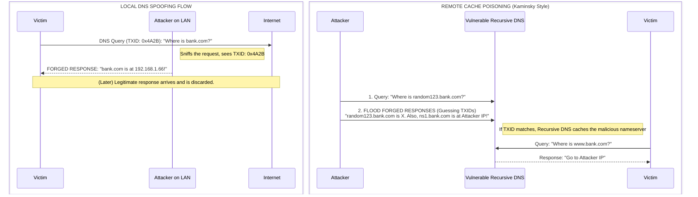

# 72.03 - DNS Spoofing and Cache Poisoning

## Executive Summary
The Domain Name System (DNS) is the "phonebook of the Internet," translating human-readable domain names (like www.example.com) into IP addresses (like 192.0.2.1). Because traditional DNS traffic is unencrypted and heavily relies on the stateless UDP protocol, it is inherently vulnerable to tampering. DNS Spoofing and Cache Poisoning are critical network-level attacks where an adversary injects forged DNS responses into the network or a DNS server's cache. This redirects victim traffic away from legitimate servers and towards attacker-controlled infrastructure, enabling widespread phishing, malware distribution, and credential harvesting.

## Deep Dive: DNS Architecture and Query Flow
To understand DNS exploitation, one must understand the recursive nature of DNS lookups.

When a client (stub resolver) queries a domain:
1. **Local Cache Check:** The client checks its OS-level DNS cache.
2. **Recursive Query:** If not found, it sends a query to its configured Recursive DNS Server (usually provided by the ISP or corporate network).
3. **Iterative Process:** The Recursive Server checks its cache. If absent, it queries the Root Servers, then the TLD Servers (.com), and finally the Authoritative Name Server for the specific domain.
4. **Caching & Response:** The Authoritative server responds. The Recursive Server caches this answer for a specified Time-to-Live (TTL) and forwards the answer back to the client.

DNS queries primarily use UDP over Port 53. Because UDP is connectionless, the only mechanisms a client uses to verify a response are:
1. The **Source IP Address** of the responder.
2. The **Destination Port** (usually ephemeral).
3. The **Transaction ID (TXID)**, a 16-bit number included in the query and matched in the response.

### Wireshark Packet Analysis: Standard DNS Query
```text
Internet Protocol Version 4, Src: 192.168.1.50, Dst: 8.8.8.8
User Datagram Protocol, Src Port: 54321, Dst Port: 53
Domain Name System (query)
    Transaction ID: 0x4a2b
    Flags: 0x0100 Standard query
        0... .... .... .... = Response: Message is a query
        .000 0... .... .... = Opcode: Standard query (0)
        .... ..0. .... .... = Truncated: Message is not truncated
        .... ...1 .... .... = Recursion desired: Do query recursively
    Questions: 1
    Answer RRs: 0
    Authority RRs: 0
    Additional RRs: 0
    Queries
        www.example.com: type A, class IN
```

## The Core Vulnerabilities
The foundational weaknesses of traditional DNS include:
- **Lack of Authentication:** A resolver implicitly trusts any response that matches the Source IP, Port, and TXID.
- **Small TXID Space:** The 16-bit TXID allows only 65,536 possible values, making it susceptible to brute-force attacks if the attacker can flood the resolver.
- **Cleartext Transmission:** UDP packets are transmitted in cleartext, easily observable by anyone on the local network path.

## Attack 1: Local DNS Spoofing
This attack occurs on the Local Area Network (LAN) and usually relies on a pre-existing Man-in-the-Middle (MitM) position (e.g., via ARP Spoofing).

Because the attacker can passively sniff the network, they can see the exact Transaction ID and source port of the victim's DNS request. The attacker simply races the legitimate DNS server to send a forged DNS response back to the victim. Since the attacker is on the local network, their response almost always arrives before the legitimate server's response.

## Attack 2: DNS Cache Poisoning (Remote)
Remote cache poisoning does not require a local network presence. The attacker targets the Recursive DNS Server directly. The goal is to inject a forged record into the server's cache so that *all* clients using that server are subsequently redirected to the malicious IP.

The most famous variant is the **Kaminsky Vulnerability**:
Instead of trying to poison the cache for an existing record (which has a long TTL), the attacker queries the recursive server for non-existent subdomains (e.g., `1234.example.com`).
Simultaneously, the attacker floods the server with forged responses claiming to be the authoritative server. By guessing the 16-bit TXID, one of the forged responses will be accepted. In the forged response, the attacker includes malicious "Additional Records" (Glue Records) that poison the entire zone (e.g., mapping `ns.example.com` to the attacker's IP).

## Architecture & Attack Flow Diagram



## Step-by-Step Exploitation (Local Spoofing)

### 1. Establish MitM
The attacker must first secure a MitM position, typically using ARP spoofing as detailed in earlier modules.
```bash
arpspoof -i eth0 -t 192.168.1.50 192.168.1.1
arpspoof -i eth0 -t 192.168.1.1 192.168.1.50
```

### 2. Configure the Spoofing Rules
Tools like `Ettercap` or `dnsspoof` use a configuration file to map target domains to the attacker's IP.
Create a `hosts.txt` file for `dnsspoof`:
```text
192.168.1.66    *.corporate-login.com
192.168.1.66    www.bank.com
```

### 3. Launch the Attack
Execute `dnsspoof` to intercept queries and provide the forged answers:
```bash
dnsspoof -i eth0 -f hosts.txt
```

### 4. Hosting the Malicious Payload
The attacker must host a web server on `192.168.1.66`. When the victim attempts to navigate to `www.bank.com`, their browser resolves the IP to `192.168.1.66` and loads the attacker's pixel-perfect phishing page, designed to harvest credentials.

## Mitigation and Defense Strategies

### 1. DNSSEC (Domain Name System Security Extensions)
DNSSEC is the ultimate defense against DNS spoofing and cache poisoning. It adds cryptographic signatures to DNS records.
- When a resolver receives a DNSSEC-signed response, it verifies the digital signature using the authoritative server's public key.
- If an attacker injects a forged response, they cannot validly sign it without the private key. The resolver rejects the forged response.

### 2. Source Port Randomization
To mitigate remote cache poisoning attacks, modern DNS servers implement strict source port randomization. Instead of always sending outward queries from UDP port 53, the server uses a random ephemeral port. This expands the entropy an attacker must guess from 16 bits (TXID) to 32 bits (TXID + Port), making brute-force mathematically unfeasible.

### 3. DNS over HTTPS (DoH) / DNS over TLS (DoT)
DoH and DoT encrypt the DNS queries between the client and the recursive resolver. This completely neutralizes local network sniffing, preventing an attacker from observing the TXID or modifying the traffic in transit.

### 4. Zero Trust and HSTS
Even if DNS is spoofed, HTTP Strict Transport Security (HSTS) prevents the browser from downgrading to plaintext HTTP. If the attacker presents a self-signed or invalid TLS certificate, the browser will hard-block the user from accessing the spoofed site.

## Chaining Opportunities
- [[01 - ARP Spoofing and Man-in-the-Middle Attacks]] - ARP spoofing is the required first step for local DNS spoofing.
- [[05 - SMB Relay Attacks]] - DNS spoofing can redirect WPAD (Web Proxy Auto-Discovery) queries to an attacker, forcing victims to authenticate via SMB.
- [[Phishing and Social Engineering]] - DNS spoofing vastly increases the success rate of phishing campaigns by eliminating suspicious URLs.

## Related Notes
- [[Cryptography Fundamentals]]
- [[Active Directory Certificate Services Abuse]]
- [[Web Proxy Auto-Discovery (WPAD) Attacks]]
