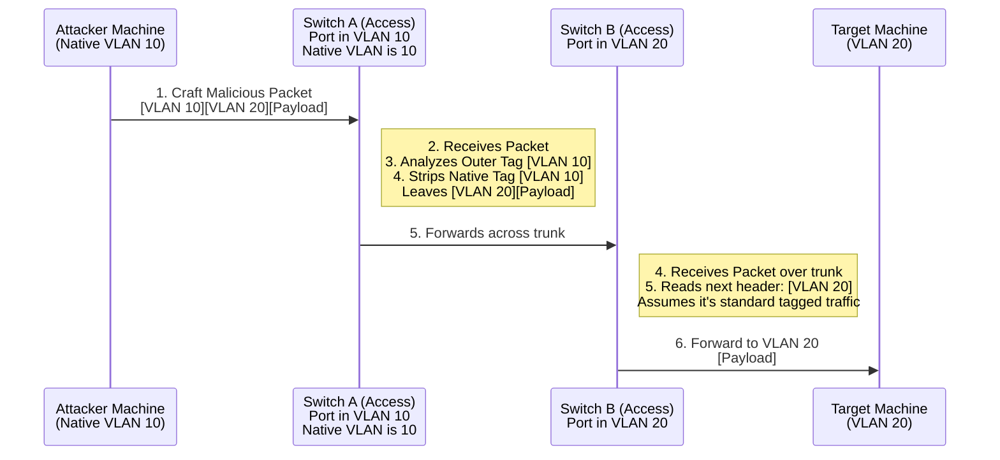

# 72.07 VLAN Hopping Attacks

## 1. Introduction to VLANs and 802.1Q Tagging

Virtual Local Area Networks (VLANs) are a foundational element of modern enterprise network architecture. They are used extensively to logically segment broadcast domains at Layer 2 of the OSI model, regardless of physical location. This segmentation improves network performance by isolating and reducing broadcast traffic, but more importantly, it enhances security by isolating sensitive departments (e.g., Human Resources, Finance, Management) from general user networks and guest networks.

To allow multiple VLANs to traverse a single physical link between two switches or between a switch and a router, the IEEE 802.1Q standard is utilized. 802.1Q achieves this multiplexing by inserting a 4-byte VLAN tag into the Ethernet frame header, specifically after the Source MAC address and before the EtherType field. This tag specifies which VLAN the packet belongs to. These links, carrying traffic for multiple VLANs simultaneously, are known in Cisco terminology as **Trunk Links**.

VLAN Hopping is a network exploitation technique where an attacker connected to one specific VLAN attempts to send traffic to, or receive traffic from, a different VLAN that they are not authorized to access. This effectively bypasses the logical isolation enforced by the switch hardware. There are two primary, well-documented methods for executing VLAN Hopping: **Switch Spoofing** and **Double Tagging**. Understanding both requires a deep understanding of switch port configurations and frame manipulation.

## 2. Dynamic Trunking Protocol (DTP) and Switch Spoofing

### 2.1 The Dynamic Trunking Protocol Mechanics
Cisco switches natively utilize a proprietary protocol called Dynamic Trunking Protocol (DTP) to automatically negotiate the formation of a trunk link between two switch ports. This was designed for plug-and-play convenience, allowing administrators to simply plug two switches together and have them automatically figure out how to trunk.

By default, many older Cisco switch ports were configured to a DTP mode of `dynamic desirable` or `dynamic auto`. 
- **Dynamic Desirable**: The port actively attempts to form a trunk. It continuously sends DTP frames asking the other side to become a trunk.
- **Dynamic Auto**: The port passively waits for the other side to initiate trunking. It will not send DTP frames, but will respond to them and become a trunk if asked.
- **Trunk**: The port is forced to be a trunk and may still send DTP frames to negotiate the encapsulation type (ISL vs 802.1Q).
- **Access**: The port is forced to be a non-trunking access port.

### 2.2 Switch Spoofing Attack Execution
If an attacker plugs their machine into a switch port that is configured for DTP negotiation (e.g., `dynamic desirable` or `dynamic auto`), the attacker can generate and send customized DTP frames to convince the switch that the attacker's machine is actually another switch attempting to form a trunk link. 

Once the switch accepts the DTP negotiation, the port transitions from a standard access port into a trunk port. The attacker now has Layer 2 access to all VLANs permitted on that trunk (which is often all VLANs by default). The attacker can then "hop" into any VLAN by simply tagging their outbound frames with the desired 802.1Q VLAN ID and creating virtual interfaces on their attack machine for each VLAN.

```mermaid
sequenceDiagram
    participant Attacker as Attacker Machine<br/>(Kali Linux)
    participant Switch as Target Switch<br/>(Port Fa0/1)

    Attacker->>Switch: 1. Connect to wall jack
    Attacker->>Switch: 2. Send DTP "Desirable" Frame<br/>(Using Yersinia or Scapy)
    Switch-->>Attacker: 3. Switch receives DTP, assumes<br/>attacker is another switch
    Attacker<->>Switch: 4. Trunk Link Established successfully
    Attacker->>Switch: 5. Send 802.1Q tagged packet (VLAN 50)<br/>[Eth Hdr][802.1Q Tag: 50][IP Payload]
    Note right of Switch: 6. Switch accepts frame and forwards<br/>it natively to target VLAN 50
```

## 3. Double Tagging Attack and the Native VLAN

### 3.1 The Native VLAN Concept Explained
In an 802.1Q trunk, one specific VLAN must be designated as the "Native VLAN" (usually VLAN 1 by default, though this can be changed). Traffic belonging to the Native VLAN is transmitted across the trunk link **untagged**. This was originally designed to support legacy devices that did not understand 802.1Q tagging, allowing them to still communicate across trunk links. 

When a switch receives an untagged frame on a trunk port, it automatically assumes the frame belongs to the currently configured Native VLAN.

### 3.2 Double Tagging Mechanism
Double tagging is an ingenious, albeit unidirectional, attack that takes advantage of the way switches process 802.1Q tags in sequential order and how they handle the Native VLAN. It specifically requires the attacker to be connected to an access port that happens to be assigned to the **same VLAN** as the Native VLAN of the trunk link connecting two switches.

The attacker crafts a malicious Ethernet packet containing **two** sequential 802.1Q tags:
1. **Outer Tag**: Matches the Native VLAN (the VLAN the attacker is currently on).
2. **Inner Tag**: Matches the target VLAN the attacker wants to reach.

When the first switch receives the frame, it analyzes the outer tag. Because the outer tag matches the Native VLAN, the switch removes (strips) the outer tag and forwards the frame across the trunk link to the second switch, as native VLAN traffic should always be untagged on the trunk. 

However, the frame now arrives at the second switch with the inner tag still attached. The second switch reads this inner tag, assumes it is a legitimately tagged frame from the trunk, and forwards the packet directly to the target VLAN.


*Crucial Note: This attack is strictly unidirectional. Because the target machine on VLAN 20 receives the packet with the attacker's spoofed IP address, it will attempt to reply. However, it has no route back to the attacker's original IP without going through a Layer 3 router, which will likely drop the packet or route it normally without the double tags. Therefore, this technique is primarily used for blind exploits, delivering UDP payloads (like SNMP exploits), or ICMP-based DoS attacks.*

## 4. Exploitation Execution and Tooling

### 4.1 Tools Required for Practical Exploitation
- **Yersinia**: A powerful network protocol exploitation framework specifically designed to analyze and attack Layer 2 protocols (DTP, CDP, STP, HSRP, VTP, etc.). It is the industry standard for switch spoofing.
- **Scapy**: A highly flexible Python-based interactive packet manipulation program, excellent for crafting double-tagged frames.
- **vconfig / ip link**: Linux utilities used to create virtual 802.1Q VLAN interfaces once a trunk has been established.

### 4.2 Executing Switch Spoofing with Yersinia
To execute a switch spoofing attack, an attacker leverages Yersinia to inject continuous DTP desirable frames into the network.

```bash
# Launch Yersinia in interactive graphical mode (ncurses)
sudo yersinia -I

# Within the Yersinia interface:
# 1. Press 'g' to change the protocol view and select 'DTP'.
# 2. Press 'x' to open the attack menu.
# 3. Select "Enable trunking" to start sending DTP desirable frames.
```
Monitor the switch (or use Wireshark) to verify that a trunk has been established. Once the trunk is live, the attacker must configure their local machine to communicate over the new trunk by creating virtual network interfaces for any VLAN they wish to hop into:

```bash
# Ensure the 8021q kernel module is loaded
sudo modprobe 8021q

# Add a virtual interface for the target VLAN (e.g., VLAN 50)
sudo ip link add link eth0 name eth0.50 type vlan id 50

# Bring the interface up
sudo ip link set dev eth0.50 up

# Assign a static IP address or request one via DHCP on the newly accessible VLAN
sudo dhclient eth0.50
# OR
sudo ip addr add 192.168.50.10/24 dev eth0.50
```

### 4.3 Executing Double Tagging with Scapy
To perform double tagging, an attacker uses Python and Scapy to precisely craft the nested 802.1Q headers. Since it is unidirectional, a blind payload like an ICMP echo request is often used to verify reachability.

```python
from scapy.all import *

# Define the MAC addresses and IPs
target_mac = "00:11:22:33:44:55"
attacker_mac = "aa:bb:cc:dd:ee:ff"
target_ip = "192.168.20.100"
attacker_ip = "192.168.10.50"

# Craft the double-tagged packet
# Outer tag: VLAN 10 (Native) | Inner tag: VLAN 20 (Target)
packet = Ether(dst=target_mac, src=attacker_mac) \
         / Dot1Q(vlan=10) \
         / Dot1Q(vlan=20) \
         / IP(dst=target_ip, src=attacker_ip) \
         / ICMP()

# Send the malicious packet out the interface
sendp(packet, iface="eth0", verbose=True)
```

## 5. Detection and Network Monitoring

Detecting VLAN hopping can be notoriously difficult because the resulting traffic often appears as perfectly legitimate inter-VLAN communication to intrusion detection systems (IDS), which typically lack visibility into Layer 2 encapsulation details. However, at the switch port level, several anomalies can be monitored:

- **DTP Frame Monitoring**: Monitor access ports for unexpected DTP frames. Legitimate access ports connected to end-user workstations or printers should never receive or transmit DTP packets. Alert on any DTP traffic on ports configured for access.
- **Mac Address Flapping**: Rapid changes in MAC address tables across multiple VLANs can indicate an active switch spoofing attack, as the attacker's MAC address suddenly appears on numerous virtual interfaces.
- **Unexpected Trunk Formation**: Implement alerting within network management software (like Cisco Prime, SolarWinds, or via SNMP traps) when a switch port unexpectedly transitions from access mode to trunk mode.
- **Double Tagging Detection**: Deep Packet Inspection (DPI) firewalls and advanced IDS can sometimes be configured to inspect Ethernet headers for stacked 802.1Q tags, though this incurs a performance penalty.

## 6. Mitigation and Best Practices

Defending against VLAN hopping requires strict discipline in the configuration of switch ports and meticulous VLAN management. It is primarily an architectural fix rather than an appliance-based fix.

### 6.1 Mitigating Switch Spoofing
- **Disable DTP Completely**: Turn off Dynamic Trunking Protocol entirely on all access ports. Force ports to operate statically as access ports and explicitly disable negotiation.
```text
Switch(config-if)# switchport mode access
Switch(config-if)# switchport nonegotiate
```
- **Explicit Trunking with DTP Disabled**: For legitimate trunk links between switches, manually configure them and disable negotiation.
```text
Switch(config-if)# switchport mode trunk
Switch(config-if)# switchport nonegotiate
```
- **Port Security**: Implement MAC address limiting on access ports to prevent an attacker from spawning dozens of virtual interfaces with different MACs.

### 6.2 Mitigating Double Tagging
- **Change the Native VLAN**: Never use the default VLAN 1 as the native VLAN. Assign a dedicated, completely unused VLAN ID to be the native VLAN for all trunk links (e.g., VLAN 999).
- **Do Not Assign End Users to the Native VLAN**: Ensure absolutely no access ports are configured to use the native VLAN. The native VLAN should strictly be a "black hole" used only for inter-switch control traffic. If an attacker is not on the native VLAN, the double tagging attack fails completely.
- **Tag the Native VLAN**: Configure the switch to explicitly tag native VLAN traffic across trunk links, completely eliminating the reliance on untagged frames. This stops the switch from arbitrarily stripping outer tags.
```text
Switch(config)# vlan dot1q tag native
```

## 7. Chaining Opportunities

- **DHCP Starvation and Spoofing**: Once hopped into a highly restricted target VLAN, an attacker can execute DHCP starvation to consume all available IP addresses, followed immediately by deploying a rogue DHCP server attack to route all traffic on the secure VLAN through their machine. See `[[11 - DHCP Starvation and Rogue Servers]]`.
- **ARP Spoofing in Target VLAN**: After gaining Layer 2 access to a restricted VLAN (like the server management VLAN), execute ARP spoofing to intercept traffic between high-value targets (e.g., between an application server and a database). See `[[03 - ARP Spoofing and MITM]]`.
- **Bypassing Firewalls and NAC**: Leverage the new network vantage point to completely bypass perimeter firewalls, ACLs, and Network Access Control (NAC) systems that rely on VLAN segregation for enforcement. See `[[22 - Bypassing Network Access Control NAC]]`.
- **Lateral Movement**: Utilize the access to scan and attack internal services directly that were previously isolated. See `[[14 - Network Lateral Movement Strategies]]`.

## 8. Related Notes

- `[[06 - IPv6 Spoofing and MITM mitm6]]`
- `[[15 - Cisco Protocol Abuse CDP and STP]]`
- `[[01 - Introduction to Layer 2 Attacks]]`
- `[[22 - Bypassing Network Access Control NAC]]`
- `[[13 - BGP Hijacking and Route Manipulation]]`
