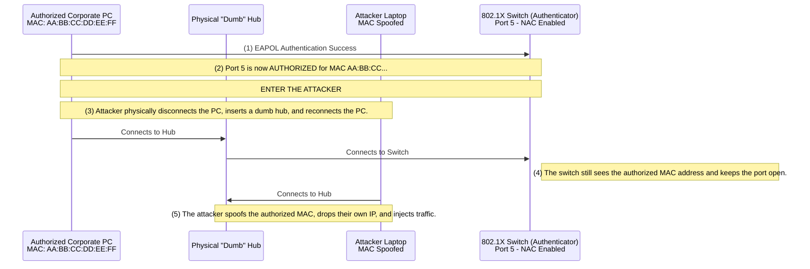

# Bypassing Network Access Control (NAC)

## 1. Introduction to Network Access Control (NAC)

Network Access Control (NAC) is a security architecture that enforces policies on devices attempting to connect to a corporate network. Before a device is granted an IP address and allowed to communicate with other devices, it must be authenticated and authorized. 

NAC systems are designed to prevent rogue devices, unauthorized users, and compromised machines from gaining a foothold on the internal network. The most prevalent standard for port-based network access control is **IEEE 802.1X**.

While NAC significantly raises the barrier to entry for internal network attacks, it is not infallible. Attackers have developed numerous hardware and software techniques to bypass these controls.

## 2. IEEE 802.1X Architecture Deep Dive

Understanding 802.1X is crucial for bypassing it. The architecture consists of three main components:

1. **Supplicant**: The client device (laptop, workstation, printer) attempting to connect to the network. It runs an 802.1X client software.
2. **Authenticator**: The network switch or wireless access point. It acts as a gatekeeper, blocking all traffic (except EAPOL frames) until authentication succeeds.
3. **Authentication Server**: Typically a RADIUS server (like Cisco ISE or FreeRADIUS). It verifies the credentials provided by the Supplicant and tells the Authenticator whether to grant access.

### 2.1 The Authentication Flow
1. The Supplicant connects to a switch port.
2. The Authenticator blocks all standard traffic (DHCP, IP, ARP) and only allows Extensible Authentication Protocol over LAN (EAPOL) frames.
3. The Authenticator challenges the Supplicant for identity.
4. The Supplicant responds, and the Authenticator forwards this to the RADIUS server.
5. If the RADIUS server approves, it sends an `Access-Accept` message to the switch.
6. The switch port transitions to an "Authorized" state, allowing standard network traffic.

## 3. NAC Bypass Techniques Overview

When faced with a NAC-protected port during a physical penetration test or internal red team engagement, attackers typically rely on one of three methodologies:
1. **MAC Spoofing**: Masquerading as an already authorized device (like a printer).
2. **Hubbing Out (Passive Tapping)**: Physically intercepting the connection of an authorized device.
3. **VLAN Hopping**: Exploiting voice VLANs meant for VoIP phones.

## 4. Architectural Diagram: Hubbing Out NAC Bypass



## 5. Exploitation Methodology

### 5.1 MAC Address Spoofing
Many rudimentary NAC deployments rely heavily on "MAB" (MAC Authentication Bypass). MAB is used to allow "dumb" devices that cannot run 802.1X supplicants (like printers, IP cameras, or older medical equipment) onto the network. The RADIUS server simply checks if the device's MAC address is in a whitelist.

**The Attack:**
1. Unplug a networked printer or find its MAC address printed on a sticker on the back of the device.
2. Unplug the printer from the wall jack and plug in your attacking laptop.
3. Spoof your MAC address to match the printer.

```bash
# Bring down the interface
sudo ip link set dev eth0 down

# Change the MAC address
sudo macchanger -m 00:11:22:33:44:55 eth0
# OR manually: sudo ip link set dev eth0 address 00:11:22:33:44:55

# Bring the interface back up
sudo ip link set dev eth0 up

# Request a DHCP lease
sudo dhclient eth0
```
If MAB is configured, the switch will authorize the port, and you will receive an IP address.

### 5.2 Passive Hubbing Out
If true 802.1X is enforced (requiring certificates or PEAP passwords), MAC spoofing alone will fail because you cannot complete the EAP handshake. The "Hubbing Out" technique bypasses this by letting the legitimate machine do the authentication for you.

**The Attack:**
1. Locate an authorized, powered-on PC connected to a wall jack.
2. Unplug the PC from the wall and plug the wall connection into a "dumb" physical hub (not a switch, a true Layer 1 hub).
3. Plug the authorized PC into the hub.
4. The PC will re-authenticate via 802.1X, and the switch port will open.
5. Plug your attacking laptop into the hub.
6. Put your interface into promiscuous mode and sniff the network to identify the legitimate PC's IP and MAC.
7. Spoof the legitimate PC's MAC address on your attacking laptop.
8. Wait for the legitimate PC to go to sleep or perform a localized DoS (carefully) to take over its IP, or use a complex NAT setup (like the `Fenrir` tool) to share the IP transparently.

### 5.3 VoIP VLAN Hopping
Most enterprise networks deploy VoIP phones. Because phones need to boot quickly and often sit in front of the PC (the PC plugs into the phone, the phone plugs into the wall), network engineers often configure the switch port to automatically dump devices claiming to be phones into the "Voice VLAN" without strict 802.1X checks.

Switches identify phones using Cisco Discovery Protocol (CDP) or Link Layer Discovery Protocol (LLDP).

**The Attack:**
1. Plug into a network port.
2. Use a tool like **Yersinia** or a Python script to broadcast CDP packets claiming to be a Cisco IP Phone.
```bash
sudo yersinia cdp -I
```
3. The switch receives the CDP packet, believes a phone has been connected, and dynamically configures the port to grant access to the Voice VLAN.
4. Request a DHCP lease on the Voice VLAN. You now have internal network access, from which you can target VoIP servers, or pivot into the data VLAN.

### 5.4 Attacking EAP-MD5
If the network is using the outdated EAP-MD5 protocol for 802.1X (which transmits the password hash over the wire), an attacker can capture the EAPOL frames and crack the password.

1. Capture the EAP-MD5 challenge and response using Wireshark or `tcpdump`.
2. Extract the packet data.
3. Use `eapmd5pass` to crack the hash offline.
```bash
eapmd5pass -r capture.pcap -w rockyou.txt
```

## 6. Defenses against NAC Bypasses

1. **Implement 802.1X with EAP-TLS:** The strongest defense is requiring client-side certificates (EAP-TLS) for all devices. This defeats simple credential cracking and makes rogue device insertion extremely difficult.
2. **Disable MAB where possible:** Do not use MAC Authentication Bypass. If headless devices must be connected, place them on heavily restricted, isolated VLANs that cannot route to the main corporate network.
3. **Port Security (Sticky MAC):** While easily spoofed, combining port security limits (max 1 MAC per port) with 802.1X can mitigate basic hubbing out attacks.
4. **Endpoint Profiling:** Use advanced NAC solutions (like Cisco ISE) that actively profile devices using DHCP fingerprints, HTTP user-agents, and Nmap scans to verify that a device claiming to be a printer actually behaves like a printer.
5. **Enforce MACsec (802.1AE):** The ultimate mitigation against Hubbing Out. MACsec encrypts the link at Layer 2 between the switch and the endpoint. Even if an attacker uses a hub to intercept traffic, they will only see encrypted frames.

## 7. Chaining Opportunities

- **[[13 - Exploiting Telnet and Cleartext Protocols]]**: Once NAC is bypassed and internal network access is achieved, the immediate next step is firing up Responder or Bettercap to capture cleartext credentials flying across the internal LAN.
- **[[08 - Network Pivoting and Tunneling]]**: A bypassed NAC port serves as the physical beachhead for establishing reverse SSH tunnels back to command and control (C2) infrastructure.

## 8. Related Notes
- [[02 - Introduction to Network Protocols]]
- [[21 - Lateral Movement Techniques]]
- [[72.15 Network Denial of Service DoS Attacks]]
