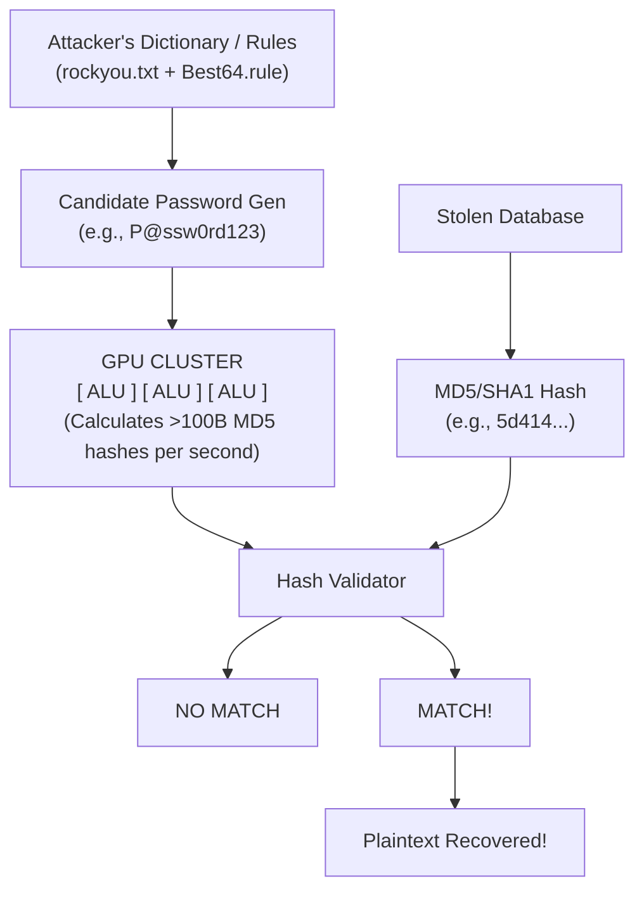

# Weak Hashing Algorithms (MD5, SHA1 for passwords)

## 1. Introduction to Cryptographic Hashing and Passwords

Cryptographic hashing is a mathematical algorithm that maps data of arbitrary size to a bit string of a fixed size (a hash). It is designed to be a one-way function, meaning it is computationally infeasible to invert or reverse the calculation to find the original data. In the context of password security, hashing is fundamentally intended to protect the plaintext password from being exposed in the event of a database compromise.

However, not all hashing algorithms are created equal. Algorithms like **MD5 (Message Digest 5)** and **SHA-1 (Secure Hash Algorithm 1)** were originally designed for data integrity checks (e.g., verifying file checksums) and digital signatures, not for password storage. Their primary design goal was **speed**. While high speed is highly desirable for computing the checksum of a 10 GB ISO file, it is utterly disastrous for storing human-created passwords.

This note deeply explores the fundamental flaws in using fast, general-purpose message digests for password storage, the mathematical background of these legacy algorithms, and how modern hardware exploits these weaknesses.

## 2. Deep Dive: MD5 and SHA-1 Architecture

### 2.1 The MD5 Algorithm
Designed by Ronald Rivest in 1991, MD5 operates on 512-bit blocks of input data and produces a 128-bit (16-byte) hash value, typically rendered as a 32-character hexadecimal number.
It relies on the **Merkle-Damgård construction**:
1. **Padding**: The input is padded so its length modulo 512 is 448.
2. **Length Appending**: A 64-bit representation of the original message length is appended, bringing the total length to an exact multiple of 512.
3. **Initialization**: A 128-bit state is initialized with fixed constants.
4. **Processing**: Each 512-bit block is processed through a compression function consisting of 64 operations grouped in 4 rounds.

**Vulnerabilities in MD5:**
*   **Collision Resistance Failure:** In 2004, Xiaoyun Wang demonstrated a practical collision attack against MD5, meaning two completely different inputs can produce the exact same MD5 hash.
*   **Pre-image Resistance:** While finding the *original* plaintext from an MD5 hash (pre-image attack) is still theoretically difficult without brute-forcing, the incredibly fast execution speed of MD5 renders brute-forcing trivial for typical passwords.

### 2.2 The SHA-1 Algorithm
Designed by the NSA and published in 1995, SHA-1 produces a 160-bit (20-byte) hash value, typically rendered as a 40-character hexadecimal number. It operates similarly to MD5 (Merkle-Damgård construction) but uses 80 rounds of operations instead of 64 and a larger internal state.

**Vulnerabilities in SHA-1:**
*   **SHAttered (2017):** Google and CWI Amsterdam successfully performed a collision attack against SHA-1, producing two different PDF files with the exact same SHA-1 hash.
*   **Speed:** Like MD5, SHA-1 executes incredibly fast on modern CPUs and GPUs, making brute-forcing highly efficient.

## 3. The Core Issue: Execution Speed

The most critical vulnerability when using MD5 or SHA-1 for passwords is not their lack of collision resistance (though that is a serious cryptographic flaw for signatures). The fatal flaw is their **execution speed**.

Modern Graphics Processing Units (GPUs), which contain thousands of Arithmetic Logic Units (ALUs), are incredibly efficient at performing parallel mathematical operations—exactly the kind of operations used in MD5 and SHA-1. 

A single, consumer-grade GPU (like an NVIDIA RTX 4090) can calculate over **100 Billion MD5 hashes per second**. At this speed, a relatively complex 8-character alphanumeric password can be exhaustively brute-forced in a matter of seconds to minutes.

## 4. Architectural Diagram: Hardware-Accelerated Cracking



## 5. Exploitation and Cracking Mechanics

Attackers exploit weak hashing algorithms primarily through offline cracking. Once a database is dumped (e.g., via SQL Injection), the attacker feeds the hashes into dedicated cracking software like Hashcat or John the Ripper.

### 5.1 Dictionary Attacks
The simplest attack. The software hashes every word in a large list (e.g., `rockyou.txt`) and compares it to the target hash. Because MD5/SHA-1 are so fast, massive dictionaries (billions of words) can be processed in seconds.

### 5.2 Rule-Based Attacks
Since humans rarely use simple dictionary words without modification, attackers apply "rules" to dictionary words.
*   *Append numbers:* `password` -> `password123`
*   *Capitalize first letter:* `password` -> `Password123`
*   *Leet speak:* `password` -> `P@ssw0rd123`

### 5.3 Hashcat Execution Examples

**Cracking MD5 (Hash type 0) with a dictionary and ruleset:**
```bash
hashcat -m 0 -a 0 ./stolen_md5_hashes.txt /usr/share/wordlists/rockyou.txt -r /usr/share/hashcat/rules/best64.rule
```

**Cracking SHA-1 (Hash type 100) using a Mask Attack (Brute-forcing a known pattern):**
Assuming the attacker knows the password is exactly 8 characters, starts with a capital letter, followed by 5 lowercase letters, and ends in two digits (e.g., `Spring23`):
```bash
hashcat -m 100 -a 3 ./stolen_sha1_hashes.txt ?u?l?l?l?l?l?d?d
```

### 5.4 Benchmark Data (Approximate rates on a single modern GPU)
*   **MD5:** ~100,000,000,000 hashes/second (100 GH/s)
*   **SHA-1:** ~30,000,000,000 hashes/second (30 GH/s)
*   **Bcrypt (Cost 10):** ~10,000 hashes/second

This stark contrast illustrates why MD5 and SHA-1 are entirely unsuited for passwords.

## 6. Identifying Weak Hashes During a VAPT Assessment

When assessing a web application or database, penetration testers must identify what algorithm is in use. Often, this can be inferred by the hash length and character set.

*   **MD5:** 32 hexadecimal characters (128 bits). Example: `5d41402abc4b2a76b9719d911017c592`
*   **SHA-1:** 40 hexadecimal characters (160 bits). Example: `aaf4c61ddcc5e8a2dabede0f3b482cd9aea9434d`

If you compromise a database via SQL injection or LFI and observe hashes of these lengths, it is highly probable that the system is vulnerable to offline brute-forcing.

## 7. Remediation and Modern Alternatives

The solution to weak hashing algorithms is to use **Key Derivation Functions (KDFs)** or password hashing algorithms specifically designed to be slow and computationally expensive. These algorithms implement a "work factor" or "cost" parameter, allowing the defender to slow down the algorithm as hardware gets faster.

### 7.1 Argon2
The winner of the Password Hashing Competition (PHC). Argon2 comes in three variants:
*   **Argon2d:** Maximizes resistance to GPU cracking attacks (data-dependent memory access).
*   **Argon2i:** Maximizes resistance to side-channel attacks (data-independent memory access).
*   **Argon2id:** A hybrid of both, recommended for general password storage.

### 7.2 Bcrypt
Based on the Blowfish cipher, bcrypt incorporates a salt to protect against rainbow table attacks and an adaptive cost factor. It heavily utilizes RAM, which makes it resistant (though not immune) to GPU and ASIC (Application-Specific Integrated Circuit) based attacks, as GPUs have relatively limited memory bandwidth compared to their ALU count.

### 7.3 PBKDF2 (Password-Based Key Derivation Function 2)
NIST approved. It applies a pseudorandom function (like HMAC-SHA256) to the input password along with a salt and repeats the process many times (thousands or millions of iterations).

### 7.4 Example: Upgrading from MD5 to Bcrypt in PHP

**Vulnerable (Legacy) Implementation:**
```php
<?php
// CRITICALLY VULNERABLE: Uses MD5
$password = $_POST['password'];
$hashed_password = md5($password);
// Store $hashed_password in DB
?>
```

**Secure Implementation:**
```php
<?php
// SECURE: Uses Bcrypt with a built-in salt and cost factor of 12
$password = $_POST['password'];
$options = [
    'cost' => 12,
];
$hashed_password = password_hash($password, PASSWORD_BCRYPT, $options);
// Store $hashed_password in DB

// To verify during login:
if (password_verify($password_attempt, $hashed_password_from_db)) {
    // Login successful
}
?>
```

## 8. Summary

Using MD5 or SHA-1 for passwords represents a critical misconfiguration. Because they lack a work factor and were designed for speed, they expose user credentials to trivial recovery via massive parallelization on modern GPUs. Any system utilizing these algorithms must undergo an immediate cryptographic migration to Argon2, Bcrypt, or PBKDF2.

---

## Chaining Opportunities
*   **SQL Injection (SQLi):** An attacker successfully exploiting an SQLi vulnerability can dump the user database. If the hashes are MD5/SHA-1, the SQLi effectively leads to complete account takeover (ATO).
*   **Local File Inclusion (LFI):** Reading shadow files or configuration files containing weak hashes.
*   **Credential Stuffing:** Once weak hashes are cracked, the plaintext credentials can be used in credential stuffing attacks against other platforms, exploiting password reuse.

## Related Notes
*   [[02 - Rainbow Table Attacks]] - A specific type of precomputation attack heavily used against weak, unsalted hashes.
*   [[03 - Unsalted Password Hashes]] - The lack of salt exacerbates the weakness of MD5/SHA-1, making mass-cracking trivial.
*   [[04 - Key Derivation Functions (KDFs)]] - Deep dive into Bcrypt, Argon2, and PBKDF2.
*   [[15 - SQL Injection (SQLi)]] - The primary vector for obtaining password hashes from a database.
