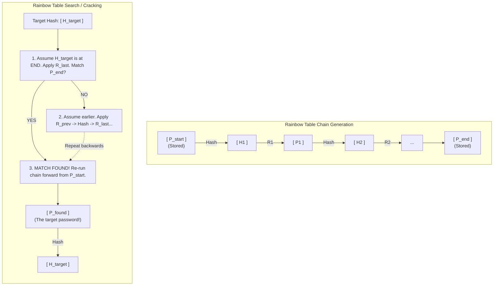

# Rainbow Table Attacks

## 1. Introduction to Time-Memory Trade-offs

In cryptographic attacks against hashed passwords, attackers generally face a choice between two extremes:
1.  **Time-intensive attacks (Brute Force / Dictionary):** The attacker calculates the hash for every possible password on the fly. This requires very little storage (memory) but an enormous amount of computation time.
2.  **Memory-intensive attacks (Lookup Tables):** The attacker precomputes the hash for every possible password and stores them in a massive database (Hash -> Plaintext). When a stolen hash is obtained, cracking it is a simple, instantaneous database lookup. However, for a sufficiently large password space, the storage requirements are astronomical and physically impossible to build.

A **Rainbow Table** represents a brilliant, mathematically elegant middle ground known as a **Time-Memory Trade-off**. Invented by Philippe Oechslin in 2003 (building on earlier work by Martin Hellman), rainbow tables significantly reduce the memory required to store precomputed hashes while keeping the cracking time extremely fast.

## 2. Core Mechanics of Rainbow Tables

Rainbow tables do not store every single hash and its corresponding plaintext. Instead, they store a "chain" of calculations, saving only the starting point and the ending point of the chain.

### 2.1 The Reduction Function
To understand a rainbow chain, one must understand the **Reduction Function (R)**. 
A cryptographic hash function maps a plaintext password to a hash (e.g., `hash(P) = H`).
A reduction function does the opposite: it maps a hash back into the password character space (e.g., `reduce(H) = P'`). 
**Crucial Note:** The reduction function is *not* the inverse of the hash function. It does not reverse the hash to find the original password. It simply takes the hash and deterministically munges it into a string that *looks* like a valid password.

### 2.2 Generating a Rainbow Chain
A chain is generated by alternating Hash (H) and Reduce (R) functions multiple times (thousands of iterations):

1.  Start with an arbitrary initial password (e.g., `P_start = "aaaaaa"`).
2.  Hash it: `H1 = hash(P_start)`
3.  Reduce the hash to get a new password string: `P1 = R(H1)`
4.  Hash the new string: `H2 = hash(P1)`
5.  Reduce the new hash: `P2 = R(H2)`
6.  ... Repeat this process `k` times.
7.  The final result is `P_end`.

The rainbow table stores **only** `P_start` and `P_end`. All the intermediate hashes and plaintexts are discarded, vastly saving storage space. Millions of these chains make up the rainbow table.

### 2.3 The "Rainbow" in Rainbow Tables
Hellman's original time-memory trade-off used a single reduction function. This led to a high rate of **chain collisions**: if two different chains happen to hit the same intermediate password, they will merge and duplicate the rest of the chain, wasting space and computation.
Oechslin solved this by using a *different* reduction function for every step of the chain (`R1`, `R2`, `R3`, ..., `Rk`). Because the reduction functions change at each step (like the colors of a rainbow), chains that collide at step 3 using `R3` will diverge at step 4 when using `R4`, drastically reducing chain merging and improving efficiency.

## 3. The Lookup Process (Cracking Phase)

When an attacker obtains a stolen hash (`H_target`), they use the rainbow table to find the plaintext:

1.  **Step 1:** The attacker takes `H_target` and applies the *last* reduction function in the sequence (`Rk`). This produces a candidate password. They check if this password matches any of the `P_end` values stored in the table.
2.  **Step 2:** If there is no match, the attacker assumes the target hash must have been generated earlier in the chain. They take `H_target`, apply `R(k-1)`, hash it, apply `Rk`, and check the result against the `P_end` column.
3.  **Step 3:** This process of working backwards through the reduction functions continues until a match is found in the `P_end` column.
4.  **Step 4 (Rebuilding the Chain):** Once a match is found, the attacker knows which chain contains the target hash. They look up the corresponding `P_start` for that chain and recalculate the chain from the beginning, moving forward step-by-step.
5.  **Step 5:** When the forward calculation produces the target hash `H_target`, the plaintext password that immediately preceded it in the chain is the cracked password!

## 4. Architectural Diagram: Rainbow Chain Generation & Lookup

## 5. False Alarms
A phenomenon known as a "false alarm" occurs when the table lookup matches a `P_end`, but recalculating the chain from `P_start` does *not* yield the target hash. This happens because reduction functions map a huge space of hashes into a smaller space of passwords, meaning collisions are inevitable (two different hashes reduce to the same password). The cracking software detects and discards false alarms automatically, continuing the search.

## 6. Exploitation Tools

### 6.1 RainbowCrack Suite
RainbowCrack is the most famous suite of tools for generating and using rainbow tables. It consists of three primary binaries:
*   `rtgen`: Used to generate the rainbow tables. Requires parameters like the hash algorithm, charset, password length, chain length, and number of chains.
    *   *Example:* `rtgen md5 loweralpha 1 7 0 10000 1000000 0`
*   `rtsort`: Sorts the generated rainbow tables by their `P_end` values. This is mandatory, as sorting allows the cracking tool to perform rapid binary searches on the endpoint column.
    *   *Example:* `rtsort ./*.rt`
*   `rcrack`: The cracking engine. It takes the sorted tables and a target hash, executing the backwards lookup and forward recalculation.
    *   *Example:* `rcrack ./*.rt -h 5d41402abc4b2a76b9719d911017c592`

### 6.2 Ophcrack
Ophcrack is a Windows password cracker based on rainbow tables. It specifically targets LM (LAN Manager) and NTLM hashes used by Microsoft Windows. Because LM hashes enforce a maximum length of 7 characters and convert all text to uppercase, the possible password space is small, making it incredibly susceptible to rainbow table attacks. Ophcrack can often crack Windows XP/Vista passwords in seconds using free, downloadable tables.

## 7. Limitations of Rainbow Tables

While revolutionary at the time, rainbow tables have several strict limitations:

1.  **Algorithm Specific:** A rainbow table generated for MD5 is completely useless against SHA-1. Every hash algorithm requires its own massive set of tables.
2.  **Length and Charset Specific:** Tables are generated for specific password lengths and character sets (e.g., lowercase letters, length 1-8). If the victim's password contains a symbol or is 9 characters long, a table built for length 1-8 alphanumeric will *never* crack it, regardless of how much time is spent.
3.  **Storage Costs:** Even with the time-memory trade-off, effective rainbow tables can be massive. The Free Rainbow Tables project has tables exceeding hundreds of Terabytes.

## 8. Remediation: The Death of the Rainbow Table

Rainbow tables have largely fallen out of favor in modern penetration testing for two reasons: hardware acceleration (GPUs) and **Salting**.

### 8.1 The Power of the Salt
A cryptographic "salt" is a random, unique string appended to the password *before* hashing: `hash(password + salt)`. 
If a database uses unique salts for every user, the attacker can no longer use a precomputed rainbow table. To attack a salted database with rainbow tables, the attacker would have to compute an entirely separate, massive rainbow table for *every single unique salt* in the database, which is computationally impossible.

**Therefore, the standard remediation against Rainbow Table attacks is to implement properly salted password hashing (using algorithms like Bcrypt, Argon2, or PBKDF2).**

### 8.2 GPU Dominance
Because modern GPUs can calculate tens of billions of hashes per second, attackers often find it easier to perform highly optimized dictionary and rule-based brute-force attacks on the fly using Hashcat, rather than dealing with the massive storage and download times required for high-success-rate rainbow tables.

## 9. Summary

Rainbow tables leverage a sophisticated time-memory trade-off to crack unsalted password hashes almost instantly by precomputing chains of hashes and reduction functions. While mathematically brilliant and historically devastating (especially against Windows LM hashes), the universal adoption of password salting and the rise of massive GPU computing power have rendered rainbow tables largely obsolete against modern systems.

---

## Chaining Opportunities
*   **OS Credential Dumping:** Dumping SAM/SYSTEM hives on legacy Windows environments to extract LM/NTLM hashes, which are heavily targeted by rainbow tables (Ophcrack).
*   **Database Breaches:** Dumping unsalted user tables via SQL Injection provides the raw material needed for rainbow table lookup.

## Related Notes
*   [[01 - Weak Hashing Algorithms (MD5, SHA1 for passwords)]] - The primary targets for rainbow table creation.
*   [[03 - Unsalted Password Hashes]] - The critical vulnerability that allows rainbow tables to function.
*   [[17 - Windows Credential Dumping]] - Discusses LM/NTLM extraction.
