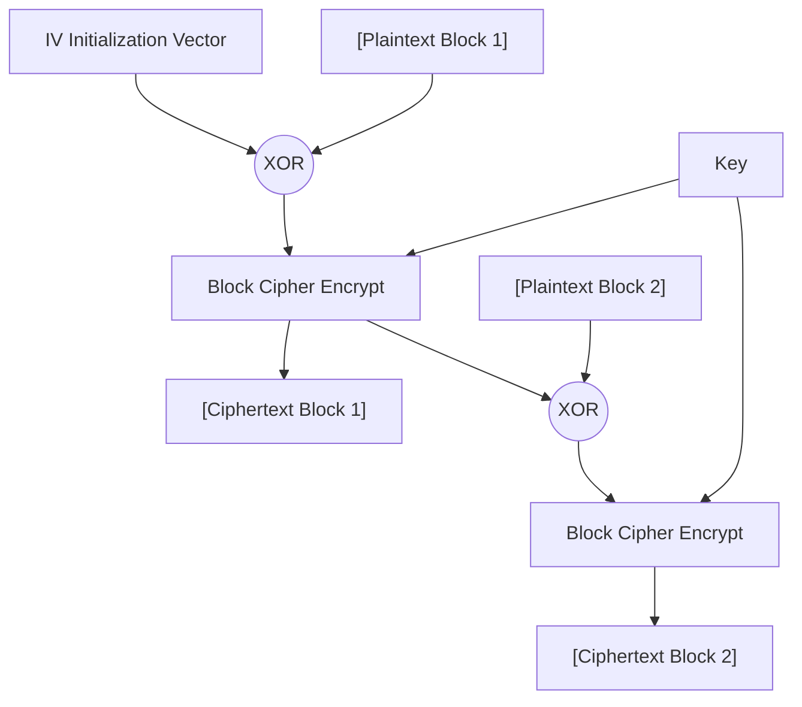

# Predictable IVs and Nonces

## 1. Introduction to IVs and Nonces

In modern cryptography, a deterministic algorithm will always produce the same output for a given input and key. While this is mathematically sound, it introduces a critical security vulnerability: if an attacker observes identical ciphertexts, they know the underlying plaintexts were identical. This violates the principle of **semantic security**.

To solve this, cryptographic systems use Initialization Vectors (IVs) and Nonces (Numbers Used Once). These are essentially random or semi-random values introduced into the encryption process to ensure that encrypting the same plaintext multiple times with the same key yields completely different ciphertexts.

- **Initialization Vector (IV):** Typically used in block cipher modes like Cipher Block Chaining (CBC). An IV must be unpredictable and random.
- **Nonce:** Typically used in stream ciphers (like RC4) or stream-like block cipher modes (like CTR, GCM). The absolute strict requirement for a nonce is that it must **never be reused** with the same key. Predictability is often tolerated, but repetition is catastrophic.

When developers fail to generate, manage, or transmit these values correctly, the cryptographic integrity of the entire system collapses.

---

## 2. Visualizing IV Usage in CBC Mode

### ASCII Diagram: CBC Encryption with IV

As the diagram illustrates, the IV is XORed with the very first block of plaintext before it enters the block cipher. If the IV is static, predictable, or heavily biased, the security of the first block is severely compromised.

---

## 3. The Vulnerability: Predictable IVs in CBC Mode

In CBC mode, the IV must be indistinguishable from random data to an attacker. If an attacker can predict the IV that will be used for the *next* encryption operation, they can mount a Chosen-Plaintext Attack (CPA) to deduce the contents of previously encrypted messages. This is the core mechanic behind the famous **BEAST attack** against early TLS versions.

### Attack Mechanics: The Watermark Attack
Imagine a scenario where a user is browsing via a VPN that uses CBC mode, and the IV is simply a counter (1, 2, 3...) or derived predictably from the system clock. 

An attacker observes a target ciphertext block, $C_1$, which was generated from an unknown target plaintext block, $P_{target}$, using $IV_{target}$.
The mathematical relationship is:
$C_1 = Encrypt(P_{target} \oplus IV_{target})$

The attacker's goal is to guess the value of $P_{target}$. Let their guess be $P_{guess}$.
If the attacker can predict the next IV that the system will use, let's call it $IV_{next}$, they can construct a malicious plaintext block to submit to the system:
$P_{malicious} = P_{guess} \oplus IV_{target} \oplus IV_{next}$

The system takes $P_{malicious}$ and encrypts it using the predictable $IV_{next}$:
$C_{next} = Encrypt(P_{malicious} \oplus IV_{next})$

Substitute $P_{malicious}$ into the equation:
$C_{next} = Encrypt((P_{guess} \oplus IV_{target} \oplus IV_{next}) \oplus IV_{next})$

The two $IV_{next}$ values cancel each other out during the XOR operation:
$C_{next} = Encrypt(P_{guess} \oplus IV_{target})$

Now, the attacker simply compares the resulting ciphertext $C_{next}$ with the originally captured target ciphertext $C_1$.
- If $C_{next} == C_1$, then the attacker's guess was absolutely correct: $P_{guess} == P_{target}$.
- If they do not match, the attacker guesses again.

This allows the attacker to systematically verify guesses about the plaintext, byte by byte or block by block, completely breaking the confidentiality of CBC mode.

---

## 4. The Vulnerability: Nonce Reuse in CTR and GCM Modes

While CBC requires unpredictable IVs, Counter (CTR) mode and Galois/Counter Mode (GCM) operate by generating a keystream that is XORed with the plaintext. This keystream is generated by encrypting a combination of a Nonce and a Counter.

In these modes, the most critical rule of cryptography applies: **Never reuse a nonce with the same key.**

### The "Two-Time Pad" Catastrophe
If a nonce is reused, the exact same keystream is generated for two different plaintexts. This is identical to the fatal flaw of reusing a One-Time Pad.

Let $K$ be the keystream generated by the Key and the reused Nonce.
$C_1 = P_1 \oplus K$
$C_2 = P_2 \oplus K$

An attacker intercepts $C_1$ and $C_2$. They XOR the two ciphertexts together:
$C_1 \oplus C_2 = (P_1 \oplus K) \oplus (P_2 \oplus K)$
$C_1 \oplus C_2 = P_1 \oplus P_2$

The keystream entirely cancels out! The attacker is left with the XOR of the two underlying plaintexts. By using a technique called "Crib Dragging" (sliding common words or expected byte patterns across the XORed stream), the attacker can easily recover both $P_1$ and $P_2$ simultaneously without ever knowing the key or the keystream.

### GCM Nonce Reuse: Total Loss of Authentication
AES-GCM is an Authenticated Encryption with Associated Data (AEAD) mode. It provides both confidentiality (via CTR mode) and integrity (via a polynomial MAC mechanism called GHASH).

If a nonce is reused in AES-GCM, the impact is catastrophic:
1. **Confidentiality Loss:** The attacker can perform the Two-Time Pad attack described above to recover the plaintexts.
2. **Integrity Loss:** By observing two ciphertexts encrypted with the same nonce, an attacker can use basic algebra over a finite field to solve for the GHASH authentication subkey (usually denoted as $H$). Once $H$ is recovered, the attacker can forge valid MACs for *any* arbitrary ciphertext they create. This completely destroys the integrity guarantees of GCM, allowing the attacker to inject malicious data that the server will blindly trust and decrypt.

---

## 5. Practical Examples of IV/Nonce Failures

- **Static IVs:** Hardcoding the IV in the application source code (e.g., `IV = "0000000000000000"`). This means identical plaintexts will yield identical ciphertexts, reverting the cipher back to ECB-like behavior for the first block.
- **Timestamp-based IVs:** Deriving the IV from `time.now()`. Because timestamps are highly predictable and easily brute-forced within a small window, an attacker can reliably predict the IV.
- **Counter-based Nonces without State:** Using a simple incrementing counter for a nonce in GCM mode, but failing to persist the counter across application reboots. If the application crashes and restarts, the counter resets to zero, leading to immediate nonce reuse.

---

## 6. Defense and Mitigation

Ensuring proper IV and Nonce management is crucial for the security of any cryptographic implementation.

1. **Use CSPRNGs for CBC IVs:** When using CBC mode, the IV must be generated using a Cryptographically Secure Pseudo-Random Number Generator (CSPRNG), such as `/dev/urandom` on Linux or the `secrets` module in Python.
2. **Proper Nonce Management for GCM/CTR:**
   - **Random Nonces:** For GCM, use a 96-bit randomly generated nonce (via a CSPRNG) for every encryption. The probability of a collision (and thus nonce reuse) with a 96-bit random value is negligible until millions of messages are encrypted under the same key.
   - **Deterministic Nonces:** Alternatively, use a strictly increasing 64-bit counter combined with a 32-bit fixed device identifier. However, the state of the counter *must* be securely persisted across reboots to prevent reuse.
3. **Use Synthetic IVs (SIV):** For systems where state management is difficult and accidental nonce reuse is a high risk, consider using modes like AES-GCM-SIV (RFC 8452). SIV modes are designed to be "nonce-misuse resistant"; if a nonce is reused, they leak only that the identical plaintext was encrypted again, but they do not allow keystream recovery or authentication key extraction.
4. **Prepend IVs Safely:** IVs and nonces are not secret. They should be generated securely, stored or transmitted safely alongside the ciphertext (typically prepended), and never reused or predicted.

---

## 7. Chaining Opportunities

- **Session Hijacking:** Recovering plaintext session tokens via predictable IV chosen-plaintext attacks allows for unauthorized access.
- **Data Manipulation:** Extracting the GHASH subkey due to GCM nonce reuse allows an attacker to tamper with financial transactions, API parameters, or encrypted application states, bypassing all integrity checks.
- **[[04 - ECB Mode Encryption - Block Boundary Manipulation]]:** A static, hardcoded IV in CBC mode degrades the security of the first block down to the level of ECB, allowing localized block manipulation.

---

## 8. Related Notes

- [[01 - Introduction to Cryptographic Concepts]]
- [[02 - Block Ciphers and Stream Ciphers]]
- [[05 - CBC Padding Oracle Attack]]
- [[07 - Cryptographic Failures in Web Tokens]]
