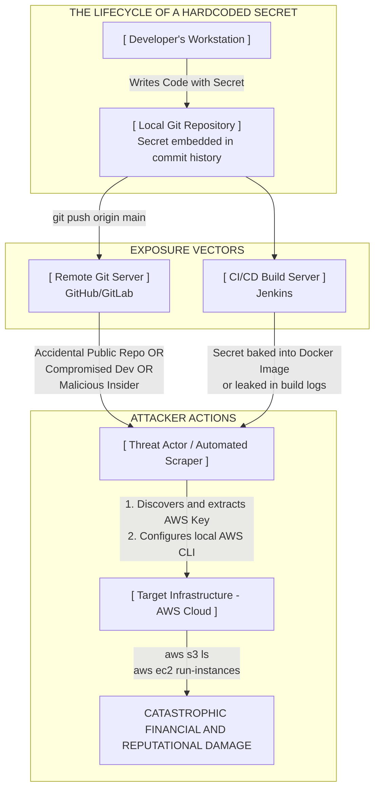

# Hardcoded Secrets in Code

## Introduction: The Fallacy of Code Secrecy
The practice of hardcoding secrets—the act of embedding highly sensitive, credential-equivalent information directly into the plaintext source code or static configuration files of an application—represents one of the most pervasive, damaging, and easily preventable vulnerabilities in the modern software development lifecycle (SDLC).

"Secrets" in this context encompass a wide array of critical assets: API keys for cloud providers (AWS, Azure, GCP), database connection strings containing administrative passwords, asymmetric cryptographic private keys (RSA, ECC), symmetric encryption keys (AES), OAuth access tokens, third-party service integration keys (Stripe, Twilio, SendGrid), and even default administrative credentials for the application itself.

When developers hardcode these values, they are making a fundamental, deeply flawed assumption: that the source code will forever remain a black box, inaccessible to anyone outside the immediate development team. They prioritize the immediate convenience of rapid prototyping and seamless local execution over the fundamental principles of secure architecture.

However, the history of cybersecurity is littered with devastating breaches that prove the "code is secret" assumption entirely false. Source code is inherently leaky. It is replicated across developer workstations, backed up to network attached storage, pushed to centralized version control repositories, packaged into CI/CD build artifacts, compiled into distributable binaries, and delivered directly to the client's device in the case of mobile and front-end applications. Once a hardcoded secret traverses any of these boundaries and is exposed, the cryptographic systems or access controls relying on that secret are instantly and completely compromised.

## The Mechanisms of Secret Exposure and Extraction

Hardcoded secrets are rarely difficult to extract. Threat actors have developed automated pipelines and profound expertise in scanning various mediums to harvest these exposed credentials.

### 1. Version Control Systems (Git and the Eternal History)
The most prolific source of leaked secrets globally is the mismanagement of Git repositories, particularly on platforms like GitHub, GitLab, and Bitbucket.
*   **Accidental Public Exposure:** The simplest and most common error occurs when a developer inadvertently changes a repository's visibility from "Private" to "Public," or accidentally pushes proprietary, internal code to their personal, public GitHub profile.
*   **The Problem of Git History:** A critical misunderstanding of Git leads to sustained vulnerabilities. If a developer hardcodes an AWS key, commits it, realizes their mistake, deletes the key in the next commit, and pushes to the remote server, **the secret is not gone.** Git is a version control system; its primary purpose is to remember every change ever made. The secret remains permanently embedded in the diff history of the earlier commit. Anyone who clones the repository or views the commit history online can trivially retrieve the key.
*   **Automated Scraping Operations:** Threat actors operate massive, automated botnets that continuously monitor GitHub's public event stream via its API. They use complex regular expressions to scan every single commit made globally in real-time. If an AWS `AKIA...` key or a Stripe `sk_live...` key is committed, it is often detected, extracted, and actively exploited within seconds of the push—faster than the developer can realize the error and revoke the key.

### 2. Reverse Engineering Mobile Applications (Android/iOS)
Mobile applications distributed via app stores (APK files for Android, IPA files for iOS) are essentially compressed archives containing the compiled code, assets, and resources. They are executed on a device controlled by the user (and potentially an attacker).
*   **Decompilation and Disassembly:** Attackers utilize powerful, readily available tools like `apktool`, `jadx` (for converting Dalvik bytecode back to readable Java/Kotlin), and `Ghidra` or `IDA Pro` (for analyzing compiled native libraries).
*   **Strings Analysis:** Developers frequently hardcode API keys for backend services (like Firebase, analytics platforms, or custom REST APIs) directly into Java class files or `strings.xml` resources. Once decompiled, these strings are visible in plaintext. Even if ProGuard or R8 is used to obfuscate class and method names, string literals remain intact and easily discoverable.
*   **Dynamic Hooking:** If developers attempt to construct secrets at runtime to evade static analysis (e.g., appending string fragments together), attackers use dynamic instrumentation frameworks like Frida or Xposed. They hook the cryptographic functions or network request APIs at runtime and simply read the fully constructed secret from memory just before it is used.

### 3. Front-End Web Applications (JavaScript/React/Vue)
The advent of Single Page Applications (SPAs) built with frameworks like React, Angular, or Vue.js has led to a massive increase in exposed secrets.
*   **The Client-Side Reality:** Any code shipped to the browser is executed on the client-side. Therefore, **absolutely nothing within frontend JavaScript can be considered a secret.**
*   **Environment Variable Misuse:** Developers often use `.env` files in frontend projects. However, build tools (like Webpack or Vite) bundle these variables directly into the minified JavaScript output files sent to the browser. Anyone opening the Chrome Developer Tools, navigating to the "Sources" tab, and searching the bundled JavaScript can extract these "secrets."

### 4. Containerization and CI/CD Pipelines
*   **Docker Image Layers:** When building Docker images, if a secret is passed via an `ENV` directive or copied into a configuration file in an early layer, it becomes baked into the image history. Even if a subsequent command deletes the file, the underlying layer still contains the secret. Anyone who pulls the image can use commands like `docker history --no-trunc` or tools like `dive` to inspect the layers and extract the data.
*   **CI/CD Build Logs:** Build systems (Jenkins, GitLab CI, GitHub Actions) often output extensive logs. If scripts are not carefully written to mask variables, hardcoded passwords or deployment tokens can be printed directly to the build logs, which are often accessible to a wider range of employees than the source code itself.

## ASCII Diagram: The Secret Exposure and Exploitation Pipeline

## Impact and Real-World Exploitation Scenarios

The severity of a hardcoded secret vulnerability is directly proportional to the privileges associated with the exposed credential.

### Scenario 1: The Uber Breach (2016) - GitHub Exposure
In one of the most famous examples of this vulnerability, Uber engineers published code to a private GitHub repository. However, they had inadvertently granted access to individuals outside the organization. Within that repository were hardcoded AWS access keys.
**The Impact:** Attackers found the keys, authenticated to Uber's AWS environment, and accessed an unencrypted S3 bucket containing the personal data (names, email addresses, phone numbers, and driver's licenses) of 57 million Uber users and drivers. This single hardcoded secret resulted in massive regulatory fines, lawsuits, and severe reputational damage.

### Scenario 2: Hardcoded Cryptographic Keys in Mobile Apps
Consider a mobile healthcare application that stores sensitive patient data locally on the device (e.g., in an SQLite database). To comply with regulations, the developers encrypt the database using AES-256. However, they hardcode the symmetric AES key directly into the Java source code (`public static final String DB_KEY = "SuperSecretKey123!@#";`).
**The Impact:** An attacker downloads the APK, decompiles it, searches for the string "DB_KEY", and extracts the plaintext AES key. If the attacker gains physical or logical access to the device (e.g., via malware or physical theft), they can extract the encrypted database file and decrypt it instantly on their own machine, exposing all patient records. The encryption provided zero practical security.

### Scenario 3: Hardcoded JWT Secret Keys
JSON Web Tokens (JWTs) rely on a secret cryptographic key (usually HMAC SHA-256) known only to the server to sign the token and verify its integrity. If developers hardcode this signing key in the application's source code, and that code is leaked or the application is an open-source project, catastrophe ensues.
**The Impact:** An attacker with the secret key can construct arbitrary JWTs. They can create a token with the payload `{"username": "admin", "role": "superuser"}`, sign it with the exposed key, and present it to the application. The server will cryptographically verify the signature, accept it as valid, and grant the attacker full administrative access, completely bypassing the authentication process.

## Auditing and Discovery Techniques (VAPT Methodology)

Penetration testers and security auditors utilize specialized tools to hunt for hardcoded secrets across all application artifacts.

### 1. Static Source Code Analysis (SAST)
*   **Entropy Scanning:** Tools like **TruffleHog** and **Gitleaks** scan repositories by analyzing the Shannon entropy of strings. Highly random strings (like cryptographic keys or base64 encoded tokens) trigger alerts, as natural language and variable names have low entropy.
*   **Regex Pattern Matching:** These tools also use extensive databases of regular expressions to identify specific, known credential formats (e.g., `AKIA[0-9A-Z]{16}` for AWS access keys, `xox[baprs]-[0-9a-zA-Z]{10,48}` for Slack tokens, `sk_live_[0-9a-zA-Z]{24}` for Stripe secret keys).
*   **History Deep Dives:** Crucially, these tools do not just scan the current working tree; they iterate through the entire `git log`, checking every diff of every commit since the repository's creation.

### 2. Binary and Mobile Application Analysis
*   **String Extraction:** The foundation of reverse engineering is the `strings` command. Running `strings application_binary | grep -iE 'key|secret|password|token'` is a highly effective first step.
*   **Decompilation:** For Android (APK), testers use `apktool` to unpack the manifest and resources, and `jadx-gui` to review the decompiled Java code, manually searching for classes named `Constants`, `Config`, or `Secrets`.
*   **Automated Mobile SAST:** Tools like **MobSF** (Mobile Security Framework) automate the decompilation and pattern matching process, flagging potential hardcoded secrets in the report.

## Remediation and Secure Secret Management

The core remediation principle is immutable: **Application code must be entirely agnostic to its environment. Secrets belong to the deployment environment, not the codebase.**

### 1. Environment Variables (The Baseline)
The minimum viable security posture is to inject secrets at runtime using environment variables.
*   The code references the variable: `database_password = os.environ.get('DB_PASS')`
*   The orchestrator (Docker, Kubernetes, Systemd, or the CI/CD pipeline) injects the actual value into the container or process environment when the application starts.

### 2. Dedicated Secret Management Systems (Enterprise Standard)
For mature organizations, environment variables are insufficient due to auditability and rotation challenges. Applications must integrate with robust Secret Management Systems.
*   **HashiCorp Vault:** The industry standard. Vault securely stores, tightly controls access to, and audits secrets. It can generate dynamic, short-lived credentials on demand.
*   **Cloud-Native Solutions:** AWS Secrets Manager, Azure Key Vault, Google Cloud Secret Manager.
*   **Workflow:** The application authenticates to the Vault using a managed identity (e.g., an AWS IAM role assigned to the EC2 instance) and requests the secret dynamically at runtime. The secret is never written to disk or configuration files.

### 3. Mitigating an Existing Leak (Incident Response)
If a secret is discovered hardcoded in a repository, the incident response process must be precise:
1.  **Assume Compromise:** The moment a secret hits a Git repository, you must assume an attacker possesses it.
2.  **Revoke and Rotate Immediately:** Log into the provider (AWS, Stripe, Database) and instantly revoke the exposed key. Generate a new key and update the deployment environment.
3.  **Clean the History (Optional but Recommended):** Use tools like `git filter-repo` or BFG Repo-Cleaner to rewrite the Git history and completely eradicate the secret from all past commits. *Warning: This alters commit hashes and forces all developers to perform a fresh clone, disrupting workflows.*
4.  **Implement Pre-Commit Hooks:** To prevent recurrence, utilize tools like `talisman` or `pre-commit` combined with `gitleaks`. These run locally on the developer's machine and block the `git commit` action if they detect a secret, preventing the data from ever reaching the local repository.

## Chaining Opportunities

Hardcoded secrets serve as the ultimate pivot point, enabling attackers to bypass initial defenses and escalate attacks significantly:

*   **[[05 - Server-Side Request Forgery (SSRF)]]:** If an attacker finds an SSRF vulnerability but the target internal API requires an authorization header, finding a hardcoded internal API token allows them to construct valid SSRF payloads and exploit the internal systems.
*   **[[12 - Privilege Escalation]]:** Discovering hardcoded database credentials allows an attacker (who might only have low-level application access) to connect directly to the database, extract password hashes, crack an administrator's hash, and achieve full administrative control.
*   **[[13 - Broken Authentication]]:** As detailed in the JWT scenario, hardcoded signing keys completely compromise the authentication mechanism, allowing for trivial impersonation and bypass.
*   **[[14 - Security Misconfiguration]]:** Hardcoding secrets is fundamentally a configuration management failure, blurring the lines between code and deployment infrastructure.

## Related Notes
*   [[04 - Cryptographic Failures]]
*   [[06 - Insufficient Key Size]]
*   [[07 - Insecure Random Number Generation]]
*   [[09 - Weak TLS Configuration (SSLv3, TLS 1.0, RC4, DES)]]
