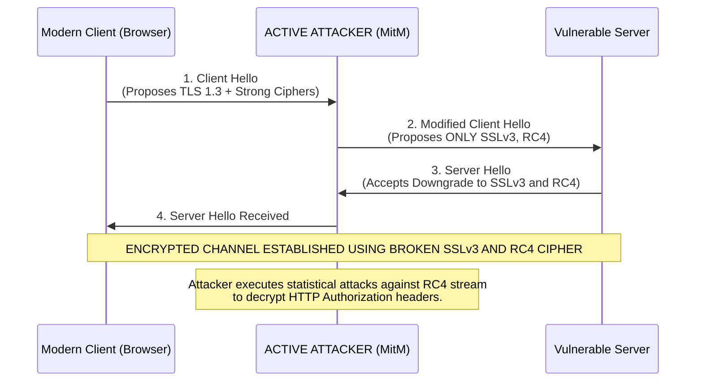

# Weak TLS Configuration (SSLv3, TLS 1.0, RC4, DES)

## Introduction to TLS and Cryptographic Attrition
Transport Layer Security (TLS), and its now-obsolete predecessor Secure Sockets Layer (SSL), are the foundational cryptographic protocols responsible for securing data in transit over computer networks. They are the underlying security mechanism of HTTPS, FTPS, SMTPS, and virtually all secure client-server communications on the internet. Their primary goals are to provide **Confidentiality** (encryption), **Integrity** (tamper detection), and **Authentication** (identity verification).

A TLS connection does not rely on a single algorithm; rather, it is a complex negotiation of various cryptographic primitives grouped together in a "cipher suite." A cipher suite defines:
1.  **Key Exchange Algorithm:** How the client and server agree on a shared secret (e.g., RSA, Diffie-Hellman, ECDHE).
2.  **Authentication Algorithm:** How the server proves its identity (e.g., RSA, ECDSA certificates).
3.  **Bulk Encryption Algorithm (Cipher):** How the actual data payload is encrypted (e.g., AES, ChaCha20, RC4, 3DES).
4.  **Message Authentication Code (MAC):** The hashing algorithm used to ensure data integrity (e.g., SHA-256, MD5).

**Cryptographic Attrition:** Cryptography is not static. As computational power increases (Moore's Law) and cryptographic research advances, algorithms that were considered secure a decade ago are inevitably broken. Weak TLS Configuration vulnerabilities occur when server administrators fail to maintain cryptographic hygiene. They leave web servers, load balancers, or VPN gateways configured to support obsolete, deprecated, and cryptographically shattered protocols or cipher suites. This is often done under the misguided justification of maintaining backward compatibility with ancient clients (like Windows XP/IE6), but the cost is exposing all modern users to severe interception risks.

## The Anatomy of a Weak Configuration

A weak configuration is characterized by the server's willingness to accept a connection using primitives that are known to be vulnerable to practical attacks.

### 1. Deprecated and Broken Protocols
The TLS protocol itself has evolved to fix structural flaws in the handshake and key derivation processes.
*   **SSLv2 and SSLv3:** Released in the 1990s, these are completely fundamentally broken. SSLv3 is fatally vulnerable to the POODLE attack. They offer zero effective security against modern adversaries and must be aggressively disabled everywhere.
*   **TLS 1.0 (1999) and TLS 1.1 (2006):** These protocols were officially deprecated by the IETF (Internet Engineering Task Force) in 2021 and support was removed by all major browser vendors (Chrome, Firefox, Safari, Edge) in 2020. They rely on weak hashing algorithms (MD5 and SHA-1) for integrity and pseudo-random function derivation. They are highly susceptible to CBC (Cipher Block Chaining) padding oracle attacks like BEAST.
*   **TLS 1.2 (2008) and TLS 1.3 (2018):** These are the only currently acceptable standards. TLS 1.3 is a massive architectural overhaul that removes support for legacy algorithms entirely, enforces Perfect Forward Secrecy, and accelerates the handshake process.

### 2. Weak and Broken Cipher Suites
Even if a modern protocol like TLS 1.2 is used, the connection is vulnerable if it negotiates a weak cipher suite.
*   **RC4 (Rivest Cipher 4):** A stream cipher that was once ubiquitous due to its speed. However, serious statistical biases were discovered in its output. If an attacker observes a large amount of encrypted traffic (like repeatedly sending the same session cookie), they can recover the plaintext. It is explicitly prohibited in modern TLS.
*   **DES (Data Encryption Standard) and 3DES:** DES utilizes a minuscule 56-bit key. Modern distributed computing architectures or specialized hardware can brute-force a 56-bit key in a matter of hours. 3DES (applying DES three times) was a stopgap, but it operates on a 64-bit block size, making it vulnerable to collision attacks (SWEET32) when large volumes of data are transferred over a single session.
*   **NULL Ciphers (e.g., `TLS_RSA_WITH_NULL_SHA`):** These bizarre cipher suites perform the handshake and integrity checks but provide **absolutely zero encryption**. Data is transmitted over the wire in completely readable plaintext. They are intended for debugging but are sometimes accidentally enabled in production.
*   **Export-Grade Cryptography:** In the 1990s, US export regulations mandated that software shipped overseas utilize deliberately weakened cryptography (e.g., 40-bit keys or 512-bit RSA moduli). While the laws changed, the code remained in many libraries. Servers supporting these suites are vulnerable to FREAK and Logjam attacks.
*   **Anonymous Diffie-Hellman (ADH):** Cipher suites that perform key exchange without requiring the server to present an SSL certificate for authentication. This completely eliminates the authentication pillar of TLS, rendering the connection trivially vulnerable to Man-in-the-Middle (MitM) attacks.

## The Threat Model: Active Downgrade Attacks

The primary threat model for weak TLS configurations involves an active Man-in-the-Middle (MitM) attacker. This attacker is positioned on the network path between the client and the server (e.g., operating a rogue Wi-Fi hotspot, performing ARP spoofing on a LAN, or compromising a router).

When a modern browser connects to a server, it sends a "Client Hello" message detailing the strongest protocols and ciphers it supports (e.g., TLS 1.3, AES-GCM). The vulnerability arises because the TLS handshake is initially sent in plaintext.

An active attacker can intercept the `Client Hello` and maliciously modify it, stripping away all strong modern protocols and ciphers. The attacker forwards this modified request to the server, claiming the client *only* supports SSLv3 and RC4. If the server is poorly configured and supports these legacy options, it will agree to the downgrade. The connection is established using broken cryptography, and the attacker can then utilize specialized exploitation frameworks to decrypt the traffic, steal session cookies, and inject malicious payloads.

### ASCII Diagram: The TLS Downgrade Attack Architecture

## Notable Vulnerabilities and Exploitation Frameworks

*   **POODLE (Padding Oracle On Downgraded Legacy Encryption - CVE-2014-3566):** This devastating attack exploits the way SSLv3 handles block cipher padding in CBC mode. By acting as a MitM, forcing a downgrade to SSLv3, and using JavaScript injected into the victim's browser to send thousands of crafted requests, the attacker can decrypt bytes of the ciphertext (typically the secret session cookie) one byte at a time.
*   **BEAST (Browser Exploit Against SSL/TLS - CVE-2011-3389):** Similar to POODLE, BEAST targets a flaw in CBC mode implementations in TLS 1.0. It allows an attacker to perform a chosen-plaintext attack and recover targeted data streams, such as authentication tokens.
*   **SWEET32 (CVE-2016-2183):** This targets older block ciphers utilizing a 64-bit block size (predominantly 3DES and Blowfish). In cryptography, the "birthday bound" implies that after generating $2^{32}$ blocks of data (roughly 32 Gigabytes), a collision is highly likely. If an attacker can force the client and server to exchange 32GB of data over a single 3DES connection (e.g., via long-lived VPN tunnels or heavy API usage), they can recover the XOR of two plaintexts, severely compromising the encryption.
*   **FREAK (Factoring RSA Export Keys) & Logjam:** These attacks prey on servers that maintain support for 1990s-era "export-grade" cryptography. The MitM attacker forces the server to use a weak 512-bit RSA or Diffie-Hellman key. The attacker can then use cloud computing resources to factor the key in near real-time, compute the master secret, and decrypt the entire session retroactively.

## Auditing and Identification Techniques

Assessing TLS configurations is highly deterministic and forms the baseline of any infrastructure penetration test. It does not require authentication to the target.

### Automated Command-Line Tools
*   **Nmap (`ssl-enum-ciphers`):** The standard tool for internal network assessments.
    `nmap -sV --script ssl-enum-ciphers -p 443 <target_ip_or_range>`
    This script negotiates with the server, enumerates all supported protocols and ciphers, grades them (A to F), and flags specific vulnerabilities like POODLE or SWEET32.
*   **TestSSL.sh:** A comprehensive, deeply thorough bash script specifically designed for assessing TLS posture. It checks for cipher support, protocol support, certificate validity, HTTP Strict Transport Security (HSTS), and tests for dozens of specific CVEs (Heartbleed, CCS Injection, Ticketbleed, etc.).
    `./testssl.sh https://target.com`

### Public Web Services (For external assets)
*   **Qualys SSL Labs Server Test:** (ssllabs.com/ssltest/) The industry gold standard for assessing public-facing websites. It provides a highly detailed, deeply technical report and assigns a letter grade. Scoring an 'A' or 'A+' is the standard requirement for compliance (PCI-DSS, HIPAA). Anything lower than a 'B' usually indicates significant misconfigurations.

### Manual Verification via OpenSSL
Security engineers often use the `openssl s_client` tool to manually verify findings or troubleshoot specific handshakes.
*   To test if a server accepts the broken SSLv3 protocol:
    `openssl s_client -connect target.com:443 -ssl3`
    If the command succeeds and displays the certificate chain, the server is vulnerable. If it fails with a "handshake failure" or "protocol version" error, the protocol is correctly disabled.
*   To test for a specific weak cipher (e.g., RC4-SHA):
    `openssl s_client -connect target.com:443 -cipher RC4-SHA`

## Remediation and Secure Configuration Engineering

Securing TLS is an infrastructure-level task, typically performed by configuring the web server (Nginx, Apache, IIS), load balancer (AWS ALB, HAProxy), or API gateway. The goal is to aggressively restrict the allowed cryptographic parameters.

1.  **Protocol Eradication:** Explicitly and completely disable SSLv2, SSLv3, TLS 1.0, and TLS 1.1 in the server configuration. The only allowed protocols must be TLS 1.2 and TLS 1.3.
    *   *Nginx Example:* `ssl_protocols TLSv1.2 TLSv1.3;`
2.  **Cipher Suite Hardening:** Remove all support for RC4, DES, 3DES, MD5, export ciphers, anonymous ciphers, and NULL ciphers.
3.  **Enforce Perfect Forward Secrecy (PFS):** Prioritize cipher suites that utilize Ephemeral Diffie-Hellman (`DHE`) or Elliptic Curve Ephemeral Diffie-Hellman (`ECDHE`) for key exchange. PFS ensures that a unique session key is generated for every single connection. Crucially, if a nation-state adversary records years of encrypted traffic, and later compromises the server's private RSA key, they *cannot* use that private key to decrypt the historical traffic.
    *   Prioritize AEAD (Authenticated Encryption with Associated Data) block ciphers like `AES-256-GCM` or `ChaCha20-Poly1305` over legacy CBC mode ciphers.
4.  **Implement HSTS (HTTP Strict Transport Security):** Once strong TLS is configured, applications must return the `Strict-Transport-Security` HTTP header. This instructs the browser to *never* attempt a plaintext HTTP connection to the domain, effectively mitigating SSL stripping downgrade attacks initiated before the TLS handshake even begins.
5.  **Utilize Configuration Generators:** Security engineers should rarely write TLS configurations from memory. Utilize the **Mozilla SSL Configuration Generator**, an industry-standard tool that provides copy-paste, mathematically sound configurations for nearly every web server software, tailored to required compatibility levels (Modern vs. Intermediate).

## Chaining Opportunities

A weak TLS configuration is the foundational enabler for numerous network-level attacks:

*   **[[01 - Man-in-the-Middle (MitM) Attacks]]:** The ability to downgrade and decrypt traffic is the textbook definition of a successful MitM attack, destroying the confidentiality of the channel.
*   **[[02 - Session Hijacking]]:** By utilizing attacks like BEAST or POODLE against weak configurations, attackers extract the user's `Set-Cookie` headers from the decrypted stream, allowing them to hijack authenticated sessions.
*   **[[08 - Hardcoded Secrets in Code]]:** If an application transmits administrative credentials, API keys, or hardcoded secrets over a network utilizing a weak, decryptable TLS configuration, those secrets are exposed to network-level adversaries, compounding the severity of the leak.
*   **[[14 - Security Misconfiguration]]:** Weak TLS is the most visible and easily identifiable symptom of broader security misconfiguration and poor patch management practices within an organization's infrastructure.

## Related Notes
*   [[04 - Cryptographic Failures]]
*   [[05 - Using Deprecated Algorithms]]
*   [[06 - Insufficient Key Size]]
