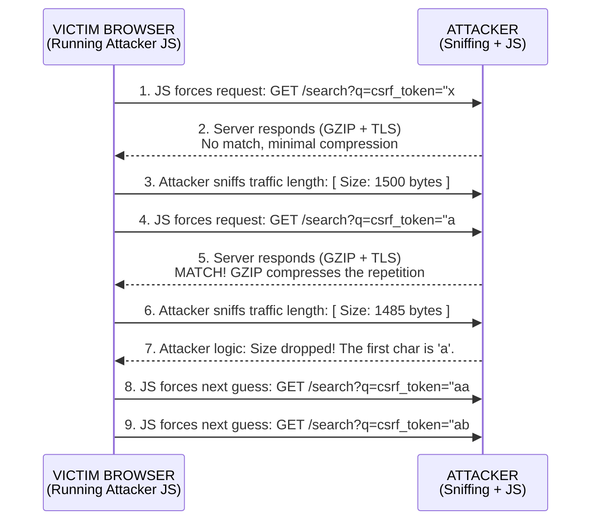

# BREACH Attack (Browser Reconnaissance and Exfiltration via Adaptive Compression of Hypertext)

## 1. Executive Summary

The BREACH attack is an advanced, highly sophisticated cryptographic vulnerability that targets the intersection of HTTP compression and TLS encryption. Discovered in 2013 by Gluck, Harris, and Prado, BREACH demonstrates that encryption alone cannot guarantee confidentiality if an attacker can observe the size of the encrypted output and manipulate the input to a compression algorithm.

Unlike attacks targeting the underlying cryptographic mathematics (like BEAST) or protocol design flaws (like POODLE), BREACH is a side-channel attack. It exploits the fact that HTTP-level compression (like GZIP or Deflate) reduces the size of data by finding repeated patterns. By iteratively injecting guesses into the HTTP request and observing the size of the resulting encrypted HTTP response, an attacker can extract highly sensitive, relatively static secrets—most notably, Anti-CSRF tokens or Session IDs embedded in the response body.

The danger of BREACH is that it affects all versions of TLS (including modern TLS 1.3) and all cipher suites (including AES-GCM), because the vulnerability lies at the HTTP application layer, before the data is handed off to TLS for encryption.

## 2. The Core Mechanics: Compression and Encryption

To understand BREACH, we must analyze the interaction between compression and encryption.

### 2.1. The Nature of Compression (DEFLATE/GZIP)
Compression algorithms like DEFLATE work by finding repetitive strings in the plaintext data and replacing subsequent occurrences with short pointers back to the original string. 
*   If the text contains the string `secret_token=XYZ` once, it takes up `N` bytes.
*   If the text contains `secret_token=XYZ` *twice*, the compressor recognizes the duplicate. The second occurrence is replaced by a tiny reference (e.g., "go back 50 bytes and copy 16 bytes"). 
*   **Crucial Rule:** The more repetitions there are, the smaller the final compressed output will be.

### 2.2. Encryption Preserves Size
Stream ciphers and Block ciphers in AEAD modes preserve the length of the plaintext (plus a fixed overhead for MACs/tags/padding). 
*   If the compressed plaintext is 500 bytes, the encrypted ciphertext will be approximately 500 bytes (plus predictable overhead).
*   Therefore, observing the length of the ciphertext over the network directly reveals the length of the compressed plaintext.

## 3. The BREACH Mechanism (Chosen Plaintext via Side-Channel)

BREACH is an adaptive Chosen-Plaintext Attack combined with a length-based side-channel. 

### 3.1. Prerequisites
For a target endpoint to be vulnerable to BREACH, all the following must be true:
1.  **HTTP Compression:** The server uses HTTP-level compression (e.g., `Content-Encoding: gzip`).
2.  **Attacker Controlled Input:** The endpoint reflects user-supplied data (e.g., a URL parameter, a search query) into the HTTP response body.
3.  **Target Secret:** The response body contains a sensitive secret (like a CSRF token) that remains static across multiple requests.
4.  **Network Positioning:** The attacker must be able to sniff the victim's HTTPS traffic to measure the size of the encrypted responses.
5.  **Request Forgery:** The attacker must trick the victim's browser (usually via malicious JavaScript on a different site) into repeatedly querying the vulnerable endpoint.

### 3.2. The Attack Execution
Imagine an HTML response that looks like this:
```html
<html>
<body>
  <p>Search results for: {{USER_INPUT}}</p>
  <input type="hidden" name="csrf_token" value="abc123xyz">
</body>
</html>
```

The attacker wants to steal the CSRF token `abc123xyz`. They know the format of the token field (`csrf_token" value="`).

1.  **The Baseline:** The attacker forces the victim's browser to send a request with a random, non-matching guess, e.g., `?query=csrf_token" value="ZZZ`.
    The response contains:
    `Search results for: csrf_token" value="ZZZ`
    `<input type="hidden" name="csrf_token" value="abc123xyz">`
    Because `ZZZ` does not match `abc`, the compression is minimal. The attacker measures the encrypted response size. Let's say it's **1050 bytes**.

2.  **The Correct Guess:** The attacker sends a request with the correct first character: `?query=csrf_token" value="a`.
    The response contains:
    `Search results for: csrf_token" value="a`
    `<input type="hidden" name="csrf_token" value="abc123xyz">`
    The compressor notices that the string `csrf_token" value="a` appears *twice*. It compresses the second occurrence.
    Because of the better compression, the resulting plaintext is smaller. 
    The attacker measures the encrypted response size. It is now **1048 bytes**.

3.  **The Oracle:** The attacker has created an oracle. By iterating through all possible characters (a-z, 0-9) and injecting `csrf_token" value="[guess]`, the attacker looks for the response that is *smaller* than the others. The smaller response indicates a correct character guess because the compression algorithm successfully found a longer matching prefix.

4.  **Iteration:** Once 'a' is confirmed, the attacker guesses the next character: `ab`, `ac`, `ad`. When they guess `ab`, the response shrinks again. They repeat this byte-by-byte until the entire token is extracted.

## 4. Visualizing the BREACH Attack



## 5. Technical Nuances and Complications

While the concept is straightforward, executing BREACH in reality is highly complex:

1.  **Block Cipher Padding:** If the TLS connection uses a block cipher in CBC mode (like AES-CBC), the ciphertext is padded to the nearest block size (e.g., 16 bytes). A 1-byte difference in plaintext might not change the ciphertext length if it gets swallowed by the padding. Attackers circumvent this by padding their own injected string to intentionally push the ciphertext exactly to the boundary of a block, so any compression gain instantly drops the ciphertext size by a full block.
2.  **Noise:** Dynamic web pages contain varying content (timestamps, ad IDs, dynamic load times). This "noise" alters the response size independently of the compression, making the signal (the 1-byte drop) hard to detect. Attackers use statistical analysis over many requests to filter out the noise.
3.  **Huffman Coding:** GZIP uses Huffman coding, where common characters are represented by fewer bits than rare characters. This means the size reduction isn't strictly byte-aligned, requiring complex mathematical models to interpret the length differences accurately.
4.  **Rate Limiting:** Extracting a 32-character token might take thousands of requests. Robust WAFs or rate-limiting on the target server will easily detect and block this anomalous volume of traffic.

## 6. Mitigation Strategies

Because BREACH exploits HTTP features rather than TLS flaws, mitigations must be implemented at the application or web server level. There is no "silver bullet," and developers must choose the mitigation that best fits their architecture.

### 6.1. Disabling HTTP Compression
The most definitive mitigation is to disable HTTP compression (GZIP/DEFLATE). However, this is often unacceptable for performance reasons, as it drastically increases bandwidth consumption and load times.

### 6.2. Separating Secrets from User Input
Ensure that user-controlled input and sensitive secrets never share the same context or response body. For example, serve static HTML (which can be compressed) and load dynamic data (secrets, CSRF tokens) via separate, uncompressed AJAX calls.

### 6.3. CSRF Token Masking (The Standard Defense)
The most practical defense against extracting CSRF tokens via BREACH is to use **Token Masking** (or XOR masking).
Instead of sending the static token `abc123xyz` every time, the server generates a random one-time pad (OTP) per request. It XORs the real token with the OTP, and sends both the OTP and the masked token to the client.
Because the actual bytes sent over the wire change completely on every single request, the attacker cannot use the compression oracle to build a consistent guess; the target is constantly shifting. Modern frameworks like Django and Ruby on Rails implement this automatically.

### 6.4. Length Hiding (Padding)
Some implementations attempt to append a random amount of padding bytes to the end of every HTTP response. This artificially alters the length of the ciphertext, destroying the exact measurements the attacker relies on. However, sophisticated statistical analysis can sometimes average out the random padding over thousands of requests.

### 6.5. Same-Site Cookies
While not a direct fix for BREACH, setting the `SameSite` attribute on sensitive cookies prevents the malicious JavaScript (running on the attacker's domain) from forcing authenticated requests to the vulnerable endpoint, effectively cutting off the attack vector.

## 7. Penetration Testing Methodology

Testing for BREACH involves verifying the prerequisites:

1.  **Analyze Headers:** Intercept HTTP responses and verify if `Content-Encoding: gzip` or `deflate` is present.
2.  **Identify Secrets:** Look for static secrets in the HTML body (CSRF tokens, hidden API keys, session data).
3.  **Identify Reflection:** Find input vectors (URL parameters, headers) that are reflected in the same response body as the secret.
4.  **Evaluate Mitigations:** Check if the CSRF token changes on every request (indicating masking is in place) or if SameSite cookies are heavily utilized.
5.  **Tooling:** Tools like `ruxcon-breach` or custom scripts can be used to theoretically prove the length differential, but full exploitation in a real-world test is rarely performed due to the high volume of traffic required and the complexity of noise filtering; identifying the prerequisites is usually sufficient for reporting.

## 8. Chaining Opportunities

*   **[[07 - Cross-Site Request Forgery (CSRF)]]**: BREACH is primarily used to extract CSRF tokens, enabling a subsequent, devastating CSRF attack against the application.
*   **[[03 - Session Hijacking]]**: If a session identifier is passed in the URL or body (rather than securely in a cookie), BREACH can be used to steal it, leading to account takeover.

## 9. Related Notes
*   [[01 - TLS Protocol Overview]]
*   [[11 - BEAST Attack]] (Another chosen-plaintext attack).
*   [[13 - CRIME Attack]] (The precursor to BREACH, which targeted TLS-level compression instead of HTTP-level compression).
