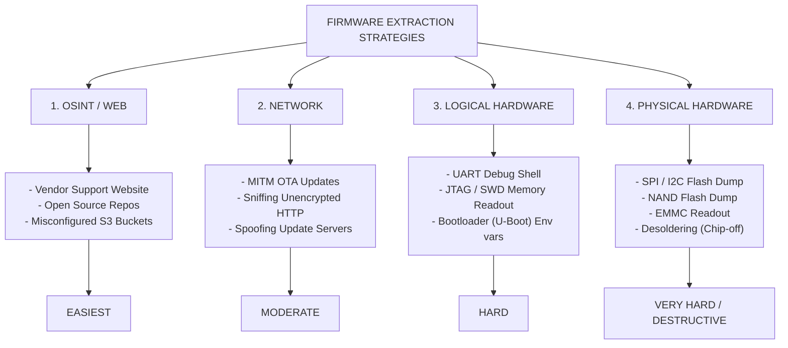

# 49.02 IoT Device Firmware Extraction

## Introduction to IoT Firmware

In the context of the Internet of Things (IoT), "firmware" is the software that resides on the device's non-volatile memory (such as NOR/NAND Flash, EEPROM, or eMMC) and dictates its functionality. Unlike a typical desktop application, firmware usually comprises an entire embedded ecosystem packaged into a single binary image. This often includes:
1.  **The Bootloader:** (e.g., U-Boot, Barebox) Responsible for initializing the minimum required hardware (RAM, clocks) and loading the kernel into memory.
2.  **The Kernel:** Typically an embedded Linux kernel, though Real-Time Operating Systems (RTOS) like FreeRTOS, VxWorks, or Zephyr are common on constrained microcontrollers.
3.  **The Filesystem:** A lightweight filesystem (e.g., SquashFS, JFFS2, UBIFS, CramFS) containing the operating system userland, configuration files, initialization scripts, and the proprietary binaries (daemons) that implement the device's specific logic (e.g., web cameras, router routing daemons).

Obtaining this firmware image is arguably the most critical phase in a comprehensive IoT penetration test. Once the firmware is extracted and resting comfortably on the analyst's local machine, it can be unpacked, reverse-engineered, and analyzed dynamically in emulated environments without the constraints, monitoring, or hardware limitations of the physical device.

---

## Why Extract Firmware?

Extracting the firmware allows a security researcher to transition from "black-box" testing (blindly prodding network ports and physical inputs) to "white-box" (or at least "grey-box") testing. The benefits include:
*   **Discovering Hardcoded Secrets:** Uncovering static encryption keys, default administrative passwords, hidden backdoor accounts, or API tokens for cloud services embedded directly in the binary or configuration files.
*   **Vulnerability Discovery (Zero-Days):** Decompiling and reverse engineering proprietary application binaries (using tools like Ghidra or IDA Pro) to identify memory corruption vulnerabilities (Buffer Overflows, Use-After-Free) or logical flaws (Command Injection, Path Traversal) in exposed services.
*   **Understanding Proprietary Protocols:** Analyzing how the device communicates with its companion app or cloud backend, particularly if it uses undocumented or custom-encrypted binary protocols over UDP or MQTT.
*   **Modifying and Repacking:** Once extracted, the firmware can be modified (e.g., adding a persistent SSH reverse shell, modifying `init` scripts) and flashed back onto the device, allowing the researcher to monitor the device's runtime behavior continuously.

---

## ASCII Diagram: Firmware Extraction Methodologies



---

## Method 1: Open Source Intelligence (OSINT) and Web Sources

Before touching a screwdriver or a logic analyzer, the simplest and least destructive method should always be attempted first: asking the internet for it.

### Vendor Support Websites
Many vendors host firmware images openly on their support pages for manual customer updates. While these are often packaged in proprietary `.bin` or `.zip` formats, they usually contain the raw filesystem.
*   **Approach:** Identify the exact Make, Model, and Hardware Revision of the device. Search the vendor's site.
*   **Caveat:** Modern vendors have begun encrypting these update files. The encrypted file is useless without the decryption key, which is usually stored on the device itself (requiring hardware extraction to obtain the key first).

### Misconfigured Cloud Storage
Vendors often utilize AWS S3, Google Cloud Storage, or Azure Blobs to host OTA update files.
*   **Approach:** By intercepting traffic from the mobile application or analyzing the device's DNS queries during boot, an attacker can discover the bucket URLs. If the bucket is misconfigured (e.g., public directory listing), the attacker can browse and download all historical firmware versions.

---

## Method 2: Over-The-Air (OTA) Update Interception

If the firmware is not available publicly, you can force the device to update and capture the payload in transit.

### Traffic Sniffing and MITM
IoT devices periodically check a cloud server for new firmware. By situating yourself between the device and the internet (using a rogue access point, ARP spoofing, or DNS hijacking), you can capture this traffic.
*   **Execution:** Connect the IoT device to an AP controlled by the attacker (e.g., a laptop broadcasting Wi-Fi via `hostapd`). Run Wireshark. Trigger a firmware update via the mobile app.
*   **Unencrypted HTTP:** Many legacy or poorly designed devices pull firmware over unencrypted HTTP. Simply right-click the HTTP stream in Wireshark -> `Export Objects` -> `HTTP` to save the firmware `.bin` file.
*   **HTTPS/TLS:** If the device uses HTTPS, you may attempt to MITM the connection using `mitmproxy` or `Burp Suite`. However, this will only work if the device lacks **Certificate Pinning** or if it completely fails to validate the server's certificate chain.

### Server Spoofing
If you understand the API request the device makes to check for updates, you can emulate the vendor's update server locally, directing the device to download a payload (either legitimate for capture, or malicious for exploitation).

---

## Method 3: Logical Hardware Interfaces (UART)

When remote methods fail, physical interaction is required. The Universal Asynchronous Receiver-Transmitter (UART) is a serial communication interface heavily used by developers for debugging.

### Identifying and Connecting to UART
1.  **Disassembly:** Open the device casing. Look for a cluster of 3 to 4 through-hole pads or pins on the PCB, often labeled `TX`, `RX`, `GND`, and `VCC`.
2.  **Multimeter Verification:**
    *   Find `GND` using continuity testing with a known ground (e.g., a metal RF shield).
    *   Find `VCC` (usually 3.3V or 5V) by measuring voltage against GND.
    *   Identify `TX` (Transmitting from the device) by observing voltage fluctuations during the device boot process.
3.  **Connection:** Connect a USB-to-TTL Serial Adapter (like a CP2102 or FT232RL) to the pins. **Crucial Rule:** Cross the connections! Connect Adapter `RX` to Device `TX`, and Adapter `TX` to Device `RX`. Connect `GND` to `GND`. *Never connect VCC unless explicitly powering the device via the adapter, which is risky.*
4.  **Baud Rate Discovery:** Use tools like `baudrate.py` or logic analyzers to determine the correct baud rate (commonly `115200` or `9600`).
5.  **Terminal:** Connect using `screen /dev/ttyUSB0 115200` or `minicom`.

### Extracting Firmware via UART Shell
If dropping to UART provides an unauthenticated root shell (`#`), you have full access to the running filesystem.
*   **Identify Partitions:** Run `cat /proc/mtd` to view the Memory Technology Device partitions. You will see partitions like `bootloader`, `kernel`, and `rootfs`.
*   **Dumping via `dd`:** You can use the `dd` command to read the raw blocks: `dd if=/dev/mtdblock3 of=/tmp/rootfs.bin`.
*   **Exfiltration:** Since UART is text-based and slow, you must exfiltrate the `.bin` file. Options include:
    *   Copying the file to a physical SD Card or USB drive inserted into the device.
    *   Using `tftp` or `nc` (Netcat) to send the file over the local network to your attacking machine (if the device has Ethernet/Wi-Fi connected).
    *   If no network tools are available, you can base64 encode the binary (`cat /tmp/rootfs.bin | base64`) and copy-paste the text from the serial terminal to your host, then decode it.

---

## Method 4: Physical Hardware Interfaces (SPI Flash Dumping)

If the device does not expose a UART shell, or if the bootloader is locked down, you must bypass the MCU entirely and read the firmware directly from the non-volatile memory chip.

### Serial Peripheral Interface (SPI) Flash
SPI is the most common protocol used by microcontrollers to interface with external NOR flash memory chips. These chips usually have 8 pins (SOIC-8) or 16 pins (SOIC-16) and are identifiable by markings from manufacturers like Winbond, Macronix, or Spansion.

### In-Circuit Extraction (SOIC Clip)
This non-destructive method involves clamping a specialized tool over the chip while it is still soldered to the board.
1.  **Ensure Power is OFF:** Unplug the IoT device. Supplying external voltage while the board is plugged in can destroy components.
2.  **Attach the Clip:** Attach an SOIC-8 test clip over the flash chip. Ensure pin 1 on the clip aligns with pin 1 on the chip (usually denoted by a small dimple on the chip casing).
3.  **Connect to a Programmer:** Wire the clip to a hardware programmer. Common tools include:
    *   **CH341A Programmer:** A cheap, ubiquitous USB device specifically designed for SPI/I2C flashing.
    *   **Bus Pirate:** A versatile multi-protocol tool.
    *   **Raspberry Pi:** Using its GPIO pins.
4.  **Read the Data:** Use the open-source software `flashrom` on your Linux machine:
    ```bash
    # Detect the chip to ensure a good connection
    flashrom -p ch341a_spi
    
    # Dump the memory to a file
    flashrom -p ch341a_spi -r firmware_dump_1.bin
    ```
5.  **Verification:** Always dump the chip at least three times and compare the SHA256 hashes of the resulting files. Poor clip connections can lead to flipped bits and corrupted reads. If all three hashes match, you have a solid dump.

---

## Method 5: Advanced Hardware Interfaces (JTAG & Chip-Off)

### Joint Test Action Group (JTAG)
JTAG is a complex debugging interface used for boundary scanning, programming, and low-level debugging.
*   **Identification:** Look for a 10-pin, 14-pin, or 20-pin unpopulated header, or use tools like the JTAGulator to brute-force the pinout (TDI, TDO, TCK, TMS, TRST) across unknown pads.
*   **Extraction:** By connecting a hardware debugger (like a Segger J-Link or an FT2232H board) and utilizing software like `OpenOCD` (Open On-Chip Debugger), an attacker can halt the CPU instruction execution, peek into RAM, and manually dump the entire contents of flash memory byte-by-byte via debugging commands.

### Chip-Off / Desoldering (The Last Resort)
If in-circuit SPI dumping fails (often because the microcontroller attempts to draw power from the programmer, causing voltage drops and read failures), the chip must be physically removed from the board.
1.  **Desoldering:** Apply flux and use a hot-air rework station to heat the solder joints until the flash chip can be lifted off the PCB with tweezers.
2.  **Reading:** Place the loose chip into a ZIF (Zero Insertion Force) socket adapter tailored to the chip's package (e.g., SOIC-8 to DIP-8).
3.  **Extraction:** Insert the adapter into the programmer (CH341A, TL866II Plus) and read it via `flashrom` or the manufacturer's software.
4.  **Resoldering:** Once the image is obtained (and optionally modified), resolder the chip back onto the PCB to ensure the device functions normally.

---

## Chaining Opportunities

*   **SPI Dump -> Static Analysis -> OTA MITM:** Extract the firmware via SPI Flash dump `->` Unpack the filesystem and extract the vendor's TLS certificate and OTA encryption keys `->` Set up a malicious MITM server, serving a modified, backdoored firmware signed with the extracted keys `->` Compromise thousands of devices downloading the fake update.
*   **UART Access -> Credential Harvesting:** Gain a root shell via UART `->` View the configuration files in `/etc/config` `->` Extract the plaintext Wi-Fi WPA2 pre-shared key of the target network `->` Pivot attacks against internal IT infrastructure.

## Related Notes
*   [[01 - IoT Attack Surface Overview]]
*   [[03 - Firmware Analysis and Reverse Engineering]]
*   [[04 - Hardcoded Credentials in Firmware]]
*   [[05 - Telnet SSH Exposed on IoT Devices]]
