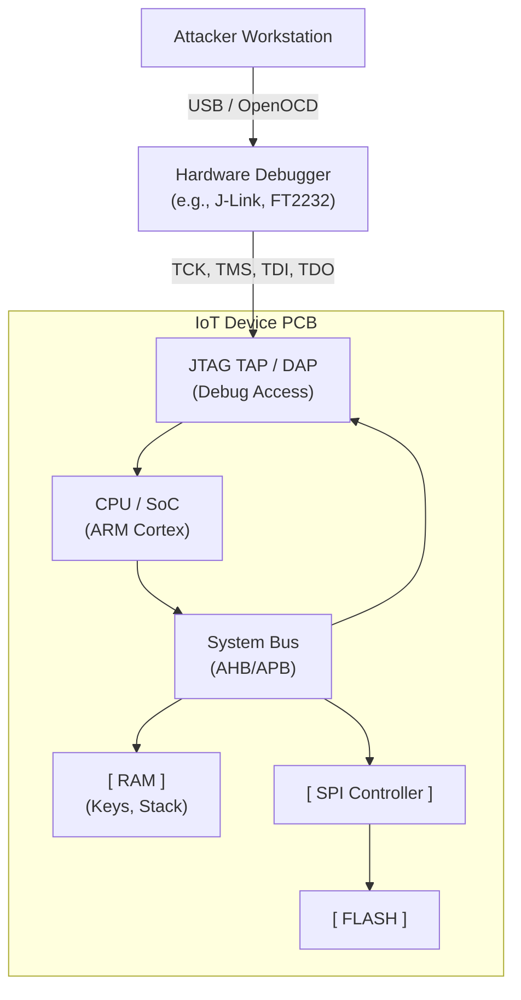

# Hardware Debugging Interfaces: UART and JTAG

## 1. Introduction to Hardware Interfaces

When analyzing IoT devices, the software layer is only half the battle. To deeply understand and exploit an embedded system, hardware hackers target physical debugging interfaces left exposed on the Printed Circuit Board (PCB). The two most critical interfaces for a penetration tester are **UART** (Universal Asynchronous Receiver-Transmitter) and **JTAG** (Joint Test Action Group).

Manufacturers use these interfaces during the development, testing, and manufacturing phases to program microcontrollers, debug code, and diagnose hardware faults. In an ideal secure product lifecycle, these interfaces are physically disabled, fused off, or heavily authenticated before the device reaches the consumer. However, due to cost, convenience, or oversight, they are frequently left active, providing a direct, unauthenticated gateway to the device's core.

This note provides an in-depth exploration of identifying, interfacing with, and exploiting UART and JTAG interfaces to achieve arbitrary control over IoT devices.

## 2. UART (Universal Asynchronous Receiver-Transmitter)

UART is a physical circuit that translates data between parallel and serial forms. It is asynchronous, meaning there is no shared clock signal between the sender and receiver; instead, they agree on a specific data rate (baud rate).

### 2.1. Why Attackers Target UART

UART typically provides a direct terminal connection to the device's operating system (e.g., a Linux root shell) or its bootloader (e.g., U-Boot). Accessing UART can yield:
*   **Unauthenticated Root Shell:** Many consumer routers and cameras drop straight to a `root@device#` prompt upon boot.
*   **Bootloader Access:** Interrupting the boot process allows attackers to modify boot arguments (e.g., setting `init=/bin/sh`), enabling them to bypass OS-level authentication or extract firmware.
*   **Kernel and Boot Logs:** Observing the boot sequence reveals memory maps, filesystem types, partition layouts, and loaded drivers, which is critical for reverse engineering.

### 2.2. Identifying UART on a PCB

UART typically requires 3 or 4 pins:
*   **TX (Transmit):** Sends data. (Connects to RX on the adapter)
*   **RX (Receive):** Receives data. (Connects to TX on the adapter)
*   **GND (Ground):** Common reference voltage.
*   **VCC (Power):** Usually 3.3V or 5V. **DO NOT CONNECT VCC to your USB adapter unless powering the board.**

**Identification Methodology:**
1.  **Visual Inspection:** Look for rows of 3, 4, or 5 through-holes or test pads on the PCB. Sometimes they are labeled `TX`, `RX`, `GND`.
2.  **Multimeter Testing (Continuity):** Identify GND by testing continuity between the pins and a known ground.
3.  **Multimeter Testing (Voltage):** Power on the device. Measure the voltage of the remaining pins relative to GND.
    *   A pin resting at 3.3V that occasionally fluctuates (drops to 0V rapidly) during boot is likely **TX**.
    *   A pin floating around 0V or a low voltage is likely **RX**.
4.  **Logic Analyzer:** Connect a logic analyzer to the suspected TX pin, power the device, and capture the boot sequence. Tools like Saleae Logic can automatically decode the serial data and determine the baud rate.

### 2.3. Interfacing with UART

Use a USB-to-TTL serial adapter (e.g., FT232RL, CP2102, CH340).
**Wiring:**
*   Device `GND` -> Adapter `GND`
*   Device `TX` -> Adapter `RX`
*   Device `RX` -> Adapter `TX`

**Connecting:**
Use a terminal emulator like `minicom`, `screen`, or `picocom`. Common baud rates are `115200` (most common), `57600`, `38400`, `9600`.
`screen /dev/ttyUSB0 115200`

## 3. JTAG (Joint Test Action Group - IEEE 1149.1)

While UART provides a software-level shell, JTAG provides hardware-level control. Originally designed for boundary-scan testing of PCBs (checking for short circuits and broken traces), JTAG evolved into a powerful interface for debugging microprocessors.

### 3.1. Why Attackers Target JTAG

JTAG connects directly to the CPU's debugging logic (e.g., ARM CoreSight). With JTAG, an attacker can:
*   **Halt the CPU:** Pause execution at any exact clock cycle.
*   **Read/Write Memory:** Dump SRAM, extract cryptographic keys from memory, or dump the entire firmware directly from Flash by reading the CPU's memory-mapped IO.
*   **Single-Step Execution:** Walk through instructions one by one.
*   **Set Hardware Breakpoints:** Pause execution when a specific memory address is accessed.
*   **Bypass Secure Boot:** Halt the processor just after the ROM validates the bootloader, patch the bootloader in RAM, and resume execution.

### 3.2. Identifying JTAG on a PCB

JTAG requires a minimum of 4 pins, but often uses 5 or more:
*   **TCK (Test Clock):** Synchronizes the internal state machine.
*   **TMS (Test Mode Select):** Controls the JTAG state machine.
*   **TDI (Test Data In):** Data sent *into* the device.
*   **TDO (Test Data Out):** Data read *out* of the device.
*   **TRST (Test Reset - Optional):** Resets the JTAG logic.
*   **GND (Ground)** and **VTref (Voltage Reference)**.

**Identification Methodology:**
JTAG headers are often 10-pin, 14-pin, or 20-pin blocks (e.g., standard ARM 10-pin JTAG). If headers are absent, finding JTAG test pads requires tools.
*   **JTAGulators:** Tools like the *JTAGulator* or *JTAGenum* (running on an Arduino) use brute-force. They connect to 8-24 unknown pads and cycle through every possible permutation of TCK, TMS, TDI, and TDO, attempting to read the `IDCODE` register from the CPU. If an IDCODE is successfully read, the pinout is discovered.

### 3.3. Architecture of a JTAG Attack (ASCII Diagram)



### 3.4. Interfacing with JTAG via OpenOCD

To use JTAG, you need a hardware debugger adapter (e.g., SEGGER J-Link, Bus Pirate, Shikra, or FT2232-based boards) and software like **OpenOCD** (Open On-Chip Debugger).

**1. Create OpenOCD Configuration (`target.cfg`):**
```tcl
source [find interface/ftdi/dp_buspirate.cfg]
transport select jtag
adapter speed 1000

# Specify the target CPU (e.g., ARM Cortex-M3)
source [find target/stm32f1x.cfg]
```

**2. Start OpenOCD:**
```bash
$ openocd -f target.cfg
Info : auto-selecting first available session transport "jtag". To override use 'transport select <transport>'.
Info : clock speed 1000 kHz
Info : JTAG tap: stm32f1x.cpu tap/device found: 0x3ba00477 (mfg: 0x23b (ARM Ltd), part: 0xba00, ver: 0x3)
Info : stm32f1x.cpu: hardware has 6 breakpoints, 4 watchpoints
```

**3. Connect GDB:**
Use the GNU Debugger (GDB) to connect to OpenOCD's local telnet/GDB server (usually port 3333).
```bash
$ gdb-multiarch
(gdb) target extended-remote :3333
(gdb) monitor halt
(gdb) monitor reset halt
```

**4. Exploit (Dump Memory):**
```gdb
(gdb) dump binary memory firmware.bin 0x08000000 0x08100000
```

## 4. SWD (Serial Wire Debug)

SWD is an ARM-specific alternative to JTAG. It achieves the same level of debug access but uses only 2 pins:
*   **SWDIO (Serial Wire Data Input/Output):** Bidirectional data.
*   **SWCLK (Serial Wire Clock):** Clock signal.
SWD is extremely common in modern ARM Cortex-M microcontrollers used in IoT (e.g., STM32) because it saves precious pins on the chip package. Exploitation techniques using OpenOCD and GDB are identical to JTAG once connected.

## 5. Defense against Hardware Debugging

Manufacturers implement several mitigations:
*   **Physical Destruction:** Snipping the JTAG pins off the CPU package before soldering.
*   **BGA Packages:** Using Ball Grid Array chips where traces route internally, preventing physical access to debug lines.
*   **eFuses:** Microcontrollers have programmable fuses. A specific fuse (e.g., "JTAG Disable" or "Debug Security Level") can be permanently blown during manufacturing. Once blown, the internal silicon physically disconnects the JTAG TAP controller from the CPU, rendering the pins useless.
*   **Authenticated Debug:** Modern SoCs require a cryptographic challenge-response before enabling JTAG access. The attacker must possess a unique, vendor-signed certificate for the specific chip ID to unlock debugging.

## 6. Real-World Attack Scenario: Bypassing Password Prompts via JTAG

Consider an IoT device running embedded Linux that presents a root login prompt on the serial console. The attacker does not know the password.
1. The attacker connects a JTAG adapter to the CPU.
2. Using GDB, the attacker halts the CPU execution.
3. The attacker searches RAM (using GDB's `find` command) for the string corresponding to the root password hash, or locates the `strcmp` function used by the login process.
4. The attacker sets a hardware breakpoint on the `strcmp` instruction.
5. When the attacker types a fake password into the serial console, the CPU halts.
6. The attacker uses GDB to alter the CPU registers (e.g., setting the return register `R0` to `0` to signify a successful match).
7. The CPU execution is resumed (`continue`), and the login process grants root access despite the incorrect password.

## 7. Chaining Opportunities

*   **[[08 - Serial Console Access]]:** UART provides the console access discussed in depth in the next note. Finding UART is the prerequisite.
*   **[[09 - SPI Flash Dumping]]:** If JTAG is locked, you must resort to desoldering and dumping the SPI flash directly. Conversely, JTAG can be used to command the CPU to dump the SPI flash for you, avoiding soldering.
*   **[[03 - Secure Boot By-passes]]:** JTAG is the primary tool for executing timing attacks and fault injection (glitching) to bypass Secure Boot mechanisms by altering the Program Counter (PC) during signature verification.

## 8. Related Notes

*   [[01 - Hardware Reconnaissance and Teardown]]
*   [[02 - Firmware Extraction and Analysis]]
*   [[11 - Side Channel Attacks in IoT]]
