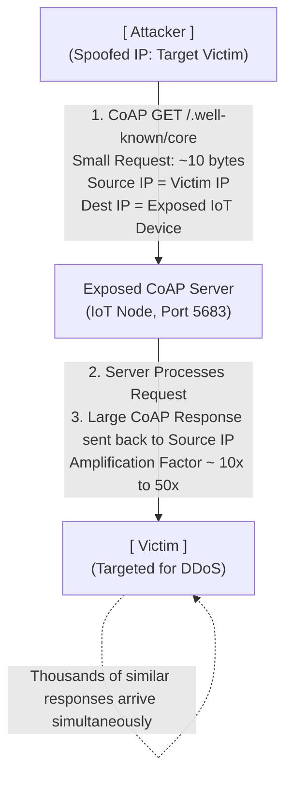

# CoAP Protocol Attacks

## 1. Introduction to CoAP

The Constrained Application Protocol (CoAP) is an HTTP-like web transfer protocol optimized for constrained nodes and networks, frequently encountered in the Internet of Things (IoT). It is designed to run over UDP, significantly reducing overhead compared to TCP-based HTTP, and employs a concise binary message format. CoAP provides request/response interactions conceptually identical to HTTP (GET, POST, PUT, DELETE) but includes features tailored for machine-to-machine (M2M) applications, such as built-in resource discovery and multicast support.

The fundamental weakness in many CoAP deployments arises precisely from its lightweight design. To conserve battery and processing power, security features like Datagram Transport Layer Security (DTLS) are often omitted, leaving the protocol entirely unauthenticated and unencrypted.

## 2. CoAP Architecture Overview

Unlike MQTT, which is heavily centralized around a broker, CoAP uses a traditional client/server model, though nodes often act as both. 

- **Transport:** UDP (Port 5683 for cleartext, 5684 for DTLS).
- **Messaging:** Uses a 4-byte fixed header followed by compact token and option fields.
- **Reliability:** Since UDP is unreliable, CoAP implements its own simple reliability mechanism marking messages as "Confirmable" (requires an ACK) or "Non-confirmable".
- **Resource Discovery:** CoAP devices typically host a directory of their capabilities at the standard URI path `/.well-known/core`.

## 3. ASCII Diagram: CoAP Amplification DDoS Attack Flow



## 4. Primary Vulnerabilities

### 4.1 Unauthenticated Resource Access

The most direct vulnerability is the lack of authentication. If a CoAP server is accessible over the network, any client can interact with its API endpoints.
- **Data Exfiltration:** Attackers can issue GET requests to retrieve sensitive sensor data.
- **State Manipulation:** Attackers can issue PUT or POST requests to change the operational state of an actuator (e.g., turning off an alarm, opening a valve).

### 4.2 Resource Discovery Information Disclosure

The `/.well-known/core` endpoint is defined by RFC 6690. When queried, it returns a list of links (URIs) to the resources hosted by the server, along with metadata (e.g., resource type, interface description). While useful for M2M integration, it acts as a highly efficient roadmap for an attacker, instantly revealing all potential attack vectors on the device without needing to brute-force paths.

### 4.3 UDP Amplification for DDoS

Because CoAP runs on UDP, it is trivial to spoof the source IP address in the packet header. An attacker can send a tiny CoAP request (such as querying `/.well-known/core`) using the victim's IP as the source. The vulnerable CoAP device will send the much larger response to the victim. When coordinated across thousands of exposed CoAP devices (often discoverable via Shodan), this generates a massive Distributed Denial of Service (DDoS) attack.

### 4.4 Plaintext Communication

Without DTLS, all CoAP payloads are transmitted in plaintext. Any attacker capable of sniffing the network traffic (e.g., via ARP spoofing, rogue access points, or physical taps) can read the telemetry data and intercept command instructions.

## 5. Exploitation Methodology

### Phase 1: Discovery

Standard port scanning is utilized to identify exposed CoAP services. Because it is UDP, scanning can be slower and less reliable than TCP.
```bash
nmap -sU -p 5683,5684 -sV --script coap-resources <target_ip>
```
The `coap-resources` Nmap script will automatically attempt to query `/.well-known/core`.

### Phase 2: Resource Mapping

Once a device is found, the attacker uses a CoAP client (such as `coap-client` from the `libcoap` package) to map the device.
```bash
coap-client -m get coap://<target_ip>/.well-known/core
```
Output Example:
`</sensors/temp>;rt="temperature", </actuators/relay>;rt="switch"`

### Phase 3: Interaction and Manipulation

Using the mapped endpoints, the attacker attempts to read and write data.

**Reading Data:**
```bash
coap-client -m get coap://<target_ip>/sensors/temp
```

**Writing Data (Actuation):**
If the endpoint allows modification, a PUT request is crafted.
```bash
coap-client -m put -e "1" coap://<target_ip>/actuators/relay
```
This simple command could trigger a physical action, demonstrating the critical link between the digital protocol and physical infrastructure.

### Phase 4: Fuzzing the Binary Protocol

For advanced exploitation, attackers will fuzz the CoAP message structure. By sending malformed headers, invalid Option numbers, or excessively large payloads, attackers aim to crash the CoAP daemon (DoS) or trigger memory corruption vulnerabilities (buffer overflows) in the embedded device's firmware, potentially leading to Remote Code Execution (RCE).

## 6. Real-World Impact

In recent years, the CoAP amplification vector has been actively exploited in the wild. Attackers have leveraged thousands of publicly exposed CoAP devices (mostly concentrated in specific regions where ISPs deploy vulnerable smart home hubs) to launch DDoS attacks peaking at hundreds of gigabits per second. The simplicity of the protocol combined with the high amplification factor (often over 30x) makes it a favored tool for botnet operators.

## 7. Mitigation and Defensive Strategies

1. **Implement DTLS:** Datagram Transport Layer Security (DTLS) is the standard method for securing CoAP. It provides encryption, data integrity, and, crucially, mutual authentication. Devices should be configured to require DTLS (Port 5684) and reject unencrypted traffic.
2. **Network Filtering and Segmentation:** CoAP devices should almost never be directly exposed to the public internet. They should reside on segmented IoT networks, shielded by a gateway or firewall.
3. **Anti-Spoofing and Amplification Mitigation:** If public exposure is unavoidable, implement strict rate limiting on responses to limit the device's usefulness in amplification attacks. Implement Source IP Verification (BCP 38) at the network edge to prevent packets with spoofed source addresses from leaving the network.
4. **Access Control:** Do not implicitly trust requests simply because they reach the device. Implement application-level authorization tokens if DTLS is not feasible.

## 8. Penetration Testing Checklist for CoAP

- [ ] Perform UDP scanning on port 5683 and 5684 across the target IP range.
- [ ] Attempt to retrieve the resource directory from `/.well-known/core`.
- [ ] Iterate through discovered endpoints to test for read access (GET) to sensitive telemetry.
- [ ] Attempt to modify state (PUT/POST/DELETE) on actuator endpoints without providing credentials.
- [ ] Capture CoAP traffic and verify if data is transmitted in plaintext.
- [ ] Fuzz the CoAP parser using specialized tools to identify memory safety issues in the implementation.
- [ ] Calculate the amplification factor (Size of Response / Size of Request) to determine the device's potential as a DDoS reflector.

## 9. Advanced Exploit Analysis
The binary nature of CoAP means that manipulating individual bits within the 4-byte header can yield unexpected results. The first byte contains the Version, Type, and Token Length. Modifying the Token Length field while supplying a disproportionately small payload can easily trigger out-of-bounds read/write scenarios in poorly coded `libcoap` implementations on RTOS platforms. This necessitates thorough binary analysis during deeply technical VAPT engagements.

## 10. Amplification DDoS Example
An attacker executes a script to iterate over millions of Shodan IPs, sending CoAP packets:
```python
import socket
from struct import pack

target_ip = "192.168.1.100"  # Spoofed victim
coap_device = "203.0.113.50" # Vulnerable reflector
port = 5683

# Basic CoAP GET /.well-known/core
payload = b"\x40\x01\x12\x34\xbb\x2e\x77\x65\x6c\x6c\x2d\x6b\x6e\x6f\x77\x6e\x04\x63\x6f\x72\x65"

sock = socket.socket(socket.AF_INET, socket.SOCK_RAW, socket.IPPROTO_RAW)
# ... packet crafting code to spoof IP ...
# sock.sendto(crafted_packet, (coap_device, port))
```

## Chaining Opportunities
- Initial discovery via **[[14 - Shodan for IoT Device Discovery]]** or **[[02 - Network Scanning and Enumeration]]**.
- Can be chained with **[[15 - Router Exploitation]]** to pivot into an internal network where CoAP devices reside.
- Poses significant risks when managing critical infrastructure, linking to **[[21 - ICS SCADA Architecture Security]]**.

## Related Notes
- [[11 - MQTT Unauthenticated Broker Exploitation]]
- [[13 - Modbus DNP3 Industrial Protocol Attacks]]
- [[17 - Cyber-Physical Systems Exploitation]]
