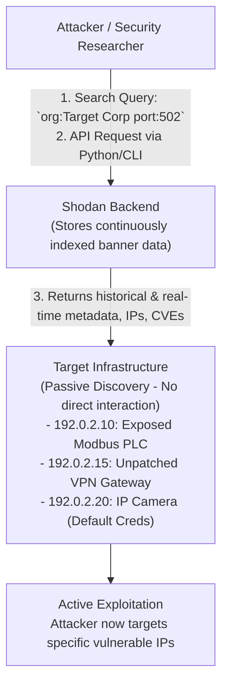

# Shodan for IoT Device Discovery

## 1. Introduction to Shodan

Shodan is fundamentally distinct from traditional search engines. While Google crawls the internet searching for web pages and HTTP content, Shodan crawls the entire IPv4 address space searching for exposed ports, service banners, and device metadata. It is affectionately known as "the search engine for the Internet of Things" because it indexes the deep infrastructure of the internet: routers, switches, webcams, industrial control systems (ICS), traffic lights, and enterprise databases.

For penetration testers and security researchers, Shodan is a critical Open-Source Intelligence (OSINT) tool. It enables passive reconnaissance—gathering immense amounts of actionable intelligence about a target's perimeter without ever sending a single packet directly to their network, thereby completely evading Intrusion Detection Systems (IDS) and firewalls.

## 2. How Shodan Works

Shodan operates a distributed network of crawlers that continuously scan IP addresses on hundreds of well-known and obscure ports (e.g., 22, 80, 443, 502, 1883, 3389). When a crawler connects to a port, it captures the "banner"—the raw text or binary blob returned by the service before authentication occurs. 

Shodan's backend parses these banners to extract:
- **Server Headers:** OS versions, web server software (e.g., Apache, lighttpd).
- **Device Metadata:** Manufacturer names, specific models, MAC addresses.
- **Vulnerabilities:** Shodan correlates banner data with known CVEs.
- **Visuals:** It actively captures screenshots of unauthenticated VNC sessions, RDP login screens, and exposed RTSP video streams from IP cameras.

## 3. ASCII Diagram: Shodan Reconnaissance Flow



## 4. Advanced Query Syntax and Filtering

Mastering Shodan requires understanding its extensive filtering capabilities. Filters allow users to narrow down billions of results to exactly what they are looking for.

### Basic Filters
- `port:` Search for specific exposed services. (e.g., `port:21`)
- `org:` Search for an organization or ASN. (e.g., `org:"Acme Corp"`)
- `net:` Search within a specific subnet. (e.g., `net:203.0.113.0/24`)
- `country:` Filter by geographic location. (e.g., `country:US`)

### IoT and ICS Specific Queries
IoT devices often run lightweight web servers or specific proprietary protocols. Finding them relies on querying specific server strings or product names found in the banners.
- **Exposed IP Cameras:** `Server: SQ-WEBCAM` or `realm="Dahua IP Camera"`
- **Unauthenticated Video Streams:** `port:554 has_screenshot:true` (RTSP protocol)
- **Industrial Control Systems (Modbus):** `port:502 "Modbus"`
- **MQTT Brokers:** `port:1883 "MQTT"` or `port:1883 "mosquitto"`

### Finding Immediate Vulnerabilities
Some devices leak catastrophic amounts of information in their initial banner.
- **Default Passwords:** `port:23 "default password"` or `admin:admin`
- **Anonymous FTP:** `port:21 "Anonymous user logged in"`
- **Vulnerable Services:** `product:"Elasticsearch" port:9200` (often exposed without auth)

## 5. Integrating Shodan into VAPT Workflows

While the web interface is useful for manual exploration, serious VAPT relies on the Shodan Command Line Interface (CLI) and API.

### Shodan CLI Operations
The CLI tool enables downloading mass datasets for further analysis.
```bash
# Initialize with API key
shodan init <YOUR_API_KEY>

# Check your own external IP visibility
shodan myip

# Download data for all exposed Memcached servers (for DDoS amplification research)
shodan download memcached_data "product:memcached port:11211"

# Parse the downloaded binary file to extract just the IP addresses
shodan parse --fields ip_str memcached_data.json.gz > memcached_ips.txt
```

### Automation via Python API
Security teams integrate the Shodan API into custom Python scripts to monitor their own attack surface continuously. If an employee connects a vulnerable, consumer-grade IoT router to the corporate network and it gets an external IP, a Shodan API script can detect it and alert the security team instantly.

```python
import shodan

SHODAN_API_KEY = "insert_your_api_key_here"
api = shodan.Shodan(SHODAN_API_KEY)

try:
    # Search for specific exposed PLCs
    results = api.search('port:502 "Schneider Electric"')
    print(f"Results found: {results['total']}")
    
    for result in results['matches']:
        print(f"IP: {result['ip_str']} | OS: {result.get('os', 'n/a')}")
except shodan.APIError as e:
    print(f"Error: {e}")
```

## 6. Case Studies

### 6.1 The Mirai Botnet
The creators of the Mirai botnet essentially replicated the functionality of Shodan. They created specialized, high-speed scanners that continuously roamed the internet looking for open Telnet ports (port 23). When they found one, they attempted to log in using a hardcoded dictionary of 60 common IoT default usernames and passwords. Shodan could easily identify millions of these vulnerable devices in seconds using the query `port:23 "login:"`.

### 6.2 HVAC Pivot
During a penetration test for a major retailer, the external perimeter was impenetrable. However, a researcher queried the client's ASN on Shodan and discovered a legacy HTTP service running on a non-standard port. Shodan's metadata indicated it was the management panel for an HVAC controller. Because the banner explicitly stated the software version, the researcher quickly found an associated unauthenticated command injection CVE. Exploiting this IoT device provided a root shell, from which they pivoted into the internal corporate VLAN.

## 7. Defensive Strategies

1. **Continuous Attack Surface Management:** Organizations must use tools like Shodan to monitor their own IP space. You cannot secure what you do not know exists. Shadow IT and undocumented IoT deployments are major risks.
2. **Strict Perimeter Filtering:** Implement a Default-Deny rule on edge firewalls. IoT devices, cameras, and ICS equipment should absolutely never be assigned a public IP address or be port-forwarded from the WAN.
3. **Banner Grabbing Mitigation:** Configure web servers and edge devices to suppress verbose error messages, software versions, and descriptive server headers. Changing `Server: Apache/2.4.41 (Ubuntu)` to a generic string makes it harder for Shodan to accurately map vulnerabilities to the device.

## 8. Penetration Testing Checklist

- [ ] Query the target organization's name, ASN, and netblocks in Shodan.
- [ ] Review historical data for the target IP ranges (services that were open recently but are now closed).
- [ ] Cross-reference exposed services with the NVD database for potential CVEs.
- [ ] Look specifically for IoT artifacts (UPnP, RTSP, MQTT, custom high ports).
- [ ] Use `has_screenshot:true` against the target's IP ranges to identify exposed internal desktops or cameras.
- [ ] Extract raw banners and search for leaked internal IP addresses, hostnames, or developer comments.

## 9. Exploring Shodan's "Honeyscore"
Shodan actively attempts to identify honeypots—fake systems designed to trap attackers. Before attacking a seemingly incredibly vulnerable ICS system found on Shodan, professionals will check Shodan's Honeyscore module to verify if the target is a legitimate industrial installation or a security researcher's trap. Engaging with a honeypot during a covert assessment can burn the attacker's infrastructure and alert the Blue Team prematurely.

## 10. Advanced API Techniques
Using Shodan's streaming API, researchers can continuously capture newly discovered IoT devices as soon as Shodan indexes them. This real-time stream is vital for threat intelligence platforms tracking botnet propagation speeds.

## Chaining Opportunities
- Acts as the primary OSINT feed for **[[02 - Network Scanning and Enumeration]]**.
- Discoveries directly lead to specific attacks like **[[11 - MQTT Unauthenticated Broker Exploitation]]** and **[[15 - Router Exploitation]]**.
- Can expose misconfigured cloud storage, linking to **[[25 - Cloud Security Posture Exploitation]]**.

## Related Notes
- [[12 - CoAP Protocol Attacks]]
- [[13 - Modbus DNP3 Industrial Protocol Attacks]]
- [[21 - ICS SCADA Architecture Security]]
