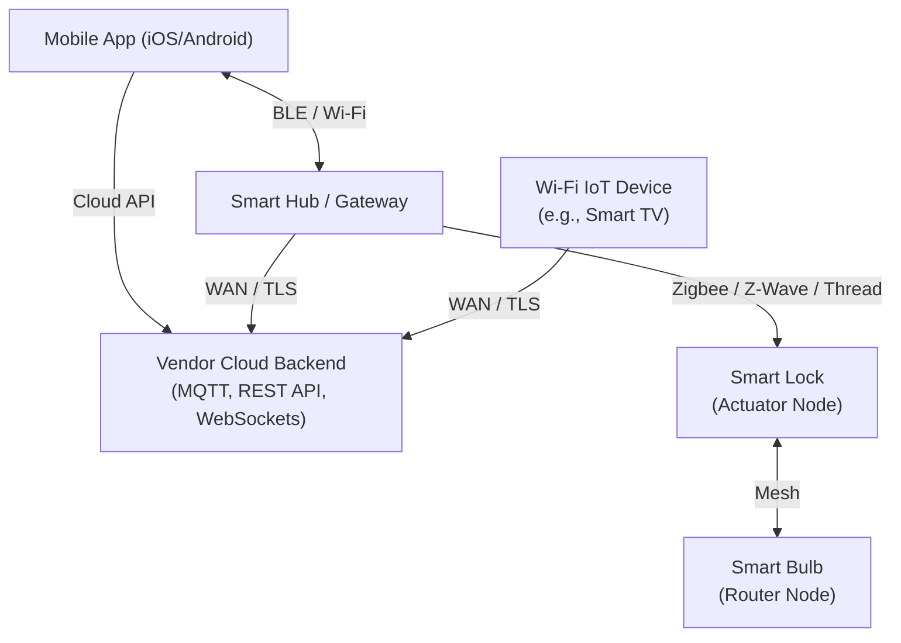

# 49.17 Smart Home Device Attacks

## 1. Introduction

The smart home ecosystem represents one of the most dynamic and complex attack surfaces in modern consumer and enterprise edge environments. Devices range from smart bulbs and thermostats to smart locks, voice assistants, and central hubs. What makes the smart home unique is the sheer variety of communication protocols involved—Wi-Fi, Bluetooth Low Energy (BLE), Zigbee, Z-Wave, Thread, and Matter—all interacting in a mesh or hub-and-spoke topology.

The security challenge is immense: manufacturers prioritize ease-of-use and rapid time-to-market over robust security. Consequently, smart home devices are frequently plagued by insecure default configurations, weak cryptography, lack of mutual authentication, and highly vulnerable companion mobile applications or cloud backend APIs.

This note comprehensively details the architecture, attack vectors, and exploitation methodologies specific to the smart home domain.

## 2. Architecture and Topologies

Smart home networks generally follow one of two models, or a hybrid of both.

### Hub-and-Spoke Model
Devices communicate via low-power RF protocols (Zigbee, Z-Wave) to a central Smart Hub (e.g., SmartThings, Hubitat). The Hub then translates these protocols to TCP/IP and communicates with the local network and the Cloud.
- **Advantage**: Centralized control.
- **Vulnerability**: The Hub is a single point of failure and a high-value target. Compromising the hub grants control over all attached devices.

### Direct-to-Cloud / Peer-to-Peer Model
Devices connect directly to the home Wi-Fi network and establish persistent WebSocket or MQTT connections to a vendor-controlled Cloud API.
- **Advantage**: No extra hardware needed for the consumer.
- **Vulnerability**: Every device has its own IP stack, expanding the network attack surface. Devices often bypass local firewalls via outbound NAT translation, and Cloud API flaws can lead to mass-compromise.

## 3. Attack Surface Diagram



## 4. Wireless RF Protocol Exploitation

Unlike traditional IP networks, smart homes rely heavily on RF protocols. 

### Zigbee (IEEE 802.15.4)
Zigbee uses a mesh network topology. Security relies on a Network Key (shared among all devices) and Link Keys (between two specific devices).
- **The Pairing Vulnerability**: When a new device joins a Zigbee network, the Network Key is often transmitted in plaintext (or encrypted with a widely known default "Trust Center Link Key" like `5A 69 67 42 65 65 41 6C 6C 69 61 6E 63 65 30 39` - "ZigBeeAlliance09").
- **Exploitation**: An attacker using a device like an RZUSBstick or a CC2531 USB dongle flashed with killerbee firmware can sniff the pairing process, extract the Network Key, and subsequently decrypt all network traffic, inject commands (e.g., "unlock door"), or spoof devices.

```bash
# Sniffing Zigbee traffic using KillerBee
zbid
zbsniff -f 11 -c 100 -w zigbee_capture.pcap
```

### Z-Wave
Z-Wave operates in the sub-1GHz band (e.g., 908.42 MHz in the US), offering better range but lower bandwidth.
- **Security Frameworks**: Z-Wave utilizes S0 and S2 security frameworks. 
- **S0 Vulnerability**: S0 negotiates the encryption key using a temporary key consisting of all zeros (`0000000000000000`). If an attacker captures the pairing process (inclusion), they can easily decrypt the permanent key.
- **Exploitation**: Using Software Defined Radio (SDR) like HackRF or YardStick One, attackers can execute a "Z-Wave Downgrade Attack" or capture the S0 inclusion process to compromise the network.

### Bluetooth Low Energy (BLE)
BLE is commonly used for initial device setup or proximity-based unlocking (e.g., smart locks).
- **Vulnerabilities**: Lack of pairing authentication ("Just Works" mode), allowing Man-in-the-Middle (MITM) attacks. Replay attacks are common if the application layer does not implement proper nonces or timestamps.
- **Exploitation Tooling**: `gattool`, `ubertooth-one`, `bettercap`.

## 5. Mobile Application and Cloud API Vectors

Often, the path of least resistance is not hacking the device locally, but attacking the infrastructure that manages it.

### Mobile App Reversing
Companion apps hold the keys to the kingdom. By pulling the APK/IPA and decompiling it (using `jadx`, `Frida`, `MobSF`), attackers routinely find:
- Hardcoded AWS S3 credentials or MQTT broker credentials.
- Hardcoded encryption keys used to generate local authorization tokens.
- Hidden developer endpoints or bypasses for certificate pinning.

### Cloud API Vulnerabilities (BOLA/IDOR)
Smart home cloud backends manage millions of devices. A common architectural flaw is Broken Object Level Authorization (BOLA).
- **Scenario**: The mobile app queries the cloud to unlock a door via a REST API: `POST /api/v1/devices/7391/unlock`.
- **Exploitation**: The API validates that the user is authenticated via a JWT, but *fails to validate that the user actually owns device ID 7391*. An attacker can simply iterate through device IDs and unlock doors globally across the vendor's user base.

### MQTT Exploitation
Message Queuing Telemetry Transport (MQTT) is the backbone of IoT messaging.
- Devices publish and subscribe to topics (e.g., `home/livingroom/temperature` or `home/frontdoor/set_lock`).
- **Misconfigurations**: Brokers often lack authentication, or enforce authentication but lack proper Access Control Lists (ACLs). This allows any authenticated user to subscribe to `#` (wildcard), reading all messages across all tenants, or publish to another user's device topic, executing unauthorized commands.

## 6. Local Network Exploitation

When an attacker is on the same Wi-Fi network (or has compromised a neighboring device), the local attack surface opens up.

### UPnP and mDNS Poisoning
Smart devices rely heavily on multicast protocols like UPnP, mDNS (Bonjour), and SSDP for local discovery.
- **Exploitation**: Attackers can spoof mDNS responses, tricking the companion app into connecting to an attacker-controlled machine instead of the actual smart device. This facilitates seamless MITM, allowing the attacker to capture setup credentials or local API tokens.

### Unauthenticated Local APIs
Many devices assume that the local Wi-Fi network is "trusted". They may require TLS and strong auth for external cloud communication, but expose a completely unauthenticated HTTP server on port 80 locally for changing states or rebooting.

## 7. Case Studies and Weaponization

- **The Mirai Paradigm**: While primarily targeting routers and cameras, Mirai's methodology of aggressive telnet brute-forcing applies directly to smart home hubs and DVRs.
- **Smart Lock Lock-picking via BLE**: Several popular smart locks have been compromised by capturing a single legitimate BLE unlock payload and replaying it, because the vendor failed to implement a cryptographic nonce (replay protection) in their proprietary BLE GATT service layer.
- **Thermostat Ransomware**: Proof-of-concepts have demonstrated compromising smart thermostats (which often run full Linux or Android) via local network attacks, locking the screen, cranking the heat to 99 degrees, and demanding cryptocurrency to restore control.

## 8. Defenses and Mitigations

1. **Consumer/End-User**:
   - Create a dedicated, isolated "IoT Wi-Fi Network" (VLAN) that cannot route traffic to the primary trusted network (where laptops and NAS devices reside).
   - Disable remote access features if not absolutely necessary.
   - Routinely update firmware.
2. **Vendor/Manufacturer**:
   - Enforce MUD (Manufacturer Usage Description) to lock down the network behavior of the device.
   - Implement mutual TLS (mTLS) for all device-to-cloud communications.
   - Use Zigbee 3.0 or Z-Wave S2, which fix the inherent vulnerabilities in the inclusion processes.
   - Never use the "Just Works" BLE pairing mode for devices requiring security (like locks or alarms); mandate Out-Of-Band (OOB) or Numeric Comparison pairing.

## 9. Chaining Opportunities

- **BLE MITM to Cloud Compromise**: Exploiting a BLE MITM vulnerability during initial device setup to intercept the home Wi-Fi PSK and the device's unique Cloud API provisioning token.
- **Smart Bulb to Network Pivot**: Using a buffer overflow in a smart bulb's custom HTTP server to drop a lightweight shell, then using the bulb as a persistence mechanism to scan and exploit the homeowner's internal LAN over time.

## 10. Related Notes
- [[16 - IP Camera Exploitation]]
- [[20 - Defense Network Segmentation Patch Management]]
- [[05 - Wireless Network Pentesting (Wi-Fi, Bluetooth)]]
- [[07 - Mobile Application Pentesting (Android/iOS)]]
- [[01 - API1 — Broken Object Level Authorization (BOLA)]]
