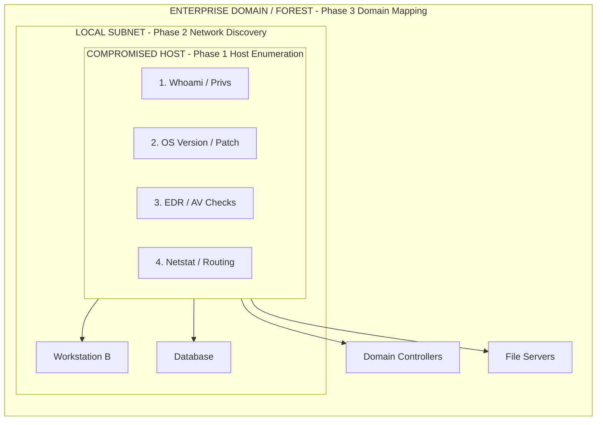

# Situational Awareness (SA)

## 1. Introduction

Situational Awareness (SA) is the systematic process of understanding the environment you have just compromised. It answers fundamental questions that dictate the entire trajectory of the post-exploitation phase: *Who am I? Where am I? What can I see? What can I do?* 

Without SA, an attacker is flying blind. Executing random commands or launching automated enumeration scripts without understanding the context is the equivalent of kicking down a door and shouting—it guarantees detection. A skilled operator moves deliberately, acting like a ghost in the machine, gradually mapping the digital terrain.

SA is generally categorized into three distinct layers:
1.  **Host-Level SA**: Understanding the specific machine you have landed on.
2.  **Network-Level SA**: Understanding the local subnet, routing, and adjacent systems.
3.  **Domain/Enterprise-Level SA**: Understanding the broader Active Directory or cloud environment, trust relationships, and organizational structure.

## 2. Host-Level Situational Awareness

The immediate priority upon gaining a shell is assessing the local host. The goal is to determine the operating system, current user privileges, installed defenses, and potential paths for local privilege escalation (LPE).

### 2.1 Windows Host Enumeration

On Windows, Living off the Land (LotL) techniques utilizing built-in command-line executables and PowerShell are preferred to avoid dropping binary tools.

**Who Am I? (User Context)**
Understanding the current user context is critical. Are you a standard user, a local administrator, or running as a service account?

```cmd
:: Get current username, SID, and assigned privileges
whoami /all

:: List local groups the user belongs to
net user %USERNAME%

:: Check for sensitive privileges like SeImpersonatePrivilege or SeDebugPrivilege
whoami /priv
```

**Where Am I? (System Context)**
Identifying the operating system version, architecture, and patch level helps determine applicable LPE exploits.

```cmd
:: Get basic OS information and hotfixes
systeminfo | findstr /B /C:"OS Name" /C:"OS Version" /C:"System Boot Time"
wmic qfe get Caption,Description,HotFixID,InstalledOn

:: Enumerate logical drives
wmic logicaldisk get caption,description,providername
```

**What Can I See? (Environment & Defenses)**
Identifying installed security software (EDR, AV, Sysmon) is paramount before executing any further payloads.

```cmd
:: Check for common EDR/AV processes
tasklist /v | findstr /i "cb.exe cbagent.exe msmpeng.exe sentinel agent.exe crowdstrike fireeye"

:: Enumerate running services
sc query | findstr /i "SERVICE_NAME DISPLAY_NAME STATE"

:: Check Windows Defender status via PowerShell
Get-MpComputerStatus
```

### 2.2 Linux Host Enumeration

Linux environments require a different toolset but follow the exact same logical progression.

**Who Am I? (User Context)**
```bash
# Get current user id, group ids
id

# Check if the user can run any commands as root (requires password usually, but check anyway)
sudo -l

# View command history for potential credentials or context
cat ~/.bash_history
```

**Where Am I? (System Context)**
```bash
# Get kernel version and architecture
uname -a
cat /etc/os-release

# Enumerate mounted filesystems
df -h
mount | column -t
```

**What Can I See? (Environment & Defenses)**
```bash
# Check running processes, look for security agents (e.g., auditd, splunk, qualys)
ps aux
top -n 1 -b

# Check cron jobs for scheduled execution context
cat /etc/crontab
ls -la /etc/cron.*
```

## 3. Network-Level Situational Awareness

Once the host is understood, the focus shifts outward. The goal is to identify how the compromised host connects to the rest of the network and what other devices are reachable.

**Network Interfaces and Routing**
```cmd
:: Windows
ipconfig /all
route print
arp -a

:: Linux
ip a
ip route
arp -an
```

**Active Connections and Listening Ports**
Identifying active connections can reveal application dependencies, database connections, or administrator RDP sessions. Listening ports reveal services running locally that might be exploitable for LPE.
```cmd
:: Windows
netstat -ano | findstr ESTABLISHED
netstat -ano | findstr LISTENING

:: Linux
ss -tulpn
netstat -natp
```

**Internal Port Scanning**
Instead of uploading Nmap, operators use built-in tools or native API calls to scan internal subnets silently.
```powershell
# Simple PowerShell TCP Port Scanner
$ports = (21,22,80,443,445,3389)
foreach ($port in $ports) {
    try {
        $tcp = New-Object System.Net.Sockets.TcpClient
        $tcp.Connect("192.168.1.0-255", $port)
        Write-Host "Port $port is open!"
    } catch { }
}
```

## 4. Domain-Level Situational Awareness

In an enterprise environment, the host is usually joined to an Active Directory (AD) domain. Domain SA involves mapping the AD structure, identifying domain controllers, finding privileged groups, and locating high-value targets (like file servers or jump hosts).

**Native AD Enumeration**
Using built-in Windows commands to query the domain directory.
```cmd
:: Get domain name and domain controller
echo %USERDNSDOMAIN%
echo %LOGONSERVER%

:: List Domain Administrators
net group "Domain Admins" /domain

:: Find all Domain Controllers
nltest /dclist:DOMAIN_NAME
```

**Advanced AD Enumeration (PowerView / BloodHound)**
Red teams typically rely on tools like PowerView (a PowerShell module) or BloodHound (a graph theory-based AD mapping tool) for deep AD enumeration. To maintain OpSec, these are often executed entirely in memory via C2 frameworks.
```powershell
# PowerView: Get all users with a specific SPN (useful for Kerberoasting)
Get-DomainUser -SPN

# PowerView: Find active sessions on file servers
Find-DomainUserLocation

# BloodHound: Data collection using SharpHound via C2 execute-assembly
execute-assembly /path/to/SharpHound.exe -c All
```

## 5. Visualizing the SA Workflow

The following ASCII diagram illustrates the expanding radius of Situational Awareness, starting from the compromised host and radiating outwards to the entire enterprise domain.



## 6. Operational Security (OpSec) in SA

Enumeration is inherently noisy. Every query leaves a trace in system logs, network traffic, or EDR telemetry. 

1.  **Avoid Voluminous Queries**: Running `net user /domain` in an environment with 100,000 users will generate massive network traffic and instantly alert the Blue Team. Use LDAP queries with specific filters instead.
2.  **API vs. Binaries**: Using `net.exe` or `whoami.exe` creates process creation events (Event ID 4688). Modern C2 frameworks utilize direct Windows API calls (e.g., calling `NetUserEnum` via BOFs - Beacon Object Files) to enumerate data without spawning sub-processes.
3.  **Command Obfuscation**: If command-line tools must be used, obfuscating the commands or bypassing AMSI can prevent basic signature-based detection.
4.  **Time Delay**: Introduce delays between commands. Do not run 50 enumeration commands in 5 seconds. Act like a human administrator.

## 7. Analyzing the Output

Data collected during SA is only useful if properly analyzed. Operators must look for anomalies and misconfigurations:
*   A user with `SeImpersonatePrivilege` indicates a potential Potato-family LPE attack path.
*   An outdated internal software version discovered via `tasklist` might have a known exploit.
*   A routing table showing a second network interface might indicate the host is a dual-homed jump box bridging two network segments.
*   A domain enumeration showing high-value targets connected to a specific file share suggests a prime location for lateral movement.

## Chaining Opportunities
*   The findings from this note directly inform the strategies used in [[01 - Post-Exploitation Goals and Phases]].
*   Identifying sensitive data during host mapping naturally leads to utilizing [[03 - Data Exfiltration Techniques]].
*   Understanding the system architecture determines whether to apply [[04 - Persistence Windows]] or [[05 - Persistence Linux]].

## Related Notes
*   [[01 - Post-Exploitation Goals and Phases]]
*   [[04 - Persistence Windows]]
*   [[06 - Backdoor Accounts]]
