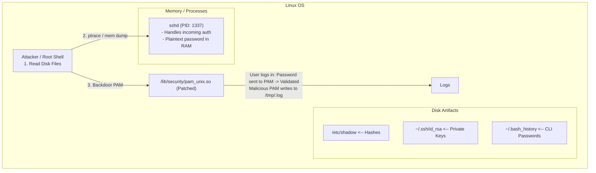

# Credential Dumping on Linux

## 1. Introduction

While Windows utilizes LSASS and the SAM database for credential management, Linux environments rely heavily on Pluggable Authentication Modules (PAM), local configuration files, and SSH key management. During post-exploitation on a Linux server, a Red Teamer with root privileges has multiple avenues to extract plaintext passwords, password hashes, and cryptographic keys. 

Credential dumping on Linux is less centralized than on Windows. An attacker must gather artifacts from configuration files, monitor active memory of authentication processes (like `sshd` or `su`), and backdoor existing authentication frameworks to capture credentials in transit.

## 2. Authentication Architecture on Linux

1. **/etc/passwd and /etc/shadow:** The `/etc/passwd` file stores user account information, while `/etc/shadow` stores the securely hashed passwords (using algorithms like SHA-512, bcrypt, or yescrypt). 
2. **Pluggable Authentication Modules (PAM):** PAM acts as an intermediary layer between Linux applications (like SSH, su, sudo, login) and the underlying authentication mechanisms. Applications call PAM APIs, and PAM handles the authentication flow.
3. **SSH Keys:** The backbone of Linux administration. Private keys (`id_rsa`, `id_ed25519`) are stored in `~/.ssh/`.

## 3. Visualizing Linux Credential Dumping and PAM Backdooring



## 4. Tools and Techniques

### 4.1 Dumping /etc/shadow
If the attacker has `root` access (or a misconfigured `sudo` policy allows arbitrary file reads), they can dump the shadow file to crack the hashes offline.

```bash
cat /etc/shadow
# Output example:
# root:$6$xyz123...$abcdefg...:18900:0:99999:7:::
```
*Note: The `$6$` prefix indicates a SHA-512 hash, which can be cracked offline using Hashcat (Mode 1800).*

### 4.2 Harvesting SSH Keys and History
Often, administrators leave private keys lying around or type passwords directly into the command line, which are saved in shell history files.

```bash
# Search for private SSH keys
find / -name "id_rsa" -o -name "id_ed25519" 2>/dev/null

# Search for passwords in bash history
cat ~/.bash_history | grep -i "pass\|ssh\|ftp\|mysql\|admin"
```

### 4.3 In-Memory Dumping (MimiPenguin)
Similar to Mimikatz on Windows, tools like **MimiPenguin** attempt to dump plaintext passwords from the memory of active processes like `sshd`, `su`, `sudo`, `gdm-session-worker`, and `vsftpd`.

```bash
# Requires root privileges to read /proc/<pid>/mem
sudo ./mimipenguin.sh
# or the C version
sudo ./mimipenguin
```
*Mechanics:* It uses `ptrace` or directly reads `/proc/PID/mem` to search for known string patterns and data structures associated with plaintext passwords cached during active sessions.

### 4.4 Backdooring PAM
To ensure persistent credential harvesting, attackers can backdoor PAM. This usually involves replacing `pam_unix.so` (the standard module that checks `/etc/shadow`) with a compiled version that logs all successful (or failed) plaintext passwords to a hidden file.

**Execution Flow:**
1. Download the exact source code for the target's PAM version.
2. Modify `modules/pam_unix/pam_unix_auth.c` to add an `fopen` and `fprintf` routine capturing the password parameter.
3. Compile and replace `/lib/x86_64-linux-gnu/security/pam_unix.so`.

*All subsequent logins via SSH, local console, or `sudo` will append plaintext passwords to the attacker's log file.*

### 4.5 SSH Daemon (sshd) Hooking and Stracing
If modifying PAM is too risky, attackers can use dynamic instrumentation or `strace` to capture passwords read by the SSH daemon.

```bash
# Attach strace to the master sshd process to capture child process reads
strace -f -e trace=read,write -p $(pgrep -f "sshd -D") -o /tmp/sshd_trace.log
```
*Note: This generates massive logs and must be carefully grepped for password structures.*

## 5. Advanced OPSEC and Evasion Considerations

### 5.1 Avoiding Disk Forensics
Writing compiled binaries (like MimiPenguin) to disk is dangerous. Advanced attackers use Python scripts utilizing `ctypes` or natively inject shellcode into memory to read `/proc/kcore` or `/proc/PID/mem` without touching the disk.

### 5.2 Shell History Evasion
When dumping credentials manually, ensure your actions are not recorded.
```bash
# Disable history for the current session
unset HISTFILE
export HISTSIZE=0

# Alternatively, run commands preceded by a space (if HISTCONTROL=ignorespace is set)
 cat /etc/shadow
```

### 5.3 Modifying File Timestamps (Timestomping)
If you read or modify sensitive files like `/etc/shadow` or `pam_unix.so`, the `Access` or `Modify` timestamps will change, alerting defenders.
```bash
# Copy timestamps from a legitimate file
touch -r /lib/x86_64-linux-gnu/security/pam_deny.so /lib/x86_64-linux-gnu/security/pam_unix.so
```

## 6. Detection and Mitigation Strategies

### 6.1 Detection Metrics
- **Auditd Rules:** Monitor access to `/etc/shadow`, `/etc/passwd`, and `~/.ssh/` directories. 
  `auditctl -w /etc/shadow -p wa -k shadow_monitor`
- **File Integrity Monitoring (FIM):** Tools like AIDE, Tripwire, or OSSEC will detect unauthorized changes to PAM modules (`/lib/*/security/*.so`) or SSH daemon binaries.
- **Process Monitoring:** Detect processes attaching via `ptrace` to `sshd` or `su`. This is highly anomalous on production servers.

### 6.2 Mitigation Metrics
- **Disable Password Authentication:** Configure `sshd_config` with `PasswordAuthentication no`. Enforce SSH key-based authentication only, rendering password dumping and PAM backdooring less effective for remote entry.
- **YubiKey / MFA:** Implement hardware tokens or TOTP for SSH access. Even if an attacker dumps a plaintext password, the secondary factor prevents lateral movement.
- **Restrict ptrace:** Use AppArmor, SELinux, or kernel parameters (`kernel.yama.ptrace_scope = 1` or `2`) to prevent unauthorized processes from reading memory of other processes.

## 7. Chaining Opportunities
- **[[12 - Port Forwarding and Pivoting]]**: Use extracted SSH keys to establish reverse SSH tunnels deep into internal enclaves.
- **[[01 - Linux Privilege Escalation]]**: Often, credentials dumped from a compromised user's `.bash_history` belong to root or other administrative accounts.
- **[[17 - Credential Dumping Windows]]**: Extracted plaintext passwords on Linux often match those on Windows Active Directory due to password reuse.

## 8. Related Notes
- [[17 - Credential Dumping Windows]]
- [[13 - Lateral Movement WinRM]]
- [[10 - Bypassing Antivirus and EDR]]
- [[02 - Essential Linux Commands and Bash Scripting]]
