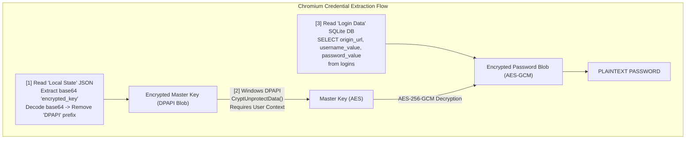

# 45.19 Browser Credential Extraction

## 1. Introduction

During the post-exploitation phase, extracting plaintext credentials or session material from browsers is one of the most high-value actions a Red Teamer or attacker can perform. Modern web browsers act as centralized vaults for passwords, authentication cookies, session tokens, autofill data, and browsing history. Accessing this data can facilitate lateral movement, privilege escalation, and direct access to high-value cloud environments, corporate VPNs, and internal applications without triggering traditional authentication alerts.

Because users heavily rely on built-in password managers and "Remember Me" features, compromising a single endpoint often yields direct access to hundreds of associated accounts. This document provides a highly detailed, deep technical dive into the cryptographic mechanisms browsers use to secure data and the post-exploitation techniques used to bypass these protections.

## 2. Core Concepts: Browser Data Architecture

Browsers are fundamentally partitioned into distinct profiles, each maintaining its own isolated set of databases. These databases are typically SQLite formats.

### 2.1 Chromium-Based Browsers (Chrome, Edge, Brave, Opera)
Chromium browsers use a unified architecture for storing user data. The most critical files reside in the user's `AppData` directory:
- **Chrome:** `%LOCALAPPDATA%\Google\Chrome\User Data\`
- **Edge:** `%LOCALAPPDATA%\Microsoft\Edge\User Data\`
- **Brave:** `%LOCALAPPDATA%\BraveSoftware\Brave-Browser\User Data\`

Key files within the profile (e.g., `Default` or `Profile 1`):
1. **`Login Data`**: An SQLite database containing saved passwords. The URLs and usernames are stored in plaintext, but the password values are encrypted.
2. **`Cookies`**: An SQLite database containing session cookies. Values are encrypted.
3. **`Web Data`**: Contains autofill information.
4. **`Local State`**: A JSON file located in the parent `User Data` directory. It contains the encrypted Master Key required to decrypt the SQLite databases.

### 2.2 Mozilla Firefox
Firefox does not use Chromium's DPAPI-dependent architecture by default, instead opting for the Network Security Services (NSS) library.
- **Path:** `%APPDATA%\Mozilla\Firefox\Profiles\<random>.default-release\`
Key files:
1. **`key4.db`**: An SQLite database containing the master key and cryptographic salts.
2. **`logins.json`**: A JSON file containing the encrypted usernames, passwords, and URLs.

## 3. Cryptographic Implementation: The Role of DPAPI

On Windows systems, Chromium heavily relies on the Data Protection API (DPAPI) to secure the master key. DPAPI is a built-in Windows cryptography framework that uses the user's logon credentials (or system credentials) to seamlessly encrypt and decrypt data without requiring the user to manually enter a master password.

When Chrome generates an AES-256-GCM Master Key to encrypt passwords and cookies, it must store this Master Key securely. It uses DPAPI's `CryptProtectData` API call to encrypt the Master Key. The encrypted Master Key is then stored as a base64-encoded string in the `Local State` JSON file under the `"os_crypt": {"encrypted_key": "..."}` node.

Because DPAPI is tied to the user session, any process running in the context of the user can call `CryptUnprotectData` to decrypt the Master Key. This is the fundamental flaw exploited during browser credential extraction.

## 4. Architecture Diagram: Chromium DPAPI Decryption Flow



## 5. Step-by-Step Chromium Extraction Process

### Phase 1: Obtaining the Encrypted Master Key
The attacker parses the `Local State` file (JSON). They navigate to `os_crypt.encrypted_key`.
The retrieved string is Base64 decoded. The first 5 bytes are typically the ASCII string `DPAPI`. The attacker strips these 5 bytes to obtain the raw DPAPI blob.

### Phase 2: Decrypting the Master Key via DPAPI
The attacker invokes the Windows API `CryptUnprotectData` via C#, PowerShell, or a compiled binary (C/C++).
```csharp
[DllImport("crypt32.dll", SetLastError = true, CharSet = CharSet.Auto)]
private static extern bool CryptUnprotectData(ref DATA_BLOB pCipherText, ... );
```
Since the post-exploitation payload is running under the compromised user's session, Windows automatically uses the user's master key (derived from their logon password) to seamlessly decrypt the blob. The result is the raw AES-256 Master Key.

### Phase 3: Accessing the `Login Data` SQLite Database
The attacker locates the `Login Data` file.
**Crucial OPSEC Note:** If the browser is currently running, the SQLite database will be locked by the OS. Attempting to open it directly will result in a file lock error or potentially crash the browser thread, alerting the user. Red Teamers bypass this by creating a temporary copy of the `Login Data` file (e.g., to `%TEMP%`) and querying the copy.

### Phase 4: AES-256-GCM Decryption
The attacker executes: `SELECT origin_url, username_value, password_value FROM logins;`
The `password_value` blob structure:
- **Prefix:** `v10` or `v11` (3 bytes) indicating the version.
- **Nonce/IV:** The next 12 bytes.
- **Ciphertext + MAC:** The remainder of the blob (the last 16 bytes being the GCM authentication tag).

The attacker uses the decrypted AES-256 Master Key, the extracted Nonce, and the Ciphertext to perform AES-GCM decryption, yielding the plaintext password.

## 6. Firefox Credential Extraction Process

Firefox extraction differs significantly because it does not rely on DPAPI by default. Instead, Firefox uses its own crypto library (NSS).

### The Mechanics:
1. Firefox stores credentials in `logins.json`. The payloads are encrypted using Triple-DES (historically) or AES.
2. The key required to decrypt `logins.json` is stored in `key4.db`.
3. If the user has NOT set a "Master Password" in Firefox, the key inside `key4.db` is encrypted with a hardcoded, blank password.
4. The attacker parses `key4.db`, extracts the global salt, and uses the blank password to derive the key-encryption-key (KEK).
5. The KEK is used to decrypt the actual Master Key inside `key4.db`.
6. Finally, the Master Key is used to decrypt the entries in `logins.json`.

If a Master Password IS set, the attacker must offline crack the `key4.db` hashes to retrieve the KEK.

## 7. Extracting Session Cookies & Tokens

While passwords are high value, **Session Cookies** are often even more critical because they allow attackers to bypass Multi-Factor Authentication (MFA). 
If a user is logged into AWS, Azure, or Okta, extracting the valid session cookie from the `Cookies` SQLite database (using the exact same DPAPI/AES flow described above) allows the attacker to achieve a "Pass-the-Cookie" attack. The attacker simply injects the decrypted cookie into their own browser to hijack the active session.

## 8. Tooling and Automation

Numerous tools automate this complex cryptographic dance:
- **SharpChromium:** A C# project designed to run in-memory via execute-assembly. It handles the file copying, SQLite parsing, and DPAPI decryption silently.
- **Seatbelt:** GhostPack's enumeration tool includes modules for browser extraction.
- **Mimikatz:** The `dpapi` module can be used to interact directly with DPAPI blobs and masterkeys.
- **Metasploit:** Modules like `post/windows/gather/credentials/chrome` and `enum_applications` automate the collection phase.

## 9. OPSEC & EDR Evasion Considerations

- **File Locking:** Always copy SQLite databases before accessing. Native SQLite DLLs should be avoided in favor of managed parsers to reduce dropped binaries.
- **API Monitoring:** EDRs heavily monitor `CryptUnprotectData`. Calling this API rapidly on known browser paths can trigger alerts. Advanced evasion involves injecting into an existing browser process or explorer.exe and calling the API from a trusted memory space.
- **RPC over SMB:** If the attacker has SYSTEM access, they can extract the user's DPAPI Master Key remotely using RPC calls over SMB, allowing offline decryption of the downloaded browser files without executing code on the target.

## 10. Defense and Mitigation Strategies

1. **Application Guard / Sandboxing:** Microsoft Defender Application Guard can isolate browser sessions, preventing the host OS from interacting with the browser's credential stores.
2. **Device Policies:** Enforce GPOs that completely disable the browser's built-in password manager. Mandate the use of enterprise password managers (like 1Password, Bitwarden) which require explicit unlocking and do not solely rely on seamless DPAPI decryption.
3. **MFA and Session Lifetimes:** Implement aggressive session timeouts for critical applications to reduce the window of opportunity for Pass-the-Cookie attacks.
4. **EDR Rules:** Alert on unexpected processes (especially `powershell.exe`, `cmd.exe`, or unsigned binaries) reading from `User Data` directories or calling `CryptUnprotectData`.

## 11. Chaining Opportunities

- **Pass-the-Cookie:** Use extracted session cookies to bypass MFA on SaaS applications.
- **[[20 - Email Client Credential Extraction]]:** Extracted browser credentials often reuse passwords that unlock email clients or VPN access.
- **Lateral Movement:** Passwords extracted from the browser can be used with `psexec` or `WinRM` to pivot to other workstations or servers.

## 12. Related Notes
- [[01 - Windows DPAPI Concepts]]
- [[02 - Local Security Authority Subsystem Service (LSASS)]]
- [[18 - Session Hijacking and Pass-the-Cookie]]
- [[21 - SSH Agent Hijacking]]
