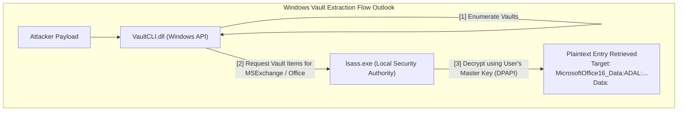

# 45.20 Email Client Credential Extraction

## 1. Introduction

Email client credential extraction is a critical post-exploitation objective. Desktop email clients such as Microsoft Outlook, Mozilla Thunderbird, and Apple Mail cache credentials, session tokens, and the entirety of a user's communication history. Compromising these assets grants an attacker immense leverage: not only access to sensitive corporate information, but the ability to perform password resets for other services, intercept Multi-Factor Authentication (MFA) tokens sent via email, and conduct internal phishing campaigns using a highly trusted, legitimate internal account.

Unlike browser credential extraction, which relies heavily on SQLite and DPAPI across the board, email client extraction involves a broader array of data stores, including the Windows Registry, the Windows Credential Manager, proprietary local database formats (OST/PST), and network-layer token passing.

## 2. Core Concepts: Email Protocols and Storage

Desktop clients must seamlessly authenticate with mail servers (Exchange, Microsoft 365, IMAP, SMTP). To avoid prompting the user for a password upon every launch, clients store the authentication material locally.

### 2.1 Storage Mechanisms
1. **Windows Credential Manager / Vault:** Modern versions of Outlook (especially those connected to Microsoft 365) heavily rely on the Windows Vault to store OAuth tokens and password equivalents.
2. **Windows Registry:** Legacy Outlook profiles and specific POP3/IMAP configurations store encrypted passwords directly in the user's registry hive (`NTUSER.DAT`).
3. **Proprietary Files (OST / PST):** Offline Storage Tables (OST) and Personal Storage Tables (PST) contain the actual cached emails. While not directly storing passwords, they are massive repositories of plaintext data.
4. **Profile Files:** Thunderbird uses `.ini` files and SQLite databases (`key4.db`, `logins.json`) identical to Firefox's architecture.

## 3. Microsoft Outlook Extraction Deep Dive

Outlook is the primary target in most corporate environments. The extraction process varies heavily based on the Outlook version and the type of authentication (Basic Auth vs. Modern Auth/OAuth).

### 3.1 Registry-Based Credential Storage (Legacy & Basic Auth)
For traditional IMAP, POP3, and older Exchange connections, Outlook stores encrypted passwords in the Windows Registry under the Mail profile.
- **Registry Key Path:** `HKCU\Software\Microsoft\Windows NT\CurrentVersion\Windows Messaging Subsystem\Profiles\Outlook\` (or `HKCU\Software\Microsoft\Office\16.0\Outlook\Profiles`)

The passwords are stored as binary registry values. Microsoft utilizes DPAPI (`CryptProtectData`) to encrypt the password before writing it to the registry. 
To extract it:
1. The attacker queries the registry to find the profile keys.
2. They identify the binary blobs corresponding to passwords (often tagged with specific property IDs like `001f6620` or `001f6641`).
3. The attacker passes the binary blob to `CryptUnprotectData` in the user's security context.
4. The API decrypts the blob, revealing the plaintext password.

### 3.2 Windows Credential Manager & Windows Vault
Modern Outlook, connecting to Exchange Online / M365, utilizes Modern Authentication. Instead of storing a plaintext password, Outlook obtains OAuth 2.0 access and refresh tokens. These tokens are stored securely in the Windows Credential Manager.

Credentials stored in the Vault are protected by DPAPI but require specific Vault APIs (`VaultEnumerateVaults`, `VaultEnumerateItems`, `VaultGetItem`) rather than raw `CryptUnprotectData` calls.

### 3.3 ASCII Diagram: Outlook Credential Manager Extraction Flow

## 4. Mozilla Thunderbird Credential Extraction

Thunderbird shares the Mozilla framework with Firefox. Its credentials are not tied to the OS's DPAPI, making them cross-platform but requiring specific decryption logic.

### Process:
1. Locate the `profiles.ini` file, typically at `%APPDATA%\Thunderbird\profiles.ini` (Windows) or `~/.thunderbird/profiles.ini` (Linux).
2. Parse the ini file to identify the active profile directory.
3. Access `key4.db` (which stores the master key encryption key) and `logins.json` (which stores the encrypted passwords).
4. If no master password is set, a script can use the default empty string to derive the decryption key, unwrap the master key from `key4.db`, and decrypt `logins.json`.
5. This yields plaintext SMTP/IMAP passwords.

## 5. Exploiting OST and PST Files

Even if credentials or tokens cannot be extracted, local email caches (OST/PST files) provide catastrophic data exposure.
- **Location:** Usually found in `%LOCALAPPDATA%\Microsoft\Outlook\`.
- **Extraction:** These files are heavily locked by the OS when Outlook is running. Attempting to copy them directly will fail.
- **Bypass:** Attackers use Volume Shadow Copy Service (VSS) or specialized API calls (like `NinjaCopy`) to clone the locked file from the raw NTFS volume.
- **Analysis:** Once exfiltrated, tools like `pffexport` or `readpst` can convert the proprietary binary format into human-readable MIME emails or MBOX formats.

## 6. Tooling and Automation

- **MailSniper:** A highly regarded PowerShell module used for searching through Exchange environments. It can search local Outlook profiles, extract passwords, and search for sensitive terms (like "password", "vpn", "secret") directly within the mailbox.
- **Mimikatz:** The `vault::list` and `vault::cred` commands are instrumental for extracting Modern Auth tokens from the Windows Credential Manager.
- **SharpMail:** A C# tool designed to read and decrypt credentials from the Outlook registry paths using DPAPI.
- **SessionGopher:** A PowerShell script that actively hunts for stored credentials, including PuTTY, RDP, and email clients.

## 7. OPSEC and EDR Evasion Considerations

- **VSS Artifacts:** Creating a Volume Shadow Copy to steal an OST file leaves significant event log artifacts (`Event ID 7036` for VSS service state changes). It also requires local Administrator privileges. EDRs often monitor for unauthorized `vssadmin` or `wmic shadowcopy` usage.
- **Registry Monitoring:** Querying legacy Outlook registry keys is relatively stealthy but heavily signatured by modern AVs when performed by non-standard processes (like `powershell.exe`).
- **Token Replay Anomaly:** Stealing an OAuth token and using it from an external IP address (an attacker's C2 infrastructure) might trigger "Impossible Travel" or "Unrecognized Device" alerts in Azure AD / M365 Identity Protection. Proxying the token replay through the compromised endpoint via SOCKS is preferred.

## 8. Defense and Mitigation Strategies

1. **Enforce Modern Authentication:** Disable legacy authentication (Basic Auth, POP3, IMAP) across the tenant to prevent passwords from being cached in the registry.
2. **Conditional Access Policies:** Require that access to Exchange Online originates only from Compliant Devices or hybrid Azure AD joined machines. This prevents an attacker from exfiltrating a token and using it on their own unmanaged device.
3. **MFA with Number Matching:** While MFA doesn't stop token theft, combining it with Conditional Access reduces the attack surface.
4. **EDR Rules:** Monitor for unusual processes accessing the Windows Credential Vault APIs. Monitor for unapproved processes reading `OST` files.
5. **Session Revocation:** Rapidly revoke refresh tokens via Azure AD when an endpoint compromise is detected.

## 9. Chaining Opportunities

- **Internal Phishing:** Use the compromised Outlook client to send malware to other internal users, bypassing external email gateways (SEGs).
- **Password Reset Routing:** Trigger a password reset for a high-value internal portal and read the recovery link directly from the local OST file or active Outlook session.
- **[[19 - Browser Credential Extraction]]:** Combine email extraction with browser credential theft to build a complete profile of the user's digital identity.

## 10. Related Notes

- [[01 - Windows DPAPI Concepts]]
- [[11 - Credential Dumping Techniques]]
- [[18 - Session Hijacking and Pass-the-Cookie]]
- [[15 - Volume Shadow Copy Abuse]]
