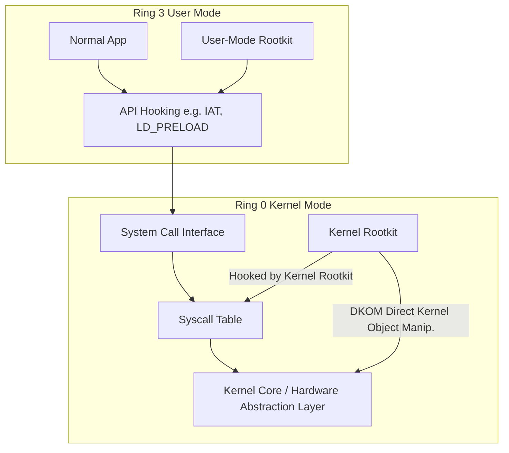

# 45.25 Rootkits

## Overview

Rootkits represent one of the most sophisticated forms of persistence and defense evasion in the post-exploitation lifecycle. The term "rootkit" originally referred to a set of modified administrative tools (like `ls`, `ps`, `netstat`) deployed on a Unix system to maintain "root" access while hiding the attacker's presence. Today, rootkits have evolved into complex software suites designed to subvert the operating system itself, intercepting API calls, modifying kernel structures, and hiding malicious processes, network connections, and files from administrators and security software.

Understanding rootkits requires a deep comprehension of operating system architecture, execution rings (Ring 3 for User Mode, Ring 0 for Kernel Mode), and how software interacts with hardware.

## Architecture and Execution Rings

Operating systems utilize hardware-enforced privilege levels to protect core system components from anomalous or malicious user applications. 

- **Ring 3 (User Mode):** Where standard applications, services, and user-mode malware operate. They must request access to hardware and system resources via System Calls (syscalls).
- **Ring 0 (Kernel Mode):** The core operating system kernel. It has unrestricted access to hardware and memory. Rootkits operating here can manipulate the truth of the system, making detection extremely difficult.

## Types of Rootkits

Rootkits are generally classified by the privilege level at which they operate. 

### 1. User-Mode Rootkits

User-mode rootkits operate in Ring 3 and attempt to intercept or modify API calls made by other applications. They do not modify the kernel itself but rather alter the data returned by the kernel to user-space applications.

#### Implementation Techniques

*   **API Hooking:** The rootkit alters the execution flow of a legitimate program to redirect calls to its own malicious functions before (or instead of) the legitimate OS function.
    *   **IAT Hooking (Import Address Table):** Modifies the table that a Windows executable uses to locate DLL functions. When the application calls a function like `CreateFileW`, the IAT points to the rootkit's code instead of `kernel32.dll`.
    *   **Inline Hooking (Detours):** The rootkit modifies the first few instructions of a function in memory, inserting an unconditional jump (`JMP`) to the rootkit's code. After the rootkit processes the request, it can return execution to the original function.
*   **Linux `LD_PRELOAD`:** In Linux, the `LD_PRELOAD` environment variable allows a user to specify a shared library (`.so`) to be loaded *before* any other libraries. An attacker can create a malicious `.so` that exports functions like `readdir` or `open`. When a legitimate tool like `ls` is run, the malicious `readdir` is called, allowing the rootkit to filter out malicious files from the output.

### 2. Kernel-Mode Rootkits

Kernel-mode rootkits operate in Ring 0. Because they run at the highest privilege level, they can subvert security software, hide processes at the OS level, and maintain near-undetectable persistence.

#### Implementation Techniques

*   **Loadable Kernel Modules (LKM):** In Linux, the kernel allows dynamic loading of modules (drivers) to support new hardware or features. Attackers abuse this by loading a malicious LKM. 
    *   *Example (Diamorphine):* Diamorphine is a classic Linux LKM rootkit. It hooks syscalls (like `getdents` for directory listing and `kill` for signal handling). Sending a specific signal (e.g., `kill -63 0`) toggles the visibility of the rootkit, making it a powerful, interactive tool.
*   **SSDT Hooking (System Service Descriptor Table):** In older versions of Windows (x86), the SSDT mapped user-mode syscalls to kernel-mode functions. Rootkits would overwrite pointers in the SSDT. When `NtQuerySystemInformation` was called to list processes, the hooked function would strip the malicious process from the returned linked list. (Note: PatchGuard/KPP in x64 Windows heavily restricts SSDT hooking).
*   **DKOM (Direct Kernel Object Manipulation):** Because modern 64-bit Windows protects the SSDT via Kernel Patch Protection (PatchGuard), attackers shifted to DKOM. Instead of hooking functions, the rootkit directly modifies data structures in memory.
    *   *EPROCESS Unlinking:* Every process in Windows is represented by an `EPROCESS` structure in kernel memory. These structures are linked together in a doubly-linked list (`ActiveProcessLinks`). A DKOM rootkit finds the `EPROCESS` block for the malicious payload and adjusts the forward (`FLink`) and backward (`BLink`) pointers of the adjacent processes to bypass the malicious one. The malicious process continues to execute because thread scheduling uses a different structure (`KTHREAD`), but tools like Task Manager, which enumerate `ActiveProcessLinks`, will not see it.

### 3. Hypervisor / Virtualization Rootkits

These rootkits run below the operating system (Ring -1). They host the target operating system as a virtual machine. Because the rootkit controls the hardware virtualization extensions (Intel VT-x or AMD-V), the OS is completely unaware it is being intercepted. Examples include the academic "Blue Pill" rootkit.

### 4. Firmware / Hardware Rootkits

These reside in peripheral hardware, such as network cards, hard drive firmware, or system BIOS/UEFI. They survive OS reinstallations and hard drive replacements. (See [[26 - Bootkit]] for detailed UEFI exploitation).

## Post-Exploitation Rootkit Deployment

Deploying a kernel rootkit requires significant privileges. An attacker must first gain local administrator or SYSTEM/root access.

1.  **Privilege Escalation:** Gain maximum privileges.
2.  **Security Software Evasion/Disabling:** Bypass EDR/Antivirus. On Windows, this often involves "Bring Your Own Vulnerable Driver" (BYOVD) attacks. An attacker drops a legitimately signed but vulnerable driver (e.g., `capcom.sys` or a vulnerable hardware monitor driver) to gain arbitrary read/write access in kernel space, bypassing Driver Signature Enforcement (DSE).
3.  **Rootkit Installation:** The rootkit module is loaded into memory.
4.  **Hiding the Artifacts:** The rootkit immediately sets to work hiding its own files, registry keys, active processes, and the network connections it uses for C2 (Command and Control).

## Detection and Defensive Strategies

Detecting rootkits requires tools that operate at an equal or higher privilege level than the rootkit itself, or analyzing the system from an external, untainted perspective.

### Memory Forensics

The most reliable way to detect kernel-mode rootkits is through memory analysis. Since rootkits must reside in RAM to execute, acquiring a raw memory dump and analyzing it offline prevents the rootkit from lying to the analysis tools.
*   **Volatility Framework:** Analysts can use Volatility to find hidden processes. Volatility compares the `ActiveProcessLinks` list (what the OS sees) with a brute-force scan of memory for `EPROCESS` header signatures (what is actually in RAM). Discrepancies indicate an unlinked (hidden) process via DKOM.

### Cross-View Validation

This technique compares the output of high-level OS APIs with low-level raw reads.
*   **File System:** Compare the output of the Windows API `FindFirstFile` with a raw parsing of the NTFS Master File Table (MFT). If a file exists in the MFT but is not returned by the API, a rootkit is likely hiding it.

### Rootkit Scanners

*   **Linux:** Tools like `chkrootkit` and `rkhunter` look for known rootkit signatures, altered binaries, and strange hidden directories (e.g., hidden files in `/dev`).
*   **Windows:** EDR solutions utilize ETW (Event Tracing for Windows) and kernel callbacks (like `ObRegisterCallbacks`) to monitor process creation and handle acquisition, making modern rootkit installation highly noisy.

### Preventative Mitigations

*   **Kernel Patch Protection (PatchGuard):** In Windows x64, PatchGuard periodically checks critical kernel structures (like the SSDT, IDT, and system images) for modifications. If a change is detected, it triggers a Blue Screen of Death (BSOD) (`CRITICAL_STRUCTURE_CORRUPTION`), stopping the rootkit.
*   **Driver Signature Enforcement (DSE):** Windows requires all kernel-mode drivers to be digitally signed by a trusted authority. This prevents attackers from loading arbitrary unsigned kernel modules (hence the reliance on BYOVD).
*   **Secure Boot:** Prevents bootkits from loading before the OS.

## Chaining Opportunities
- Deploying a rootkit often follows a successful [[15 - Windows Privilege Escalation]] or [[16 - Linux Privilege Escalation]].
- Rootkits are frequently used to hide memory-resident payloads, linking closely with [[27 - Memory-Only Malware]].
- Bypassing DSE to load a rootkit may involve techniques discussed in [[30 - Defense EDR SIEM Honeytokens]].

## Related Notes
- [[26 - Bootkit]]
- [[27 - Memory-Only Malware]]
- [[28 - Clearing Tracks Windows]]
- [[29 - Clearing Tracks Linux]]
