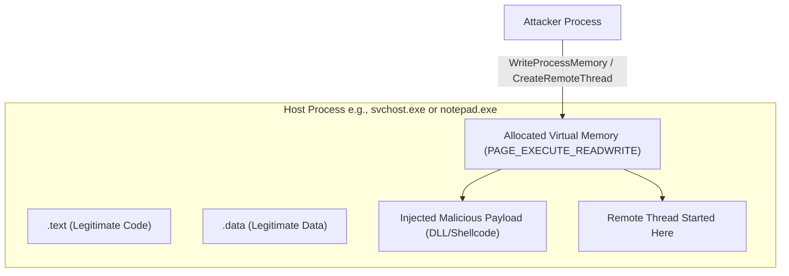

# 45.27 Memory-Only Malware

## Overview

Memory-only malware, often referred to as "fileless malware," is a type of malicious software that exists exclusively within the volatile memory (RAM) of a compromised system. Unlike traditional malware, it does not write its executable payload to the hard drive. This fundamentally breaks traditional, signature-based Antivirus (AV) paradigms that rely on scanning static files on disk.

The primary goal of memory-only techniques is to reduce the footprint left on the system, evade Endpoint Detection and Response (EDR) solutions, and complicate forensic analysis. Because the payload lives only in RAM, a system reboot will typically eradicate the malware (unless persistence mechanisms are established elsewhere, such as in the Registry or WMI).

## The Fileless Attack Chain

A typical memory-only attack follows a specific lifecycle:

1.  **Initial Access (Living off the Land):** The attacker uses legitimate system tools (LOLBins) to execute the initial stage. This often involves malicious macros in Office documents launching PowerShell, WScript, or MSHTA.
2.  **In-Memory Staging:** A small stager payload is executed in memory. It reaches out to a Command and Control (C2) server.
3.  **Reflective Loading:** The C2 server sends the main payload (e.g., a Cobalt Strike Beacon DLL or a Meterpreter payload) directly into the memory space of a running process, bypassing the disk entirely.

## Advanced Memory Injection Techniques

To execute code in memory without dropping a file, attackers utilize complex Windows API calls to allocate memory, write the payload, and execute it.

### 1. Reflective DLL Injection

Normally, loading a DLL in Windows requires the DLL to exist on disk so the Windows Loader (`LoadLibrary`) can map it into memory, resolve its dependencies, and execute `DllMain`. Reflective DLL Injection bypasses the Windows Loader entirely.
*   The attacker writes a custom loader function (the "Reflective Loader") and prepends it to their malicious DLL.
*   The entire package is injected into a target process's memory.
*   Execution is passed to the Reflective Loader, which manually performs the tasks of the Windows Loader (allocating memory, resolving the Import Address Table, and applying base relocations) entirely within RAM.

### 2. Process Hollowing (RunPE)

This technique involves creating a legitimate process in a suspended state, gutting its memory, and replacing it with malicious code.
*   **CreateProcess:** Create a legitimate process (e.g., `svchost.exe`) with the `CREATE_SUSPENDED` flag.
*   **NtUnmapViewOfSection:** "Hollow out" the memory containing the legitimate executable code.
*   **VirtualAllocEx / WriteProcessMemory:** Allocate memory and write the malicious payload into the hollowed space.
*   **SetThreadContext / ResumeThread:** Point the execution thread to the entry point of the malicious payload and resume the process.
*   *Result:* Task Manager and process monitors see a legitimate, Microsoft-signed binary running, but the code executing inside is malicious.

### 3. Process Doppelgänging

An evolution of Process Hollowing that abuses the Windows Transactional NTFS (TxF) feature to evade detection mechanisms that monitor `NtUnmapViewOfSection`.
*   A transaction is created, and a legitimate file is overwritten with the malicious payload *within the transaction*.
*   A section object is created from the transacted file.
*   The transaction is rolled back. The file on disk is never actually modified, so AV scanners see a clean file.
*   The malware executes from the section object created during the transient state.

## Advanced Memory Evasion: Sleeping Beacons

EDR solutions actively scan the memory of running processes for known malicious patterns (like Cobalt Strike configurations) or anomalous memory protections (like `PAGE_EXECUTE_READWRITE` regions not backed by a file on disk). To evade memory scanning, advanced malware uses "sleep obfuscation."

### The Gargoyle Technique / ROP-Based Hiding

When a C2 beacon is not actively processing a command, it goes to "sleep." Modern beacons do not just call `Sleep()`; they actively hide themselves during this period.
1.  Before sleeping, the beacon encrypts its own executable memory segment (the `.text` section) or marks it as `PAGE_READWRITE` (non-executable).
2.  It uses Return-Oriented Programming (ROP) or Asynchronous Procedure Calls (APCs) to schedule a timer.
3.  While sleeping, memory scanners see only encrypted, non-executable data.
4.  When the timer expires, the ROP chain executes, decrypts the memory, changes the protection back to `PAGE_EXECUTE_READ`, and execution resumes.

## Detection and Analysis

Analyzing memory-only malware requires specialized memory forensics tools.

*   **Memory Acquisition:** Tools like DumpIt, WinPmem, or hypervisor-level snapshotting (if in a VM) are used to capture the raw RAM.
*   **Volatility Framework:** The primary tool for analyzing memory dumps.
    *   `malfind`: This plugin scans processes for memory regions that are marked as executable but are not mapped to a file on disk (a massive indicator of injection).
    *   `psxview`: Used to cross-reference process lists to find hidden processes (related to DKOM).
    *   `ldrmodules`: Detects unlinked DLLs (indicative of Reflective DLL Injection).
*   **EDR Memory Scanning (Pe-Sieve / Moneta):** Modern EDRs use advanced memory scanners that look for in-memory PE headers, unbacked executable regions, and inline hooks.
*   **Event Tracing for Windows (ETW):** The `Microsoft-Windows-Threat-Intelligence` ETW provider gives EDRs deep visibility into API calls like `VirtualAlloc` and `WriteProcessMemory`, making traditional injection techniques highly visible to modern defenders.

## Mitigation

*   **Attack Surface Reduction (ASR):** Block Office applications from creating child processes to stop the initial execution chain.
*   **PowerShell Constrained Language Mode:** Limits the ability of attackers to use raw Windows API calls from PowerShell scripts.
*   **AMSI (Antimalware Scan Interface):** Allows AV/EDR to inspect script content (PowerShell, VBScript) *after* it has been decrypted in memory but *before* it is executed.

## Chaining Opportunities
- Memory-only payloads are frequently the final stage after initial execution via [[05 - Phishing and Social Engineering]] or [[13 - Client-Side Attacks]].
- Used in conjunction with [[25 - Rootkits]] to remain completely invisible.
- Analyzing these requires deep understanding of the concepts in [[30 - Defense EDR SIEM Honeytokens]].

## Related Notes
- [[25 - Rootkits]]
- [[28 - Clearing Tracks Windows]]
- [[30 - Defense EDR SIEM Honeytokens]]
