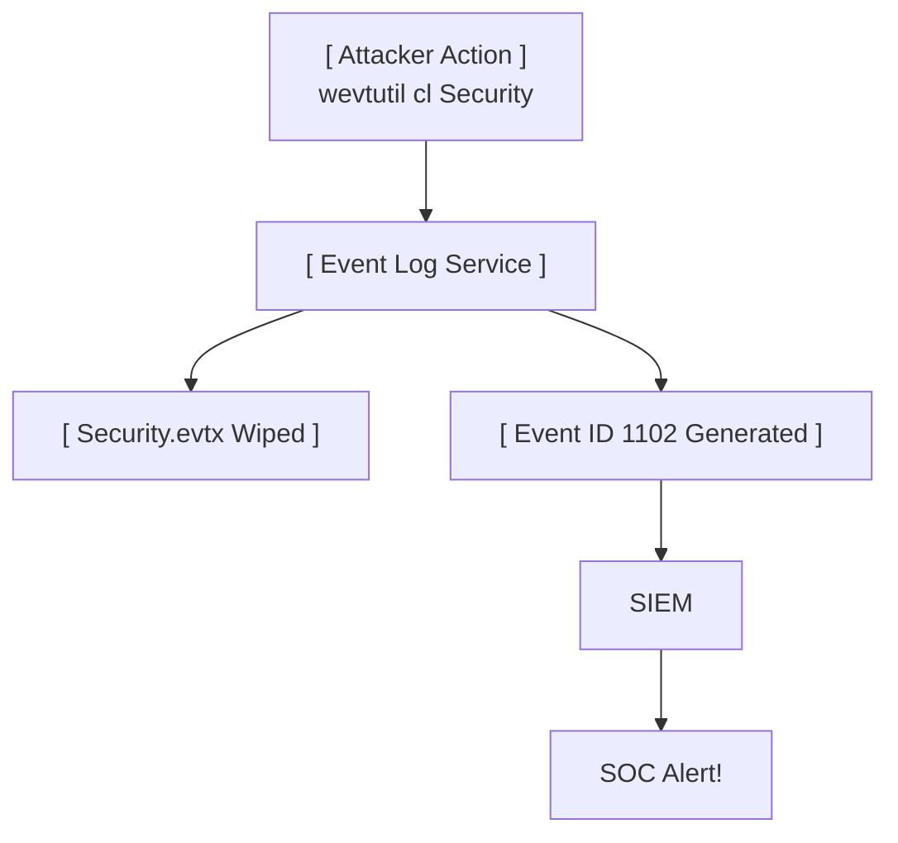

# 45.28 Clearing Tracks Windows

## Overview

Clearing tracks is the final phase of an attacker's immediate operational loop. The objective is to remove or alter forensic artifacts that indicate compromise, thereby delaying detection, complicating incident response, and masking the attacker's tools, techniques, and procedures (TTPs). 

In modern Windows environments protected by centralized logging (SIEM) and EDR, blindly "wiping everything" is highly counterproductive. A sudden, massive deletion of Windows Event Logs (Event ID 1102) is a critical severity alert in any SOC. Therefore, advanced adversaries utilize surgical techniques to remove only specific artifacts while leaving the surrounding system noise intact.

## Windows Event Logs

Windows generates thousands of logs in the `.evtx` format, typically stored in `C:\Windows\System32\winevt\Logs\`. The three primary logs are System, Security, and Application.

### The Naive Approach (High Detection Risk)

Simply clearing the entire event log is the loudest action an attacker can take.
*   **Command Line:** `wevtutil cl Security` or `wevtutil cl System`
*   **PowerShell:** `Clear-EventLog -LogName Security`
*   *Detection:* Clearing the Security log immediately generates **Event ID 1102 (The audit log was cleared)**.



### Advanced Log Manipulation (Phantom Clearing)

To avoid generating Event ID 1102, attackers target the Event Log service directly in memory or modify the `.evtx` files offline.

1.  **Suspending Event Log Threads:** The Windows Event Log service (`EventLog`) runs inside a `svchost.exe` process. An attacker can identify the specific thread handling Event Tracing for Windows (ETW) or log writing and suspend it using tools or API calls (`SuspendThread`). Operations performed while the thread is suspended are not logged. Once the attacker finishes, the thread is resumed.
2.  **MiniDump & Patching:** Advanced tools like `Invoke-Phant0m` locate the Event Log service process, identify the threads responsible for writing logs, and kill or suspend them. The service remains "running" in the Service Control Manager, but no new logs are written to disk.
3.  **Surgical Event Deletion (DanderSpritz / EvtxECmd):** Deleting a single event from an `.evtx` file is incredibly difficult because the file format relies on complex cyclic redundancy checks (CRCs) and chunk structures. Advanced frameworks can parse the `.evtx` structure, remove the specific XML node of the targeted event, and recalculate the CRCs, leaving the rest of the log intact.

## File System Artifacts and Timestomping

Whenever files are executed, created, or modified, Windows creates a plethora of forensic artifacts. Attackers must address these to hide payload execution.

### 1. Prefetch Files

Prefetch (`C:\Windows\Prefetch\`) is designed to speed up application load times. Every time an executable runs, a `.pf` file is created containing the execution count, timestamps, and files loaded by the executable.
*   *Clearing:* Deleting a specific `.pf` file (e.g., `C:\Windows\Prefetch\EVILPAYLOAD.EXE-XYZ.pf`) removes the evidence of execution.
*   *Note:* Disabling Prefetch entirely is suspicious.

### 2. Shimcache (AppCompatCache) and Amcache

These artifacts track application compatibility and execution history.
*   **Shimcache:** Stored in the Registry (`SYSTEM\CurrentControlSet\Control\Session Manager\AppCompatCache`). It tracks executables that have run or merely been browsed to. Clearing this requires registry modification.
*   **Amcache:** (`C:\Windows\AppCompat\Programs\Amcache.hve`). An independent hive file tracking application execution and SHA1 hashes. It cannot be easily deleted while the system is running.

### 3. USN Journal (Update Sequence Number)

The NTFS USN Journal (`$Extend\$UsnJrnl`) keeps a record of all changes made to files and directories (creation, deletion, modification). If an attacker drops a payload, executes it, and deletes it, the USN Journal retains the record.
*   *Clearing:* Attackers can delete the journal using `fsutil`.
    ```cmd
    fsutil usn deletejournal /D C:
    ```
    *Detection:* Deleting the USN Journal is highly anomalous and easily detected by EDR.

### 4. Timestomping (MACB Manipulation)

Forensic analysts heavily rely on MACB timestamps (Modified, Accessed, Created, Birth) to construct a timeline of the attack.
*   Timestomping is the act of maliciously altering these timestamps to make a newly dropped payload appear as if it has existed on the system for years (e.g., matching the timestamp of `kernel32.dll`).
*   **Technique:** Tools like Metasploit's `timestomp` module use the `SetFileTime` API to alter the Standard Information (SIA) attribute in the NTFS Master File Table (MFT).
*   **Detection:** Advanced forensic tools parse the MFT and compare the SIA timestamps against the File Name (FNA) attribute timestamps. Most timestomping tools only alter the SIA; a mismatch between SIA and FNA is a definitive indicator of timestomping.

## Registry Cleanup

Attackers must remove persistence mechanisms and history stored in the Registry.
*   **Run / RunOnce Keys:** Remove any autostart entries created for persistence.
*   **UserAssist:** (`NTUSER.DAT\Software\Microsoft\Windows\CurrentVersion\Explorer\UserAssist`). This key tracks GUI-based execution of programs (including execution counts and timestamps). Entries are ROT13 encoded. Attackers must selectively delete their specific entries.
*   **RDP History:** Clearing the `Terminal Server Client` registry keys removes the history of lateral movement via RDP.

## Chaining Opportunities
- Follows execution of payloads discussed in [[27 - Memory-Only Malware]] and [[25 - Rootkits]].
- Necessary to hide lateral movement artifacts generated during [[22 - Active Directory Lateral Movement]].
- A thorough understanding of defensive alerting [[30 - Defense EDR SIEM Honeytokens]] is required to clear tracks without triggering high-fidelity alerts.

## Related Notes
- [[25 - Rootkits]]
- [[27 - Memory-Only Malware]]
- [[29 - Clearing Tracks Linux]]
- [[30 - Defense EDR SIEM Honeytokens]]
