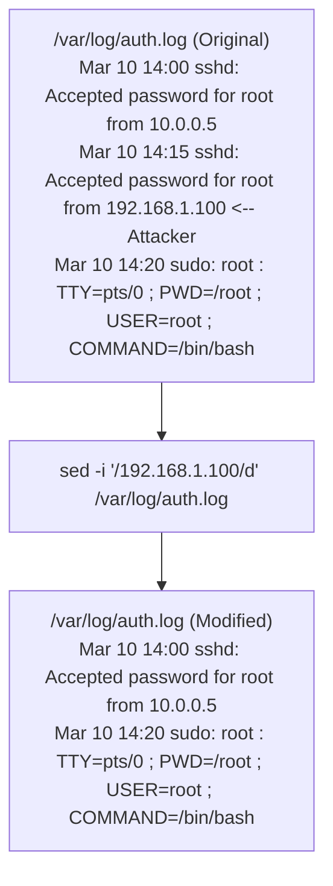

# 45.29 Clearing Tracks Linux

## Overview

In a Linux environment, clearing tracks involves a distinct set of challenges compared to Windows. Linux systems heavily rely on flat text files for logging (syslog, auth.log) and binary databases for user session tracking (wtmp, btmp). The principle remains the same as on Windows: surgical alteration is vastly superior to mass deletion. Deleting an entire log file often breaks log rotation daemons (like `logrotate`), alters file permissions, and serves as a massive red flag to any administrator or automated monitoring system.

## Command Line History Evasion

The most immediate and obvious record of an attacker's actions is the shell history file. For bash, this is `~/.bash_history`.

### 1. Disabling History Recording

The cleanest method is to prevent the shell from recording commands in the first place, rather than trying to delete them later.
*   **Environment Variables:** Upon gaining a shell, an attacker should immediately neutralize history mechanisms.
    ```bash
    export HISTFILE=/dev/null
    export HISTSIZE=0
    export HISTFILESIZE=0
    unset HISTFILE
    ```
*   **Space Prefix:** In many default bash configurations, preceding a command with a space prevents it from being written to the history file.
    ```bash
     cat /etc/shadow  # Note the leading space
    ```
*   **Set +o history:** Disables history for the current session.
    ```bash
    set +o history
    ```

### 2. Surgical History Deletion

If commands were inadvertently recorded, the attacker must edit the history file.
*   Instead of `rm ~/.bash_history`, an attacker will edit the file to remove specific lines using `sed` or `vi`, or rewrite it entirely while maintaining the original timestamp.
    ```bash
    # Remove lines containing 'wget'
    sed -i '/wget/d' ~/.bash_history
    ```

## System Logging Manipulation

Most Linux system logs are located in `/var/log/`. 

*   `/var/log/auth.log` (Debian/Ubuntu) or `/var/log/secure` (RHEL/CentOS): Tracks successful and failed logins (SSH, su, sudo).
*   `/var/log/syslog` or `/var/log/messages`: General system activity.

### Surgical Log Editing

If an attacker logs in via SSH, their IP address and timestamp are recorded in `auth.log`.
1.  **Do not delete the file:** `rm /var/log/auth.log` is a critical error.
2.  **Surgical Removal:** Use `sed` to strip out lines associated with the attacker's IP.
    ```bash
    sed -i '/192.168.1.100/d' /var/log/auth.log
    ```



## User Session and Accounting Files

Linux tracks who is currently logged in, who has logged in previously, and failed login attempts using binary database files. These cannot be edited with standard text editors like `vim` or `nano`.

*   **utmp** (`/var/run/utmp`): Currently logged-in users (viewed with the `who` or `w` command).
*   **wtmp** (`/var/log/wtmp`): History of all logins and logouts (viewed with the `last` command).
*   **btmp** (`/var/log/btmp`): History of failed login attempts (viewed with the `lastb` command).
*   **lastlog** (`/var/log/lastlog`): The most recent login time for all users.

### Modifying Binary Session Logs

To manipulate these files, attackers use specialized C utilities or Python scripts to parse the binary struct and nullify or overwrite specific records.
*   **LogWiper Tools:** Tools that read the `utmp`/`wtmp` structures and selectively overwrite the attacker's TTY, IP address, and timestamp with zeros or fake data.
*   **Clearing the entire file (Noisy):**
    ```bash
    cat /dev/null > /var/log/wtmp
    ```
    *Detection:* An empty `wtmp` file is immediately obvious to a sysadmin running the `last` command.

## Secure File Deletion and Data Wiping

Simply using the `rm` command removes the file's index node (inode) link, making the space available for writing. The actual data remains on the disk until overwritten and can be recovered using forensic tools like `extundelete` or `Scalpel`.

To securely remove a dropped payload or script:
*   **Shred:** Overwrites the file multiple times before deleting it.
    ```bash
    shred -zvu /tmp/malicious_payload.bin
    ```
    (-z: add a final overwrite with zeros to hide shredding, -v: verbose, -u: remove file after overwriting).
*   **DD:** Can be used to overwrite files or entire partitions with zeros or random data.
    ```bash
    dd if=/dev/urandom of=/tmp/payload.bin bs=1M count=10
    rm /tmp/payload.bin
    ```

## Timestomping (MAC Time Modification)

Like Windows, Linux files have timestamps (Modify, Access, Change). To hide a modified configuration file or a dropped backdoor, attackers alter the timestamps to blend in with surrounding files.

*   **Using `touch`:** The `touch` command can clone the timestamps of a legitimate file and apply them to a malicious one.
    ```bash
    # Clone timestamps from /etc/passwd to /etc/cron.d/malicious_cron
    touch -r /etc/passwd /etc/cron.d/malicious_cron
    ```
*   **Using explicit time:**
    ```bash
    touch -t 202201011200.00 /tmp/payload
    ```

## Hiding in Plain Sight (File System Obfuscation)

Rather than deleting files, attackers often hide them.
1.  **Dotfiles:** Prefixing a file or directory with a `.` hides it from standard `ls` output (requires `ls -a` to see).
2.  **Deceptive Naming:** Naming a binary `kworker/u4:2` or `[kthreadd]` to mimic legitimate kernel threads in process listings.
3.  **Mount Bind Obfuscation:** A highly advanced technique where a legitimate directory is bind-mounted over a malicious directory. The malicious files exist on disk, but the file system API only returns the contents of the legitimate directory.
4.  **In-Memory Execution:** Utilizing `/dev/shm` (Shared Memory), which is mounted as `tmpfs` (RAM). Dropping files here means they will not survive a reboot, bypassing disk forensics.

## Chaining Opportunities
- Follows initial access and lateral movement via SSH [[22 - Active Directory Lateral Movement]] (adapted for Linux/SSH environments).
- Often used to hide the presence of [[25 - Rootkits]] before the rootkit itself is fully deployed and can hide files dynamically.
- Clearing tracks is essential to maximize the lifespan of a compromised host before discovery.

## Related Notes
- [[25 - Rootkits]]
- [[28 - Clearing Tracks Windows]]
- [[30 - Defense EDR SIEM Honeytokens]]
